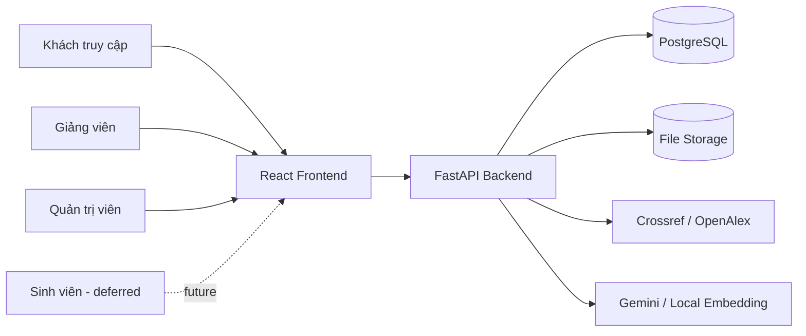

# 02. Ngữ cảnh Hệ thống và Phạm vi

## 1. Ranh giới

TrustLens gồm:

1. React frontend trên trình duyệt.
2. FastAPI backend xử lý auth, nghiệp vụ, pipeline và report.
3. PostgreSQL và file storage.
4. Provider ngoài cho metadata/embedding.

Provider ngoài không phải nguồn sự thật tuyệt đối.

## 2. Actor

| Mã | Actor | Trách nhiệm |
|---|---|---|
| ACT-01 | Khách truy cập | Landing, register, login |
| ACT-02 | Giảng viên | Quản lý lớp/assignment, upload, analyze, report |
| ACT-03 | Admin | Toàn quyền lecturer + user/provider/audit |
| ACT-04 | Sinh viên | Role tồn tại, portal deferred |
| ACT-05 | Metadata provider | Crossref/OpenAlex và provider mở rộng |
| ACT-06 | Embedding provider | Gemini/local fallback |
| ACT-07 | Người vận hành | Cấu hình, migration, storage, backup, monitor |

## 3. Sơ đồ ngữ cảnh



## 4. Phạm vi dữ liệu

### Tài khoản

Email, họ tên, role, permission, trạng thái, hồ sơ trường/khoa/chuyên ngành, thời điểm đăng nhập và audit.

### Học thuật

Học phần, lớp, assignment, submission, file, text trích xuất, reference section, citation, metadata, Trust Score, warning, report và export.

### AI

Config hiện tại mặc định:

- `AI_DATA_MODE=sanitized_text_only`.
- Không lưu raw AI input.
- Không log raw input text.

Production phải xác minh provider nhận và lưu dữ liệu gì.

## 5. Ownership hiện tại

```text
User (Lecturer)
  └── Class
       └── Assignment
            └── Submission
                 ├── File
                 ├── Processing Job
                 ├── Extracted Document
                 ├── Citation / Metadata
                 └── Report / Export
```

Admin có phạm vi rộng hơn. Đây chưa phải tenant isolation.

## 6. Luồng chính

### Đăng nhập

1. Client gửi email/mật khẩu.
2. Backend xác thực.
3. Trả access/refresh token.
4. Frontend lưu token và gắn bearer.
5. Khi 401, thử refresh một lần.

### Phân tích

1. Chọn assignment.
2. Upload file.
3. Backend kiểm tra ownership và lưu dữ liệu.
4. Gọi analyze.
5. Backend tạo job, chạy `BackgroundTasks`.
6. Frontend poll mỗi 2 giây.
7. Pipeline tạo report.
8. Frontend mở report.

### Metadata

1. Parse citation.
2. Query theo DOI/title/author/year.
3. So khớp candidate.
4. Lưu status/confidence/evidence.
5. `NOT_FOUND` không được diễn giải là fake.

## 7. In-scope baseline

- Web cho lecturer/admin.
- PDF/DOCX có text layer.
- Course/class/assignment/submission.
- Metadata verification.
- C1–C7 scoring.
- Job polling.
- Report/export.
- Audit và provider admin cơ bản.

## 8. Out-of-scope baseline

Native mobile, OCR, full-text crawling trái phép, plagiarism verdict, automatic grading, enterprise multi-tenancy, billing, SSO production, durable queue, realtime socket và SLA production.

## 9. Giả định

| ID | Giả định | Rủi ro nếu sai |
|---|---|---|
| ASM-01 | Có reference section nhận diện được | `NO_REFERENCE_SECTION` |
| ASM-02 | PDF có text layer hoặc DOCX đọc được | PDF scan thất bại |
| ASM-03 | Provider phản hồi đủ ổn định | Confidence giảm hoặc unknown |
| ASM-04 | Ownership class/assignment chính xác | Từ chối nhầm hoặc lộ dữ liệu |
| ASM-05 | Scoring version được lưu | Report cũ khó giải thích |
| ASM-06 | File storage được bảo vệ | Mất hoặc lộ file |
