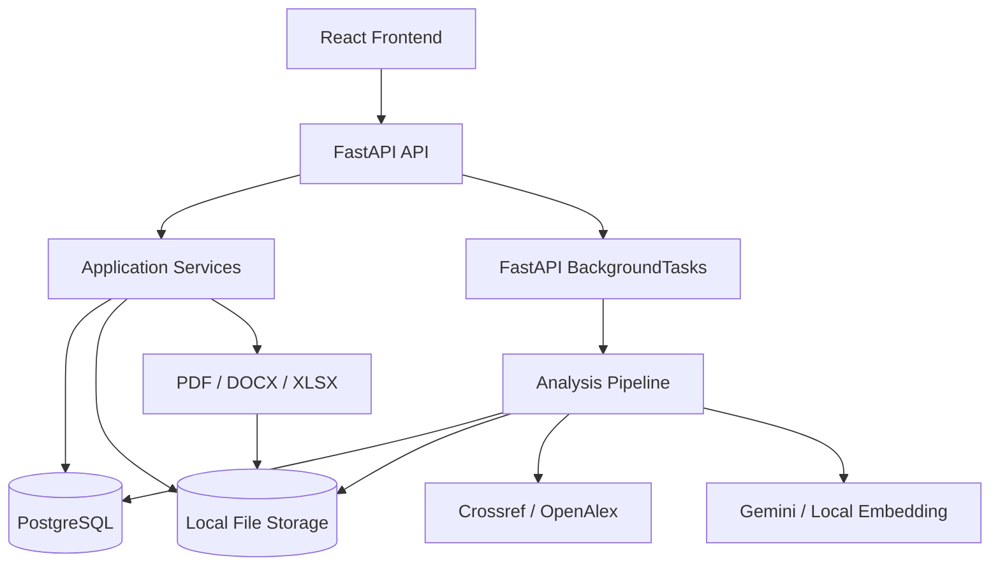

# 06. Kiến trúc Hệ thống

## 1. Mục tiêu

- Tách UI, API, nghiệp vụ, dữ liệu và tích hợp.
- Backend kiểm soát quyền.
- Pipeline chạy ngoài HTTP response.
- Traceability từ file tới report.
- Provider có adapter/fallback.
- Có đường nâng cấp từ MVP lên durable worker mà không phá client contract.

## 2. Kiến trúc hiện tại



## 3. Frontend

- `src/App.tsx`: route composition.
- `src/features/`: màn hình nghiệp vụ.
- `src/components/`: shared UI/route guard.
- `src/services/`: API clients.
- `src/auth/permissions.ts`: client-side role/permission.
- `src/config/trustScoreConfig.ts`: scoring presentation contract.
- `src/mocks/`: local mock.

Token lưu `localStorage`, Axios gắn bearer và refresh khi 401. Route guard chỉ là UX, không thay backend auth.

## 4. Backend

### API layer

Auth, users, courses, classes, assignments, submissions, jobs, reports, report exports, dashboard, admin và health.

### Service layer

Access control, file storage, submission/job, extraction/reference/citation, metadata, scoring, report/export, audit và dashboard/admin.

### Data layer

SQLAlchemy + PostgreSQL + Alembic; file vật lý nằm ngoài DB theo path.

## 5. Pipeline chính

```text
QUEUED
→ VALIDATING
→ EXTRACTING
→ DETECTING_REFERENCES
→ PARSING_CITATIONS
→ NORMALIZING
→ VERIFYING_METADATA
→ SCORING
→ BUILDING_REPORT
→ COMPLETED
```

Failure state theo stage gồm `FAILED_VALIDATION`, `FAILED_EXTRACTION`, `FAILED_METADATA`, `FAILED_SCORING`, `FAILED_INTERNAL` và có thể `CANCELLED`.

## 6. Hai pipeline không nhất quán

1. `run_analysis_pipeline`: pipeline thật, dùng bởi `/submissions/{id}/analyze`.
2. `run_submission_processing_pipeline`: placeholder chỉ cập nhật trạng thái.

`/jobs/submissions/{id}/process` và retry đang gọi placeholder. Hệ quả: job có thể `COMPLETED` nhưng không có metadata, score/report. Quyết định: chỉ giữ một orchestration service; mọi endpoint analyze/process/retry phải gọi cùng command handler.

## 7. Background execution

### As-is: `BackgroundTasks`

Ưu điểm: đơn giản, không broker. Hạn chế: không durable khi restart, khó scale, thiếu queue visibility/dead-letter/retry policy.

### To-be: durable queue

```text
API → Queue → Worker → DB/Object Storage
```

Celery/Redis chỉ là một lựa chọn. Tiêu chí gồm at-least-once delivery, idempotency, retry, dead-letter, progress persistence, scaling và monitoring.

## 8. Metadata adapter

Adapter phải chuẩn hóa query, candidate, status, confidence, evidence, error, latency và rate-limit signal. Provider failure không được biến thành kết luận học thuật.

## 9. Relevance

```text
Report context + Reference metadata
→ Embedding provider
→ Similarity/calibration
→ C4 + evidence + confidence
```

Evidence phải ghi primary/fallback, model và version.

## 10. File và export

Local filesystem phù hợp development. Production cần storage abstraction, private object storage, signed/authorized download, encryption, retention, malware scan và backup.

## 11. Kiến trúc mục tiêu theo giai đoạn

### Stabilized modular monolith

Một FastAPI app, PostgreSQL, durable worker queue, object storage, provider adapter, unified pipeline và integration tests.

### Scale by workload

Chỉ tách extraction/OCR, metadata, NLP/GPU hoặc export khi có bằng chứng về throughput/isolation. Không tách microservice chỉ để đạt hình thức.

## 12. Quality attributes

| Thuộc tính | Quyết định |
|---|---|
| Security | Backend authorization + ownership |
| Reliability | Persisted job state; durable queue target |
| Modifiability | Provider adapter; module boundaries |
| Traceability | Job/report/scoring version/audit |
| Explainability | Evidence per component |
| Performance | Async orchestration, timeout |
| Portability | Env config, migration, container target |
| Privacy | Sanitized AI data, no raw logging mặc định |
