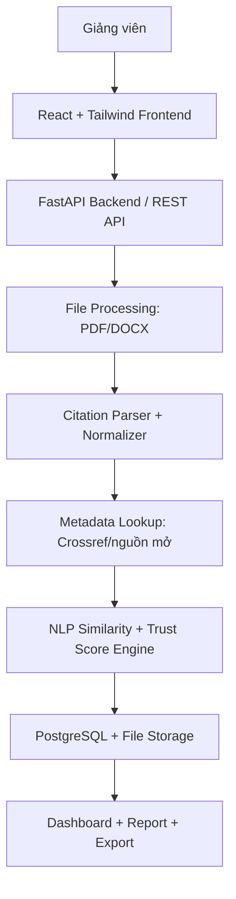

```table-of-contents
```

# 2. Overall Description
## 2.1. Product Perspective

Trong báo cáo CNTT, danh mục tài liệu tham khảo ảnh hưởng trực tiếp đến chất lượng học thuật của bài viết. Một báo cáo có thể dùng nguồn không tồn tại, nguồn khó xác minh, nguồn không liên quan, nguồn quá cũ hoặc citation sai định dạng. Việc kiểm tra thủ công từng tài liệu gây tốn thời gian, khó chuẩn hóa và phụ thuộc nhiều vào kinh nghiệm người chấm. TrustLens xử lý vấn đề này bằng cách tự động hóa quy trình thẩm định tài liệu tham khảo và trình bày kết quả theo tiêu chí định lượng.

TrustLens là một ứng dụng web độc lập. Frontend gửi file và yêu cầu phân tích qua RESTful API. Backend điều phối xử lý file, queue job, metadata lookup, NLP scoring, lưu dữ liệu PostgreSQL và trả kết quả cho dashboard. Hệ thống có thể triển khai trên Supabase/Render cho MVP, sau đó mở rộng thành service có khả năng tích hợp LMS hoặc hệ thống quản lý học phần.




## 2.2. Business Objectives 

| **Mã mục tiêu** | **Mục tiêu**                                                            | **Chỉ số kiểm chứng**                                                                    |
|-----------------|-------------------------------------------------------------------------|------------------------------------------------------------------------------------------|
| OBJ-01          | Rút ngắn thời gian kiểm tra danh mục tài liệu tham khảo của giảng viên. | Một file báo cáo 10-20 trang xử lý xong trong \<= 120 giây ở MVP với tối đa 40 citation. |
| OBJ-02          | Phát hiện nguồn không tồn tại hoặc khó xác minh.                        | Ít nhất 90% citation có DOI hợp lệ được xác minh đúng trong tập kiểm thử.                |
| OBJ-03          | Đánh giá độ phù hợp giữa tài liệu tham khảo và chủ đề báo cáo.          | Mỗi citation có relevance score và nhãn phù hợp/cần xem xét/không phù hợp.               |
| OBJ-04          | Chuẩn hóa kết quả chấm nguồn theo tiêu chí có trọng số.                 | Mỗi bài nộp có Trust Score tổng, điểm thành phần và giải thích.                          |
| OBJ-05          | Tạo báo cáo có thể dùng trong phản hồi học thuật.                       | Xuất được PDF/DOCX/XLSX gồm bảng citation, cảnh báo, lý do và gợi ý sửa.                 |

## 2.3. Project Functions

| **Nhóm**                             | **Mô tả**                                                                            | **Mức ưu tiên** |
|--------------------------------------|--------------------------------------------------------------------------------------|-----------------|
| Quản lý người dùng và phân quyền     | Đăng nhập, vai trò giảng viên/quản trị, quyền xem/sửa/xóa dữ liệu.                   | MUST            |
| Quản lý lớp học, học phần và bài nộp | Tạo lớp/học phần/bài tập, quản lý file nộp và trạng thái xử lý.                      | MUST            |
| Trích xuất tài liệu tham khảo        | Nhận file PDF/DOCX, trích văn bản, phát hiện reference section, tách citation.       | MUST            |
| Chuẩn hóa citation                   | Nhận diện APA/IEEE/ACM/MLA, tách trường metadata, phát hiện thiếu trường.            | MUST            |
| Kiểm tra tồn tại học thuật           | Tra DOI, tiêu đề, tác giả, năm xuất bản qua metadata API.                            | MUST            |
| Đánh giá độ tin cậy                  | Đánh giá loại nguồn, nhà xuất bản, nguồn công bố, xác minh và citation count nếu có. | MUST            |
| Đánh giá độ cập nhật                 | Kiểm tra năm xuất bản theo ngưỡng lĩnh vực.                                          | SHOULD          |
| Đánh giá độ phù hợp                  | So sánh title/abstract với chủ đề/nội dung báo cáo bằng embedding.                   | MUST            |
| Chấm điểm và cảnh báo                | Tạo Trust Score, nhãn rủi ro, cảnh báo và gợi ý chỉnh sửa.                           | MUST            |
| Xuất kết quả                         | Xuất báo cáo PDF/DOCX/XLSX và lưu lịch sử phân tích.                                 | MUST            |

## 2.4. User Classes and Characteristics

| Actor | Mục tiêu sử dụng | Quyền chính |
|---|---|---|
| Giảng viên | Tải bài nộp, chạy phân tích, xem điểm, xem cảnh báo, xuất báo cáo phản hồi. | Tạo lớp/học phần/bài nộp; upload file; phân tích; xem/export kết quả của lớp mình. |
| Quản trị hệ thống | Quản lý tài khoản, cấu hình tiêu chí, theo dõi lỗi và vận hành hệ thống. | Quản lý user, role, scoring config, metadata source, system log. |
| Sinh viên | Không bắt buộc trong MVP; có thể là chủ thể của bài nộp. | Có thể được bổ sung quyền upload/xem phản hồi ở phiên bản mở rộng. |

## 2.5. External Systems and Internal Components

| Thành phần   | Vai trò                                                                | Ghi chú                                                                    |
| ------------ | ---------------------------------------------------------------------- | -------------------------------------------------------------------------- |
| Metadata API | Cung cấp thông tin học thuật để xác minh citation.                     | Có thể gồm Crossref, Semantic Scholar, OpenAlex hoặc nguồn mở tương đương. |
| Queue Worker | Xử lý file, metadata lookup và scoring bất đồng bộ.                    | Truy cập job queue, file storage, database và metadata API.                |
| File Storage | Lưu file báo cáo đầu vào và file export đầu ra.                        | MVP có thể dùng local storage; bản mở rộng có thể dùng object storage.     |
| Database     | Lưu user, submission, reference, metadata, score, report và audit log. | Baseline: PostgreSQL.                                                      |
## 2.6. Operating Environment

| **Môi trường**     | **Mục đích**                           | **Yêu cầu tối thiểu**                                                  |
|--------------------|----------------------------------------|------------------------------------------------------------------------|
| Local development  | Lập trình và test nhanh.               | Python 3.11+, Node.js LTS, PostgreSQL, Redis optional, .env local.     |
| Demo/Staging       | Trình diễn sản phẩm và test trước nộp. | Frontend deployed, backend deployed, DB cloud/local ổn định, file mẫu. |
| Production mở rộng | Triển khai thật cho khoa/bộ môn.       | HTTPS, backup, monitoring, worker scale, access policy, log retention. |

## 2.7. Design and Implementation Constraints

| **Layer**       | **Công nghệ baseline**                      | **Ghi chú yêu cầu**                                                         |
|-----------------|---------------------------------------------|-----------------------------------------------------------------------------|
| Frontend        | React + Tailwind CSS                        | Giao diện upload, trạng thái xử lý, dashboard, bảng kết quả, export.        |
| Backend         | FastAPI + SQLAlchemy + Alembic + JWT Auth   | REST API, xác thực, quản lý job, scoring, business rules.                   |
| Database        | PostgreSQL                                  | Lưu người dùng, lớp, bài nộp, citation, metadata, score, report, audit log. |
| File Processing | PyMuPDF, pdfplumber, python-docx            | Trích văn bản PDF/DOCX, giữ thông tin page/line nếu có thể.                 |
| NLP/AI          | Sentence Transformers / Embedding model     | So sánh ngữ nghĩa chủ đề báo cáo - tài liệu tham khảo.                      |
| Queue           | Redis + Celery                              | Xử lý bất đồng bộ để tránh timeout khi upload nhiều file.                   |
| Export          | WeasyPrint/ReportLab, python-docx, openpyxl | Xuất báo cáo theo định dạng PDF, DOCX, XLSX.                                |

## 2.8. Standards, Business Rules

Do TrustLens hướng đến sản phẩm dự thi, MVP cần ưu tiên tính ứng dụng thực tế, sản phẩm chạy được hoặc có mô hình thực nghiệm, mã nguồn đầy đủ, tài liệu cài đặt/sử dụng và khả năng demo ổn định. Các ràng buộc này ảnh hưởng trực tiếp đến phạm vi triển khai, test case và kế hoạch nghiệm thu.

| **Ràng buộc**                                       | **Ảnh hưởng lên SRS**                                                                                                                       |
|-----------------------------------------------------|---------------------------------------------------------------------------------------------------------------------------------------------|
| Sản phẩm phải có tính ứng dụng thực tiễn            | Yêu cầu phải bám sát workflow giảng viên kiểm tra báo cáo, không chỉ là mô hình AI rời rạc.                                                 |
| Sản phẩm phải chạy được hoặc có mô hình thực nghiệm | MVP phải có pipeline end-to-end: upload -\> phân tích -\> dashboard -\> export.                                                             |
| Không vi phạm bản quyền dữ liệu, mã nguồn, hình ảnh | Cần dùng dữ liệu hợp pháp, nguồn mở, tự tạo hoặc dữ liệu được phép công bố.                                                                 |
| Báo cáo kỹ thuật tối đa 20 trang                    | SRS có thể dài hơn, nhưng báo cáo dự thi phải chọn lọc lại phần mô tả bài toán, dữ liệu, phương pháp, kiến trúc, kết quả, hướng phát triển. |
| Video demo 3-5 phút                                 | Use case demo cần ngắn, có file mẫu, có dashboard kết quả rõ ràng, có export.                                                               |

## 2.9. Assumptions and Dependencies

- Giảng viên là người dùng chính trong MVP; sinh viên có thể không đăng nhập trực tiếp ở phiên bản đầu.
- Báo cáo đầu vào chứa văn bản có thể trích xuất bằng PyMuPDF, pdfplumber hoặc python-docx; nếu file là ảnh scan, hệ thống trả trạng thái cần OCR hoặc không hỗ trợ ở MVP.
- Metadata API có thể bị giới hạn tốc độ, lỗi mạng hoặc không tìm thấy tài liệu; hệ thống phải có trạng thái unknown thay vì kết luận sai.
- Điểm Trust Score là công cụ hỗ trợ đánh giá, không thay thế hoàn toàn nhận định học thuật của giảng viên.
- Các trọng số scoring ban đầu là đề xuất kỹ thuật; cần hiệu chỉnh bằng dữ liệu kiểm thử và phản hồi của giảng viên.