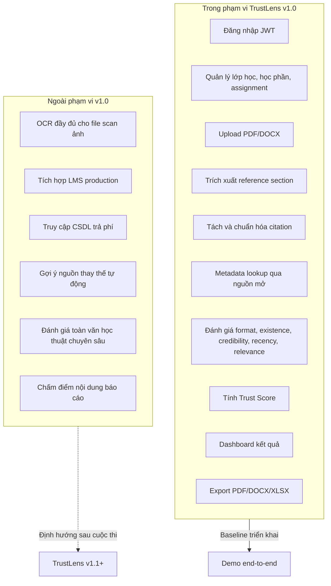

# D02. MVP Scope Boundary

```mermaid
flowchart TB
    subgraph MVP["Trong phạm vi TrustLens v1.0"]
        A1["Đăng nhập JWT"]
        A2["Quản lý lớp học, học phần, assignment"]
        A3["Upload PDF/DOCX"]
        A4["Trích xuất reference section"]
        A5["Tách và chuẩn hóa citation"]
        A6["Metadata lookup qua nguồn mở"]
        A7["Đánh giá format, existence, credibility, recency, relevance"]
        A8["Tính Trust Score"]
        A9["Dashboard kết quả"]
        A10["Export PDF/DOCX/XLSX"]
    end

    subgraph OUT["Ngoài phạm vi v1.0"]
        B1["OCR đầy đủ cho file scan ảnh"]
        B2["Tích hợp LMS production"]
        B3["Truy cập CSDL trả phí"]
        B4["Gợi ý nguồn thay thế tự động"]
        B5["Đánh giá toàn văn học thuật chuyên sâu"]
        B6["Chấm điểm nội dung báo cáo"]
    end

    MVP -->|Baseline triển khai| DEMO["Demo end-to-end"]
    OUT -.->|Định hướng sau cuộc thi| FUTURE["TrustLens v1.1+"]
```