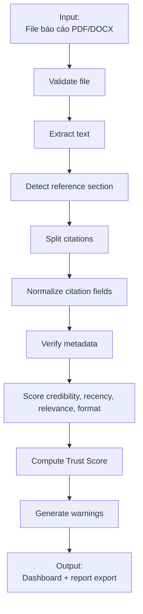

# D03. High-level End-to-End Workflow

```mermaid
flowchart TD
    I["Input:<br/>File báo cáo PDF/DOCX"] --> P1["Validate file"]
    P1 --> P2["Extract text"]
    P2 --> P3["Detect reference section"]
    P3 --> P4["Split citations"]
    P4 --> P5["Normalize citation fields"]
    P5 --> P6["Verify metadata"]
    P6 --> P7["Score credibility, recency, relevance, format"]
    P7 --> P8["Compute Trust Score"]
    P8 --> P9["Generate warnings"]
    P9 --> O["Output:<br/>Dashboard + report export"]
```