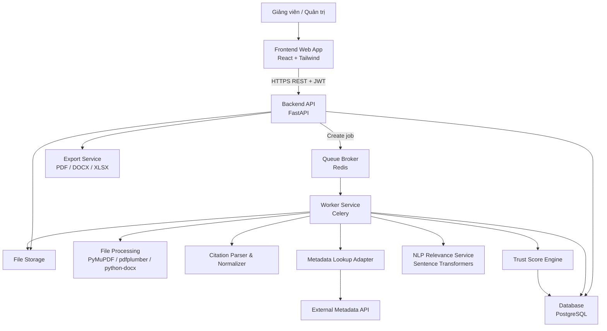

# D04. C4 Container Architecture

```mermaid
flowchart TB
    U["Giảng viên / Quản trị"] --> FE["Frontend Web App<br/>React + Tailwind"]

    FE -->|HTTPS REST + JWT| API["Backend API<br/>FastAPI"]

    API -->|Create job| Q["Queue Broker<br/>Redis"]
    Q --> W["Worker Service<br/>Celery"]

    API --> DB["Database<br/>PostgreSQL"]
    API --> ST["File Storage"]

    W --> ST
    W --> DB
    W --> FP["File Processing<br/>PyMuPDF / pdfplumber / python-docx"]
    W --> CP["Citation Parser & Normalizer"]
    W --> ML["Metadata Lookup Adapter"]
    W --> NLP["NLP Relevance Service<br/>Sentence Transformers"]
    W --> SC["Trust Score Engine"]
    ML --> EXT["External Metadata API"]

    SC --> DB
    API --> EX["Export Service<br/>PDF / DOCX / XLSX"]
```