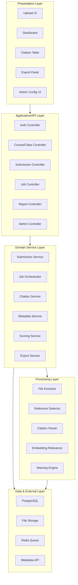

# D05. Layered Architecture

```mermaid
flowchart TB
    subgraph L1["Presentation Layer"]
        FE1["Upload UI"]
        FE2["Dashboard"]
        FE3["Citation Table"]
        FE4["Export Panel"]
        FE5["Admin Config UI"]
    end

    subgraph L2["Application/API Layer"]
        API1["Auth Controller"]
        API2["Course/Class Controller"]
        API3["Submission Controller"]
        API4["Job Controller"]
        API5["Report Controller"]
        API6["Admin Controller"]
    end

    subgraph L3["Domain Service Layer"]
        S1["Submission Service"]
        S2["Job Orchestrator"]
        S3["Citation Service"]
        S4["Metadata Service"]
        S5["Scoring Service"]
        S6["Export Service"]
    end

    subgraph L4["Processing Layer"]
        W1["File Extractor"]
        W2["Reference Detector"]
        W3["Citation Parser"]
        W4["Embedding Relevance"]
        W5["Warning Engine"]
    end

    subgraph L5["Data & External Layer"]
        DB["PostgreSQL"]
        ST["File Storage"]
        REDIS["Redis Queue"]
        META["Metadata API"]
    end

    L1 --> L2
    L2 --> L3
    L3 --> L4
    L3 --> L5
    L4 --> L5
```