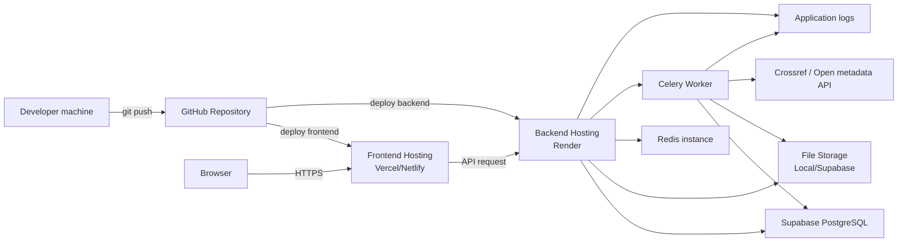

# D06. Deployment Topology

```mermaid
flowchart LR
    DEV["Developer machine"] -->|git push| GH["GitHub Repository"]
    GH -->|deploy frontend| VERCEL["Frontend Hosting<br/>Vercel/Netlify"]
    GH -->|deploy backend| RENDER["Backend Hosting<br/>Render"]

    USER["Browser"] -->|HTTPS| VERCEL
    VERCEL -->|API request| RENDER

    RENDER --> DB["Supabase PostgreSQL"]
    RENDER --> ST["File Storage<br/>Local/Supabase"]
    RENDER --> REDIS["Redis instance"]
    RENDER --> WORKER["Celery Worker"]
    WORKER --> DB
    WORKER --> ST
    WORKER --> META["Crossref / Open metadata API"]

    RENDER --> LOG["Application logs"]
    WORKER --> LOG
```