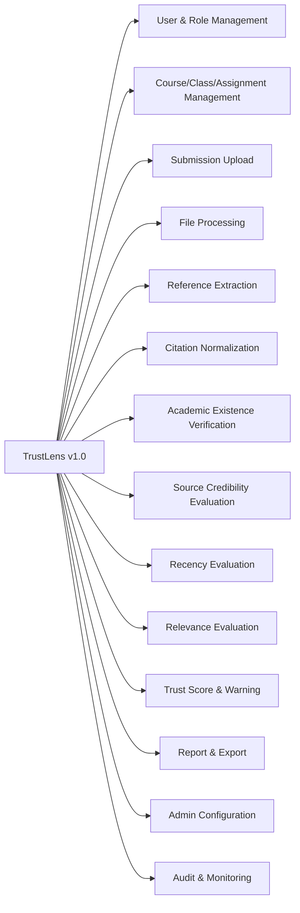

# D07. Functional Module Map

```mermaid
flowchart LR
    TL["TrustLens v1.0"] --> M1["User & Role Management"]
    TL --> M2["Course/Class/Assignment Management"]
    TL --> M3["Submission Upload"]
    TL --> M4["File Processing"]
    TL --> M5["Reference Extraction"]
    TL --> M6["Citation Normalization"]
    TL --> M7["Academic Existence Verification"]
    TL --> M8["Source Credibility Evaluation"]
    TL --> M9["Recency Evaluation"]
    TL --> M10["Relevance Evaluation"]
    TL --> M11["Trust Score & Warning"]
    TL --> M12["Report & Export"]
    TL --> M13["Admin Configuration"]
    TL --> M14["Audit & Monitoring"]
```