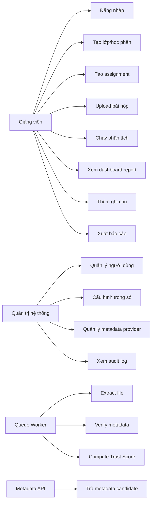

# D08. Actor & Use Case Overview

```mermaid
flowchart LR
    Lecturer["Giảng viên"] --> UC1["Đăng nhập"]
    Lecturer --> UC2["Tạo lớp/học phần"]
    Lecturer --> UC3["Tạo assignment"]
    Lecturer --> UC4["Upload bài nộp"]
    Lecturer --> UC5["Chạy phân tích"]
    Lecturer --> UC6["Xem dashboard report"]
    Lecturer --> UC7["Thêm ghi chú"]
    Lecturer --> UC8["Xuất báo cáo"]

    Admin["Quản trị hệ thống"] --> UC9["Quản lý người dùng"]
    Admin --> UC10["Cấu hình trọng số"]
    Admin --> UC11["Quản lý metadata provider"]
    Admin --> UC12["Xem audit log"]

    Worker["Queue Worker"] --> UC13["Extract file"]
    Worker --> UC14["Verify metadata"]
    Worker --> UC15["Compute Trust Score"]

    Metadata["Metadata API"] --> UC16["Trả metadata candidate"]
```