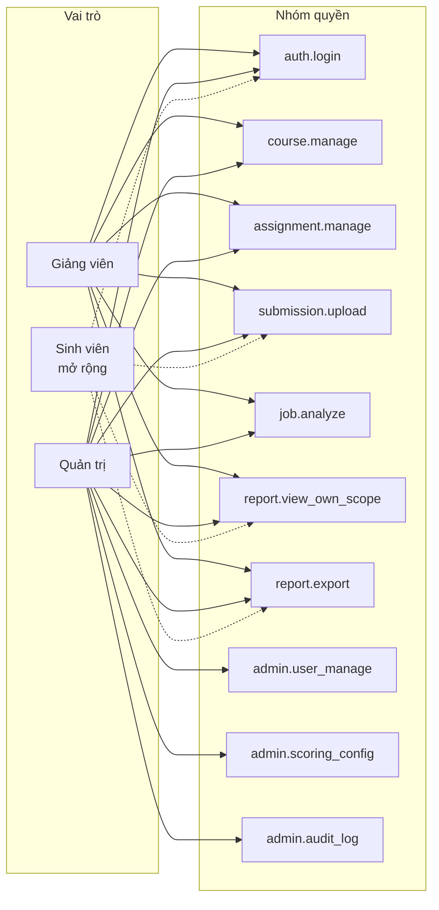

# D09. Role Permission Map

```mermaid
flowchart LR
    subgraph Roles["Vai trò"]
        R1["Giảng viên"]
        R2["Quản trị"]
        R3["Sinh viên<br/>mở rộng"]
    end

    subgraph Permissions["Nhóm quyền"]
        P1["auth.login"]
        P2["course.manage"]
        P3["assignment.manage"]
        P4["submission.upload"]
        P5["job.analyze"]
        P6["report.view_own_scope"]
        P7["report.export"]
        P8["admin.user_manage"]
        P9["admin.scoring_config"]
        P10["admin.audit_log"]
    end

    R1 --> P1
    R1 --> P2
    R1 --> P3
    R1 --> P4
    R1 --> P5
    R1 --> P6
    R1 --> P7

    R2 --> P1
    R2 --> P2
    R2 --> P3
    R2 --> P4
    R2 --> P5
    R2 --> P6
    R2 --> P7
    R2 --> P8
    R2 --> P9
    R2 --> P10

    R3 -.-> P1
    R3 -.-> P4
    R3 -.-> P6
    R3 -.-> P7
```