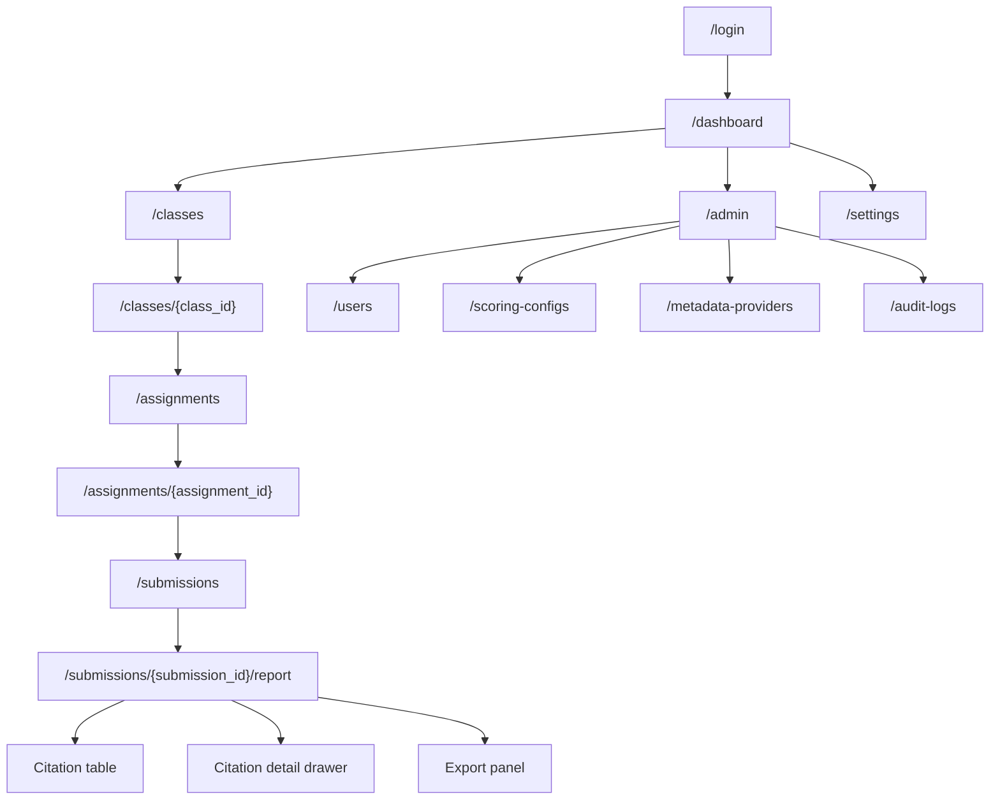

# D10. UI Navigation Map

```mermaid
flowchart TB
    Login["/login"] --> Dashboard["/dashboard"]
    Dashboard --> Classes["/classes"]
    Classes --> ClassDetail["/classes/{class_id}"]
    ClassDetail --> Assignments["/assignments"]
    Assignments --> AssignmentDetail["/assignments/{assignment_id}"]
    AssignmentDetail --> Submissions["/submissions"]
    Submissions --> SubmissionReport["/submissions/{submission_id}/report"]

    SubmissionReport --> CitationTable["Citation table"]
    SubmissionReport --> CitationDetail["Citation detail drawer"]
    SubmissionReport --> ExportPanel["Export panel"]

    Dashboard --> Admin["/admin"]
    Admin --> Users["/users"]
    Admin --> ScoringConfigs["/scoring-configs"]
    Admin --> MetadataProviders["/metadata-providers"]
    Admin --> AuditLogs["/audit-logs"]
    Dashboard --> Settings["/settings"]
```