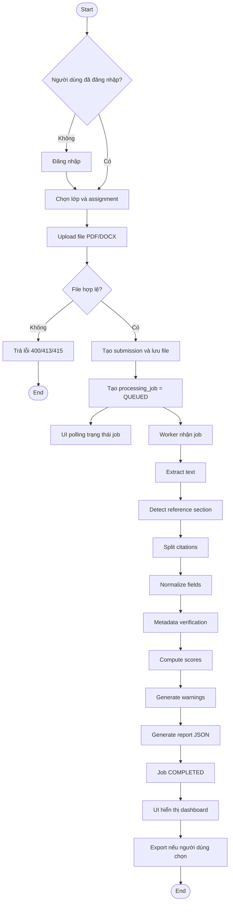

# D11. Upload-to-Report Activity Flow

```mermaid
flowchart TD
    Start(["Start"]) --> Login{"Người dùng đã đăng nhập?"}
    Login -- "Không" --> Auth["Đăng nhập"]
    Auth --> SelectAssignment
    Login -- "Có" --> SelectAssignment["Chọn lớp và assignment"]

    SelectAssignment --> Upload["Upload file PDF/DOCX"]
    Upload --> Validate{"File hợp lệ?"}
    Validate -- "Không" --> Reject["Trả lỗi 400/413/415"] --> End1(["End"])
    Validate -- "Có" --> CreateSubmission["Tạo submission và lưu file"]
    CreateSubmission --> CreateJob["Tạo processing_job = QUEUED"]
    CreateJob --> Poll["UI polling trạng thái job"]
    CreateJob --> Worker["Worker nhận job"]

    Worker --> Extract["Extract text"]
    Extract --> Detect["Detect reference section"]
    Detect --> Split["Split citations"]
    Split --> Normalize["Normalize fields"]
    Normalize --> Verify["Metadata verification"]
    Verify --> Score["Compute scores"]
    Score --> Warning["Generate warnings"]
    Warning --> Report["Generate report JSON"]
    Report --> Completed["Job COMPLETED"]
    Completed --> Dashboard["UI hiển thị dashboard"]
    Dashboard --> Export["Export nếu người dùng chọn"]
    Export --> End2(["End"])
```