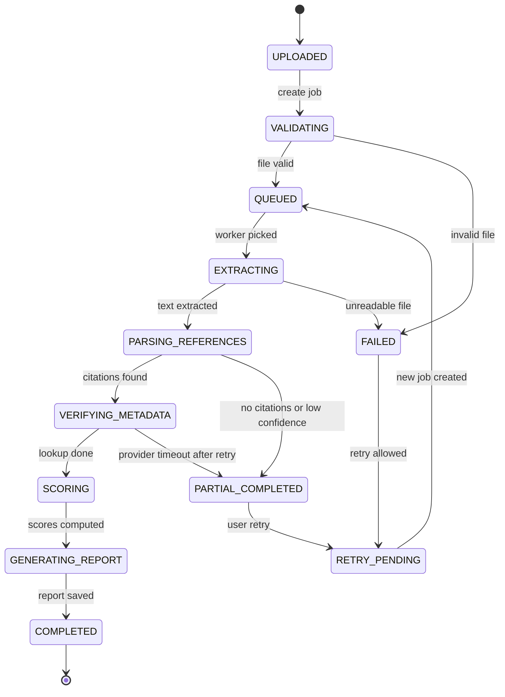

# D12. Processing Job State Machine

```mermaid
stateDiagram-v2
    [*] --> UPLOADED
    UPLOADED --> VALIDATING: create job
    VALIDATING --> QUEUED: file valid
    VALIDATING --> FAILED: invalid file
    QUEUED --> EXTRACTING: worker picked
    EXTRACTING --> PARSING_REFERENCES: text extracted
    EXTRACTING --> FAILED: unreadable file
    PARSING_REFERENCES --> VERIFYING_METADATA: citations found
    PARSING_REFERENCES --> PARTIAL_COMPLETED: no citations or low confidence
    VERIFYING_METADATA --> SCORING: lookup done
    VERIFYING_METADATA --> PARTIAL_COMPLETED: provider timeout after retry
    SCORING --> GENERATING_REPORT: scores computed
    GENERATING_REPORT --> COMPLETED: report saved
    PARTIAL_COMPLETED --> RETRY_PENDING: user retry
    FAILED --> RETRY_PENDING: retry allowed
    RETRY_PENDING --> QUEUED: new job created
    COMPLETED --> [*]
```
