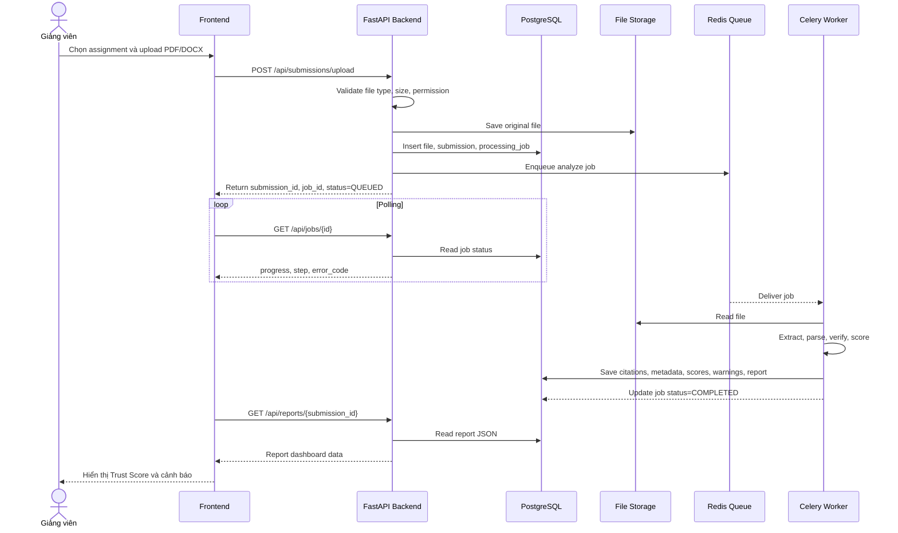

# D13. Upload & Async Analysis Sequence

```mermaid
sequenceDiagram
    actor L as Giảng viên
    participant FE as Frontend
    participant API as FastAPI Backend
    participant DB as PostgreSQL
    participant ST as File Storage
    participant Q as Redis Queue
    participant W as Celery Worker

    L->>FE: Chọn assignment và upload PDF/DOCX
    FE->>API: POST /api/submissions/upload
    API->>API: Validate file type, size, permission
    API->>ST: Save original file
    API->>DB: Insert file, submission, processing_job
    API->>Q: Enqueue analyze job
    API-->>FE: Return submission_id, job_id, status=QUEUED

    loop Polling
        FE->>API: GET /api/jobs/{id}
        API->>DB: Read job status
        API-->>FE: progress, step, error_code
    end

    Q-->>W: Deliver job
    W->>ST: Read file
    W->>W: Extract, parse, verify, score
    W->>DB: Save citations, metadata, scores, warnings, report
    W-->>DB: Update job status=COMPLETED

    FE->>API: GET /api/reports/{submission_id}
    API->>DB: Read report JSON
    API-->>FE: Report dashboard data
    FE-->>L: Hiển thị Trust Score và cảnh báo
```