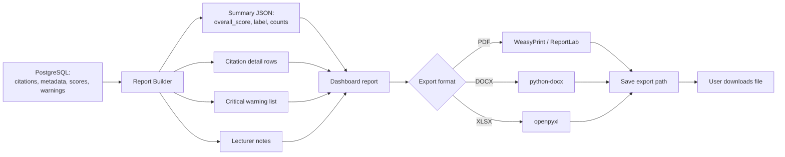

# D22. Report Generation & Export

```mermaid
flowchart LR
    DB["PostgreSQL:<br/>citations, metadata, scores, warnings"] --> Builder["Report Builder"]
    Builder --> Summary["Summary JSON:<br/>overall_score, label, counts"]
    Builder --> Detail["Citation detail rows"]
    Builder --> Warnings["Critical warning list"]
    Builder --> Notes["Lecturer notes"]

    Summary --> Dashboard["Dashboard report"]
    Detail --> Dashboard
    Warnings --> Dashboard
    Notes --> Dashboard

    Dashboard --> ExportChoice{"Export format"}
    ExportChoice -- "PDF" --> PDF["WeasyPrint / ReportLab"]
    ExportChoice -- "DOCX" --> DOCX["python-docx"]
    ExportChoice -- "XLSX" --> XLSX["openpyxl"]

    PDF --> ST["Save export path"]
    DOCX --> ST
    XLSX --> ST
    ST --> Download["User downloads file"]
```