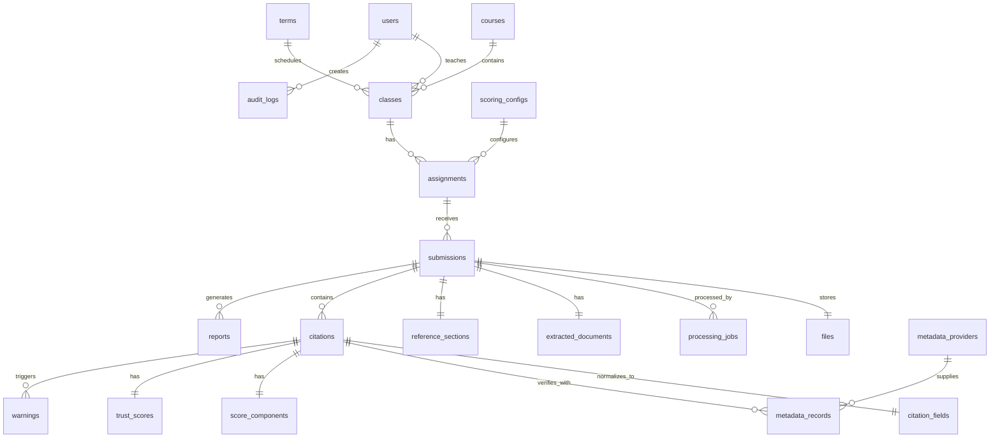

# D23. Entity Relationship Diagram

```mermaid
erDiagram
    users ||--o{ classes : teaches
    users ||--o{ audit_logs : creates
    courses ||--o{ classes : contains
    terms ||--o{ classes : schedules
    classes ||--o{ assignments : has
    assignments ||--o{ submissions : receives
    scoring_configs ||--o{ assignments : configures
    submissions ||--|| files : stores
    submissions ||--o{ processing_jobs : processed_by
    submissions ||--|| extracted_documents : has
    submissions ||--|| reference_sections : has
    submissions ||--o{ citations : contains
    citations ||--|| citation_fields : normalizes_to
    citations ||--o{ metadata_records : verifies_with
    citations ||--|| score_components : has
    citations ||--|| trust_scores : has
    citations ||--o{ warnings : triggers
    submissions ||--o{ reports : generates
    metadata_providers ||--o{ metadata_records : supplies
```

```mermaid
erDiagram 
	users {
        uuid id PK
        string email UK
        string full_name
        string role
        string password_hash
        boolean is_active
        datetime created_at
    }

    courses {
        uuid id PK
        string code
        string name
        text description
    }

    classes {
        uuid id PK
        uuid course_id FK
        uuid term_id FK
        uuid lecturer_id FK
        string class_code
        string name
    }

    assignments {
        uuid id PK
        uuid class_id FK
        string title
        datetime due_date
        string required_style
        uuid scoring_config_id FK
    }

    submissions {
        uuid id PK
        uuid assignment_id FK
        string owner_label
        uuid file_id FK
        string status
        float overall_score
    }

    files {
        uuid id PK
        string original_name
        string stored_path
        string mime_type
        integer size_bytes
        string checksum
        uuid uploaded_by FK
    }

    processing_jobs {
        uuid id PK
        uuid submission_id FK
        string status
        integer progress
        string error_code
        datetime started_at
        datetime finished_at
    }

    citations {
        uuid id PK
        uuid submission_id FK
        text raw_text
        integer order_index
        float confidence
        uuid duplicate_of
    }

    citation_fields {
        uuid citation_id PK
        string title
        string authors
        integer year
        string doi
        string url
        string venue
        string publisher
        string style_detected
    }

    metadata_records {
        uuid id PK
        uuid citation_id FK
        uuid metadata_provider_id FK
        string provider
        string match_status
        float confidence
        json raw_json
        json normalized_json
    }

    score_components {
        uuid citation_id PK
        float format_score
        float existence_score
        float credibility_score
        float recency_score
        float relevance_score
    }

    trust_scores {
        uuid id PK
        uuid citation_id FK
        uuid submission_id FK
        float score
        string label
        string config_version
        text explanation
    }

    warnings {
        uuid id PK
        uuid citation_id FK
        uuid submission_id FK
        string code
        string severity
        text message
        text suggested_action
    }

    reports {
        uuid id PK
        uuid submission_id FK
        datetime generated_at
        uuid generated_by FK
        json summary_json
        json export_paths
    }
```