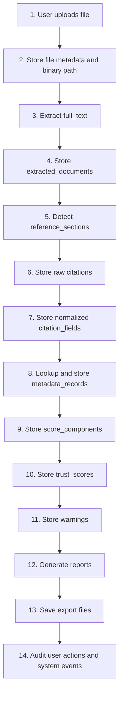

# D24. Data Lifecycle

```mermaid
flowchart TD
    A["1. User uploads file"] --> B["2. Store file metadata and binary path"]
    B --> C["3. Extract full_text"]
    C --> D["4. Store extracted_documents"]
    D --> E["5. Detect reference_sections"]
    E --> F["6. Store raw citations"]
    F --> G["7. Store normalized citation_fields"]
    G --> H["8. Lookup and store metadata_records"]
    H --> I["9. Store score_components"]
    I --> J["10. Store trust_scores"]
    J --> K["11. Store warnings"]
    K --> L["12. Generate reports"]
    L --> M["13. Save export files"]
    M --> N["14. Audit user actions and system events"]
```
