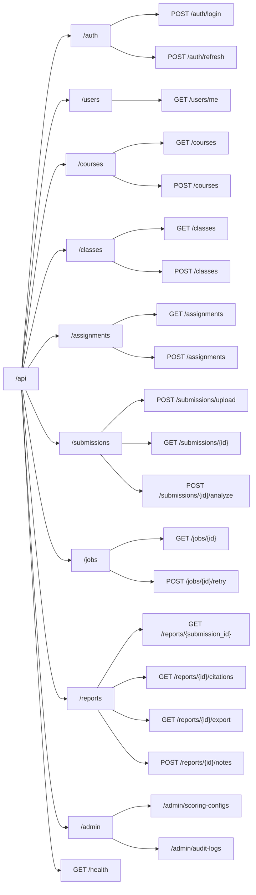

# D25. API Resource Map

```mermaid
flowchart LR
    API["/api"] --> Auth["/auth"]
    Auth --> Login["POST /auth/login"]
    Auth --> Refresh["POST /auth/refresh"]

    API --> Users["/users"]
    Users --> Me["GET /users/me"]

    API --> Courses["/courses"]
    Courses --> GetCourses["GET /courses"]
    Courses --> PostCourses["POST /courses"]

    API --> Classes["/classes"]
    Classes --> GetClasses["GET /classes"]
    Classes --> PostClasses["POST /classes"]

    API --> Assignments["/assignments"]
    Assignments --> GetAssignments["GET /assignments"]
    Assignments --> PostAssignments["POST /assignments"]

    API --> Submissions["/submissions"]
    Submissions --> Upload["POST /submissions/upload"]
    Submissions --> GetSubmission["GET /submissions/{id}"]
    Submissions --> Analyze["POST /submissions/{id}/analyze"]

    API --> Jobs["/jobs"]
    Jobs --> GetJob["GET /jobs/{id}"]
    Jobs --> RetryJob["POST /jobs/{id}/retry"]

    API --> Reports["/reports"]
    Reports --> GetReport["GET /reports/{submission_id}"]
    Reports --> Citations["GET /reports/{id}/citations"]
    Reports --> Export["GET /reports/{id}/export"]
    Reports --> Notes["POST /reports/{id}/notes"]

    API --> Admin["/admin"]
    Admin --> Scoring["/admin/scoring-configs"]
    Admin --> Audit["/admin/audit-logs"]
    API --> Health["GET /health"]
```