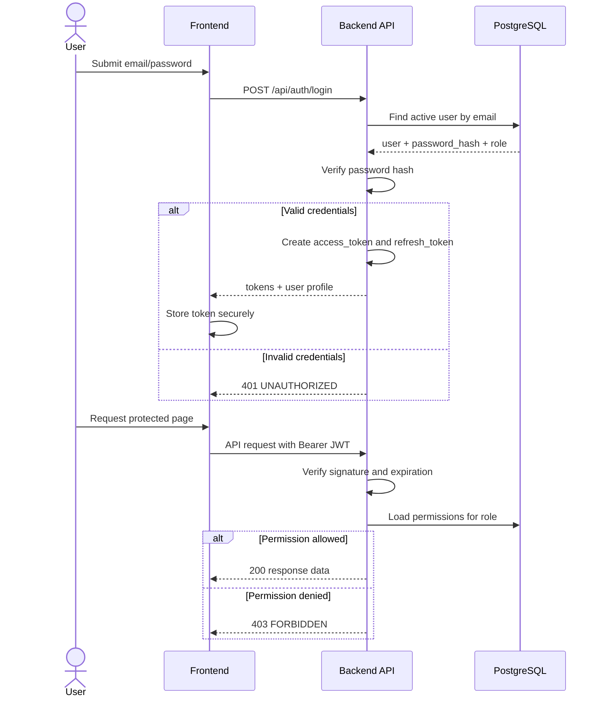

# D26. Authentication & Authorization Flow

```mermaid
sequenceDiagram
    actor U as User
    participant FE as Frontend
    participant API as Backend API
    participant DB as PostgreSQL

    U->>FE: Submit email/password
    FE->>API: POST /api/auth/login
    API->>DB: Find active user by email
    DB-->>API: user + password_hash + role
    API->>API: Verify password hash
    alt Valid credentials
        API->>API: Create access_token and refresh_token
        API-->>FE: tokens + user profile
        FE->>FE: Store token securely
    else Invalid credentials
        API-->>FE: 401 UNAUTHORIZED
    end

    U->>FE: Request protected page
    FE->>API: API request with Bearer JWT
    API->>API: Verify signature and expiration
    API->>DB: Load permissions for role
    alt Permission allowed
        API-->>FE: 200 response data
    else Permission denied
        API-->>FE: 403 FORBIDDEN
    end
```