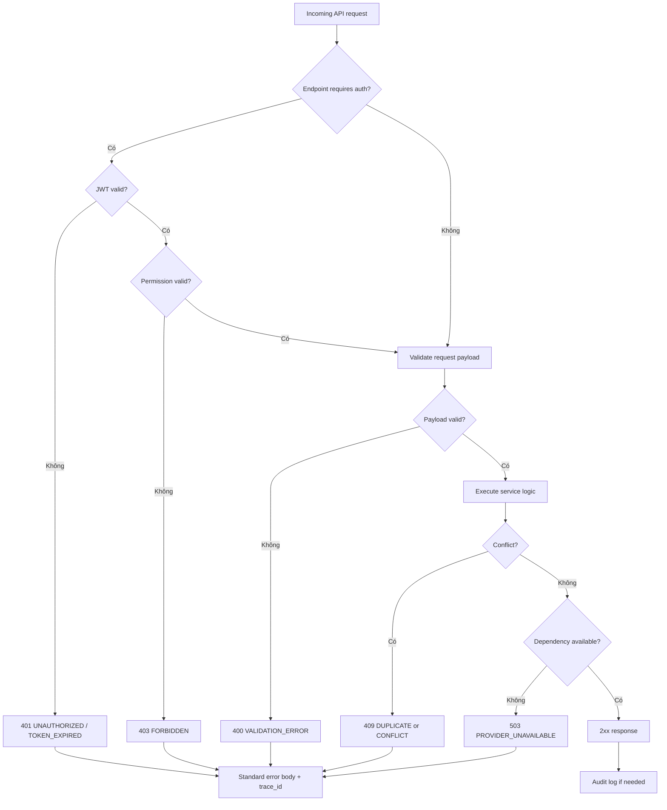

# D27. API Error Handling Flow

![[D27-API-error-handling-flow.png]]

```mermaid
flowchart TD
    Req["Incoming API request"] --> Auth{"Endpoint requires auth?"}
    Auth -- "Có" --> Token{"JWT valid?"}
    Token -- "Không" --> E401["401 UNAUTHORIZED / TOKEN_EXPIRED"]
    Token -- "Có" --> Perm{"Permission valid?"}
    Auth -- "Không" --> Validate
    Perm -- "Không" --> E403["403 FORBIDDEN"]
    Perm -- "Có" --> Validate["Validate request payload"]

    Validate --> Valid{"Payload valid?"}
    Valid -- "Không" --> E400["400 VALIDATION_ERROR"]
    Valid -- "Có" --> Execute["Execute service logic"]

    Execute --> Conflict{"Conflict?"}
    Conflict -- "Có" --> E409["409 DUPLICATE or CONFLICT"]
    Conflict -- "Không" --> Dependency{"Dependency available?"}
    Dependency -- "Không" --> E503["503 PROVIDER_UNAVAILABLE"]
    Dependency -- "Có" --> Success["2xx response"]

    E401 --> ErrorBody["Standard error body + trace_id"]
    E403 --> ErrorBody
    E400 --> ErrorBody
    E409 --> ErrorBody
    E503 --> ErrorBody
    Success --> Audit["Audit log if needed"]
```