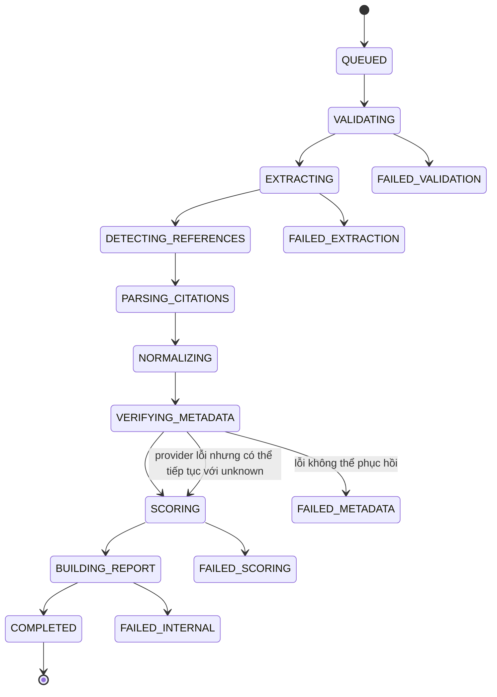

# TrustLens Backend P0 Remediation Plan v1.0

> **Mục tiêu:** sửa các lỗi P0 để backend TrustLens đạt mức MVP end-to-end có thể nghiệm thu theo SRS: upload → tạo job → xử lý bất đồng bộ → chấm Trust Score C1–C8 → sinh report thật → xuất PDF → kiểm soát JWT/RBAC/ownership → có integration test.
>
> **Đối tượng sử dụng:** Backend Developer, BA/AI-NLP Owner, Frontend Developer, QA.
>
> **Phạm vi:** backend và API contract. Frontend chỉ được đề cập ở mức thay đổi tích hợp bắt buộc.
>
> **Nguồn chuẩn:**
>
> - `SRS/2. Overall Description.md`
> - `SRS/3. Spcific Requirements.md`
> - `TrustLens_Trust_Score_Specification_v1.0.md`
> - `TrustLens_Evaluation_Criteria_v1.0.md`
> - `TrustLens_Diagrams_v1.0.md`

---

## 1. Kết quả bắt buộc sau khi hoàn tất P0

P0 chỉ được xem là hoàn tất khi đáp ứng đồng thời các điều kiện sau:

1. Frontend chỉ cần gọi **một endpoint phân tích** sau khi upload.
2. Endpoint phân tích trả về `job_id` trong thời gian mục tiêu `<= 5 giây`.
3. Pipeline chạy ngoài request HTTP và cập nhật trạng thái thực vào database.
4. Frontend có thể polling `GET /jobs/{job_id}` để đọc tiến độ thật.
5. Report sử dụng đúng mô hình Trust Score C1–C8, không còn công thức 40/30/30.
6. Kết quả không tự động thay bằng mock khi backend lỗi trong môi trường demo/staging.
7. Có report thật theo `submission_id` hoặc `report_id`.
8. Xuất được tối thiểu PDF.
9. Mọi endpoint nghiệp vụ kiểm tra JWT, role và ownership ở backend.
10. Có integration test chạy trọn luồng upload → analyze → report.
11. Có ít nhất một file PDF và một file DOCX mẫu chạy thành công.
12. Pipeline không trả kết luận tuyệt đối khi metadata thiếu hoặc provider lỗi.

---

## 2. Các quyết định kiến trúc phải khóa trước khi code

### 2.1. Nguồn sự thật duy nhất cho Trust Score

`TrustLens_Trust_Score_Specification_v1.0.md` là nguồn chuẩn cho công thức điểm.

Backend phải triển khai tám thành phần:

| Mã | Thành phần | Trọng số tối đa |
|---|---|---:|
| C1 | Metadata Completeness | 10 |
| C2 | Metadata Verification | 20 |
| C3 | Source Credibility | 20 |
| C4 | Relevance | 20 |
| C5 | Recency | 10 |
| C6 | Citation Quality | 10 |
| C7 | Source Diversity Contribution | 5 |
| C8 | Academic Risk Integrity | 5 |
|  | **Tổng** | **100** |

Công thức cấp tài liệu:

```text
Reference_Trust_Score = C1 + C2 + C3 + C4 + C5 + C6 + C7 + C8
```

Công thức cấp báo cáo:

```text
Report_Trust_Score =
    clamp(
        Weighted_Average(Reference_Trust_Score_i) - Report_Penalty,
        0,
        100
    )
```

**Quy tắc khóa:**

- Không dùng ba trọng số `40% / 30% / 30%`.
- Không đổi trọng số trong code rải rác.
- Mọi cấu hình điểm phải nằm trong một object có `version`.
- Report phải lưu `scoring_config_version`.
- `Trust Score` và `Confidence Score` là hai giá trị khác nhau.
- Không dùng `not_found` như bằng chứng chắc chắn rằng nguồn giả.

---

### 2.2. Một endpoint orchestration duy nhất

Frontend không được gọi tuần tự:

```text
analyze
→ detect-references
→ parse-citations
→ verify-metadata
```

Thay bằng:

```http
POST /api/v1/submissions/{submission_id}/analyze
```

Backend tự điều phối toàn bộ pipeline.

Các endpoint theo từng stage chỉ được giữ lại nếu phục vụ debug nội bộ và phải:

- Không xuất hiện trong flow production.
- Bảo vệ bằng quyền admin/internal.
- Không được frontend gọi trực tiếp.

---

### 2.3. Mô hình xử lý bất đồng bộ

Kiến trúc mục tiêu:

```text
Frontend
   |
   | POST /submissions/{id}/analyze
   v
FastAPI
   |
   | create Job = QUEUED
   | enqueue task
   v
Redis
   |
   v
Celery Worker
   |
   | validate
   | extract
   | detect references
   | parse
   | normalize
   | verify metadata
   | score
   | build report
   v
PostgreSQL + File Storage
```

Công nghệ baseline:

- FastAPI
- SQLAlchemy
- Alembic
- PostgreSQL
- Redis
- Celery
- PyMuPDF / pdfplumber / python-docx
- WeasyPrint hoặc ReportLab cho PDF

**Phương án local miễn phí:**

- PostgreSQL và Redis chạy bằng Docker Compose.
- Backend và worker chạy local.
- Không phụ thuộc dịch vụ trả phí.

---

## 3. Bổ sung yêu cầu còn thiếu FR-21 đến FR-28

Đưa bảng sau vào SRS để loại bỏ khoảng trống từ FR-20 đến FR-29.

| ID | Tên yêu cầu | Mô tả | Tiêu chí nghiệm thu |
|---|---|---|---|
| FR-21 | Tính Metadata Completeness | Chấm C1 dựa trên các trường tác giả, năm, tiêu đề, venue, DOI/URL và các trường bắt buộc theo loại nguồn | Mỗi citation có `c1_score`, danh sách trường thiếu và explanation |
| FR-22 | Tính Metadata Verification | Chấm C2 dựa trên mức độ khớp DOI/title/author/year với metadata provider | Có `match_status`, `match_confidence`, evidence và C2 |
| FR-23 | Tính Source Credibility | Chấm C3 theo loại nguồn, venue, publisher, domain và tín hiệu học thuật | Có `source_type`, credibility evidence và C3 |
| FR-24 | Tính Relevance | Chấm C4 bằng similarity giữa chủ đề/nội dung báo cáo với title/abstract của tài liệu | Có similarity, confidence, label và C4 |
| FR-25 | Tính Recency | Chấm C5 theo tuổi tài liệu và ngưỡng lĩnh vực | Có age, threshold, explanation và C5 |
| FR-26 | Tính Citation Quality | Chấm C6 theo citation style, cấu trúc trường và tính nhất quán | Có detected style, expected style, violations và C6 |
| FR-27 | Tính Diversity và Academic Risk | Chấm C7–C8 dựa trên độ đa dạng nguồn và cờ rủi ro học thuật | Có C7, C8, risk flags và explanation |
| FR-28 | Tổng hợp Trust Score | Tính điểm cấp citation và cấp report, sinh label, warning và confidence | Report có C1–C8, `reference_trust_score`, `report_trust_score`, penalty, label, confidence và config version |

---

## 4. State machine chuẩn cho Job

### 4.1. Trạng thái

```python
class JobStatus(str, Enum):
    QUEUED = "queued"
    VALIDATING = "validating"
    EXTRACTING = "extracting"
    DETECTING_REFERENCES = "detecting_references"
    PARSING_CITATIONS = "parsing_citations"
    NORMALIZING = "normalizing"
    VERIFYING_METADATA = "verifying_metadata"
    SCORING = "scoring"
    BUILDING_REPORT = "building_report"
    COMPLETED = "completed"
    FAILED_VALIDATION = "failed_validation"
    FAILED_EXTRACTION = "failed_extraction"
    FAILED_METADATA = "failed_metadata"
    FAILED_SCORING = "failed_scoring"
    FAILED_INTERNAL = "failed_internal"
    CANCELLED = "cancelled"
```

### 4.2. Chuyển trạng thái



### 4.3. Progress chuẩn

| Stage | Progress |
|---|---:|
| queued | 0 |
| validating | 5 |
| extracting | 15 |
| detecting_references | 30 |
| parsing_citations | 40 |
| normalizing | 50 |
| verifying_metadata | 60–75 |
| scoring | 80 |
| building_report | 90 |
| completed | 100 |

Progress không được giả lập bằng timer phía frontend.

---

## 5. API contract chuẩn P0

Tất cả endpoint nghiệp vụ dùng prefix:

```text
/api/v1
```

Tất cả endpoint, trừ login và health check, yêu cầu:

```http
Authorization: Bearer <access_token>
```

---

### 5.1. Upload submission

```http
POST /api/v1/submissions/upload
Content-Type: multipart/form-data
```

Fields:

```text
assignment_id: UUID
owner_label: string
file: PDF | DOCX
```

Response:

```json
{
  "submission_id": "8b94d81f-7afd-45d1-86f8-b326a830b714",
  "file_id": "37929ce6-95fd-48e6-92ad-b32f33e1552e",
  "status": "uploaded",
  "file": {
    "name": "report.pdf",
    "mime_type": "application/pdf",
    "size_bytes": 1283910,
    "checksum_sha256": "..."
  }
}
```

Backend bắt buộc kiểm tra lại:

- Extension.
- MIME sniffing.
- Dung lượng tối đa.
- File có thể mở.
- PDF có encryption hay không.
- PDF có text layer hay không.
- Checksum SHA-256.
- Quyền truy cập assignment.
- Path lưu file không đoán được.
- Không dùng tên file gốc làm tên lưu vật lý.

---

### 5.2. Khởi tạo phân tích

```http
POST /api/v1/submissions/{submission_id}/analyze
```

Response `202 Accepted`:

```json
{
  "job_id": "0baea4ca-66e1-4987-b3ae-149f9bdac68a",
  "submission_id": "8b94d81f-7afd-45d1-86f8-b326a830b714",
  "status": "queued",
  "progress": 0,
  "created_at": "2026-06-19T10:30:00Z"
}
```

Quy tắc:

- Nếu submission đang có job active, trả job hiện tại thay vì tạo trùng.
- Nếu report đã hoàn tất và không yêu cầu re-run, trả `409 ANALYSIS_ALREADY_COMPLETED`.
- Nếu file chưa hợp lệ, trả `422 FILE_NOT_READY`.
- Nếu user không sở hữu assignment, trả `403 FORBIDDEN_RESOURCE`.

---

### 5.3. Đọc trạng thái job

```http
GET /api/v1/jobs/{job_id}
```

Response:

```json
{
  "job_id": "0baea4ca-66e1-4987-b3ae-149f9bdac68a",
  "submission_id": "8b94d81f-7afd-45d1-86f8-b326a830b714",
  "status": "verifying_metadata",
  "progress": 68,
  "current_step": "metadata_verification",
  "started_at": "2026-06-19T10:30:02Z",
  "updated_at": "2026-06-19T10:30:27Z",
  "completed_at": null,
  "report_id": null,
  "error": null
}
```

Response khi lỗi:

```json
{
  "job_id": "0baea4ca-66e1-4987-b3ae-149f9bdac68a",
  "status": "failed_extraction",
  "progress": 15,
  "error": {
    "error_code": "PDF_HAS_NO_TEXT_LAYER",
    "message": "PDF không có lớp văn bản và OCR chưa được hỗ trợ trong MVP.",
    "details": {
      "page_count": 12
    },
    "retryable": false
  }
}
```

---

### 5.4. Retry job

```http
POST /api/v1/jobs/{job_id}/retry
```

P0 có thể giới hạn retry cho lỗi:

- Metadata provider timeout.
- Network failure.
- Temporary worker failure.

Không retry tự động cho:

- File không hợp lệ.
- PDF mã hóa.
- Không có reference section nếu business rule quyết định dừng.
- Payload không hợp lệ.

Response:

```json
{
  "job_id": "new-job-uuid",
  "retry_of_job_id": "old-job-uuid",
  "status": "queued"
}
```

---

### 5.5. Đọc report

Ưu tiên hai endpoint:

```http
GET /api/v1/reports/{report_id}
```

và:

```http
GET /api/v1/submissions/{submission_id}/report
```

Response canonical:

```json
{
  "report_id": "uuid",
  "submission_id": "uuid",
  "job_id": "uuid",
  "scoring_config_version": "trust-score-v1.0",
  "report_trust_score": 78.5,
  "confidence_score": 0.82,
  "overall_label": "needs_review",
  "summary": {
    "total_citations": 24,
    "verified": 18,
    "partial": 3,
    "not_found": 2,
    "unknown": 1,
    "critical_warnings": 2,
    "high_warnings": 3,
    "medium_warnings": 4,
    "low_warnings": 5
  },
  "report_penalty": {
    "total": 3.5,
    "items": [
      {
        "code": "EXCESSIVE_UNVERIFIED_RATIO",
        "value": 3.5,
        "explanation": "Tỷ lệ nguồn chưa xác minh vượt ngưỡng cấu hình."
      }
    ]
  },
  "component_summary": {
    "c1_metadata_completeness": 8.4,
    "c2_metadata_verification": 16.2,
    "c3_source_credibility": 15.6,
    "c4_relevance": 15.0,
    "c5_recency": 7.8,
    "c6_citation_quality": 8.0,
    "c7_source_diversity": 3.8,
    "c8_academic_risk_integrity": 4.2
  },
  "citations": [
    {
      "citation_id": "uuid",
      "raw_text": "...",
      "normalized_fields": {
        "title": "...",
        "authors": ["..."],
        "year": 2023,
        "doi": "10.xxxx/...",
        "url": null,
        "venue": "..."
      },
      "metadata": {
        "provider": "crossref",
        "match_status": "verified",
        "match_confidence": 0.94,
        "source_type": "journal",
        "evidence": {
          "title_similarity": 0.97,
          "author_match": true,
          "year_match": true,
          "doi_match": true
        }
      },
      "scores": {
        "c1": 9.0,
        "c2": 20.0,
        "c3": 17.0,
        "c4": 15.0,
        "c5": 8.0,
        "c6": 9.0,
        "c7": 4.0,
        "c8": 5.0,
        "reference_trust_score": 87.0,
        "confidence_score": 0.94
      },
      "warnings": [
        {
          "code": "STYLE_MINOR_ERROR",
          "severity": "low",
          "message": "Thiếu DOI ở cuối citation.",
          "evidence": {
            "expected_style": "apa7"
          },
          "recommendation": "Bổ sung DOI ở cuối mục tài liệu tham khảo."
        }
      ]
    }
  ],
  "created_at": "2026-06-19T10:31:12Z"
}
```

---

### 5.6. Export PDF

```http
POST /api/v1/reports/{report_id}/exports
```

Request:

```json
{
  "format": "pdf",
  "include_raw_citation": true,
  "include_teacher_notes": false
}
```

Response:

```json
{
  "export_id": "uuid",
  "format": "pdf",
  "status": "completed",
  "download_url": "/api/v1/report-exports/uuid/download",
  "created_at": "2026-06-19T10:35:00Z"
}
```

Download:

```http
GET /api/v1/report-exports/{export_id}/download
```

Backend phải kiểm tra ownership trước khi trả file.

---

## 6. Error response chuẩn

Tất cả lỗi phải có cùng cấu trúc:

```json
{
  "error_code": "FILE_TOO_LARGE",
  "message": "Dung lượng file vượt quá giới hạn 20 MB.",
  "details": {
    "max_bytes": 20971520,
    "actual_bytes": 25165824
  },
  "request_id": "uuid"
}
```

Danh sách mã lỗi tối thiểu:

| HTTP | Error code |
|---:|---|
| 400 | INVALID_REQUEST |
| 401 | UNAUTHORIZED |
| 403 | FORBIDDEN_RESOURCE |
| 404 | SUBMISSION_NOT_FOUND |
| 404 | JOB_NOT_FOUND |
| 404 | REPORT_NOT_FOUND |
| 409 | ANALYSIS_ALREADY_RUNNING |
| 409 | ANALYSIS_ALREADY_COMPLETED |
| 413 | FILE_TOO_LARGE |
| 415 | UNSUPPORTED_FILE_TYPE |
| 422 | FILE_CORRUPTED |
| 422 | FILE_ENCRYPTED |
| 422 | PDF_HAS_NO_TEXT_LAYER |
| 422 | NO_REFERENCE_SECTION |
| 429 | RATE_LIMITED |
| 502 | METADATA_PROVIDER_UNAVAILABLE |
| 500 | INTERNAL_ERROR |

---

## 7. Data model tối thiểu

### 7.1. Bảng `submissions`

```text
id UUID PK
assignment_id UUID FK
owner_label VARCHAR
uploaded_by UUID FK users
status VARCHAR
created_at TIMESTAMP
updated_at TIMESTAMP
deleted_at TIMESTAMP NULL
```

### 7.2. Bảng `files`

```text
id UUID PK
submission_id UUID FK UNIQUE
original_name VARCHAR
storage_path VARCHAR UNIQUE
mime_type VARCHAR
size_bytes BIGINT
checksum_sha256 CHAR(64)
page_count INT NULL
has_text_layer BOOLEAN NULL
is_encrypted BOOLEAN NULL
created_at TIMESTAMP
```

Indexes:

```text
UNIQUE(checksum_sha256, assignment_id) hoặc business rule tương đương
INDEX(submission_id)
```

### 7.3. Bảng `analysis_jobs`

```text
id UUID PK
submission_id UUID FK
status VARCHAR
progress INT
current_step VARCHAR
retry_of_job_id UUID NULL
error_code VARCHAR NULL
error_message TEXT NULL
error_details JSONB NULL
celery_task_id VARCHAR NULL
created_by UUID FK users
created_at TIMESTAMP
started_at TIMESTAMP NULL
updated_at TIMESTAMP
completed_at TIMESTAMP NULL
```

Constraint:

```text
0 <= progress <= 100
```

### 7.4. Bảng `citations`

```text
id UUID PK
submission_id UUID FK
ordinal INT
raw_text TEXT
page_number INT NULL
detected_style VARCHAR NULL
parse_confidence NUMERIC NULL
normalized_fields JSONB
duplicate_of UUID NULL
created_at TIMESTAMP
```

### 7.5. Bảng `citation_metadata`

```text
id UUID PK
citation_id UUID FK UNIQUE
provider VARCHAR
provider_record_id VARCHAR NULL
match_status VARCHAR
match_confidence NUMERIC
source_type VARCHAR
metadata JSONB
evidence JSONB
retrieved_at TIMESTAMP
```

### 7.6. Bảng `citation_scores`

```text
id UUID PK
citation_id UUID FK UNIQUE
scoring_config_version VARCHAR
c1 NUMERIC
c2 NUMERIC
c3 NUMERIC
c4 NUMERIC
c5 NUMERIC
c6 NUMERIC
c7 NUMERIC
c8 NUMERIC
reference_trust_score NUMERIC
confidence_score NUMERIC
explanations JSONB
created_at TIMESTAMP
```

Constraints:

```text
0 <= c1 <= 10
0 <= c2 <= 20
0 <= c3 <= 20
0 <= c4 <= 20
0 <= c5 <= 10
0 <= c6 <= 10
0 <= c7 <= 5
0 <= c8 <= 5
0 <= reference_trust_score <= 100
0 <= confidence_score <= 1
```

### 7.7. Bảng `reports`

```text
id UUID PK
submission_id UUID FK UNIQUE
job_id UUID FK
scoring_config_version VARCHAR
report_trust_score NUMERIC
confidence_score NUMERIC
overall_label VARCHAR
report_penalty NUMERIC
component_summary JSONB
summary JSONB
warnings JSONB
created_at TIMESTAMP
updated_at TIMESTAMP
```

### 7.8. Bảng `report_exports`

```text
id UUID PK
report_id UUID FK
format VARCHAR
storage_path VARCHAR
status VARCHAR
created_by UUID FK users
created_at TIMESTAMP
```

---

## 8. Cấu trúc thư mục backend đề xuất

```text
backend/
├── app/
│   ├── main.py
│   ├── core/
│   │   ├── config.py
│   │   ├── security.py
│   │   ├── errors.py
│   │   ├── logging.py
│   │   └── enums.py
│   ├── api/
│   │   ├── dependencies/
│   │   │   ├── auth.py
│   │   │   └── ownership.py
│   │   └── v1/
│   │       ├── auth.py
│   │       ├── submissions.py
│   │       ├── jobs.py
│   │       ├── reports.py
│   │       └── exports.py
│   ├── db/
│   │   ├── base.py
│   │   ├── session.py
│   │   └── models/
│   ├── schemas/
│   │   ├── submission.py
│   │   ├── job.py
│   │   ├── report.py
│   │   ├── score.py
│   │   └── error.py
│   ├── services/
│   │   ├── file_validation.py
│   │   ├── text_extraction.py
│   │   ├── reference_detection.py
│   │   ├── citation_parser.py
│   │   ├── citation_normalizer.py
│   │   ├── metadata/
│   │   │   ├── base.py
│   │   │   ├── crossref.py
│   │   │   ├── openalex.py
│   │   │   └── resolver.py
│   │   ├── relevance.py
│   │   ├── scoring.py
│   │   ├── report_builder.py
│   │   └── pdf_export.py
│   ├── tasks/
│   │   ├── celery_app.py
│   │   └── analysis.py
│   └── repositories/
│       ├── submissions.py
│       ├── jobs.py
│       ├── citations.py
│       └── reports.py
├── alembic/
├── tests/
│   ├── unit/
│   ├── integration/
│   └── fixtures/
├── sample_data/
├── docker-compose.yml
├── Dockerfile
├── requirements.txt
├── .env.example
└── README.md
```

Không đặt toàn bộ logic pipeline trong router hoặc một file `main.py`.

---

## 9. Skeleton triển khai FastAPI

### 9.1. Analyze endpoint

```python
from uuid import UUID

from fastapi import APIRouter, Depends, HTTPException, status
from sqlalchemy.orm import Session

from app.api.dependencies.auth import get_current_user
from app.api.dependencies.ownership import require_submission_access
from app.db.session import get_db
from app.schemas.job import JobResponse
from app.services.job_service import JobService
from app.tasks.analysis import run_analysis_pipeline

router = APIRouter(prefix="/submissions", tags=["submissions"])


@router.post(
    "/{submission_id}/analyze",
    response_model=JobResponse,
    status_code=status.HTTP_202_ACCEPTED,
)
def analyze_submission(
    submission_id: UUID,
    db: Session = Depends(get_db),
    current_user=Depends(get_current_user),
):
    submission = require_submission_access(
        db=db,
        submission_id=submission_id,
        current_user=current_user,
        write=True,
    )

    existing_job = JobService.get_active_job(
        db=db,
        submission_id=submission.id,
    )
    if existing_job:
        return existing_job

    if submission.status == "completed":
        raise HTTPException(
            status_code=409,
            detail={
                "error_code": "ANALYSIS_ALREADY_COMPLETED",
                "message": "Submission đã có report hoàn tất.",
                "details": {},
            },
        )

    job = JobService.create_queued_job(
        db=db,
        submission_id=submission.id,
        created_by=current_user.id,
    )

    task = run_analysis_pipeline.delay(str(job.id))
    JobService.attach_task_id(db=db, job_id=job.id, task_id=task.id)

    return job
```

### 9.2. Celery orchestration task

```python
from app.tasks.celery_app import celery_app
from app.db.session import SessionLocal
from app.services.pipeline import AnalysisPipeline


@celery_app.task(
    bind=True,
    autoretry_for=(ConnectionError, TimeoutError),
    retry_backoff=True,
    retry_kwargs={"max_retries": 3},
)
def run_analysis_pipeline(self, job_id: str):
    db = SessionLocal()
    try:
        pipeline = AnalysisPipeline(db=db, job_id=job_id)
        pipeline.run()
    except Exception:
        db.rollback()
        raise
    finally:
        db.close()
```

### 9.3. Pipeline service

```python
class AnalysisPipeline:
    def __init__(self, db, job_id: str):
        self.db = db
        self.job = JobRepository.get_for_update(db, job_id)

    def run(self) -> None:
        try:
            self._set_status("validating", 5)
            validated_file = file_validation.validate(self.job.submission.file)

            self._set_status("extracting", 15)
            document = text_extraction.extract(validated_file)

            self._set_status("detecting_references", 30)
            section = reference_detection.detect(document)

            self._set_status("parsing_citations", 40)
            parsed = citation_parser.parse(section)

            self._set_status("normalizing", 50)
            normalized = citation_normalizer.normalize_many(parsed)

            self._set_status("verifying_metadata", 60)
            verified = metadata_resolver.verify_many(
                normalized,
                progress_callback=self._metadata_progress,
            )

            self._set_status("scoring", 80)
            scored = scoring_service.score_submission(
                submission=self.job.submission,
                citations=verified,
                config_version="trust-score-v1.0",
            )

            self._set_status("building_report", 90)
            report = report_builder.build(
                submission=self.job.submission,
                scored_result=scored,
            )

            self._complete(report_id=report.id)

        except FileValidationError as exc:
            self._fail("failed_validation", exc)

        except ExtractionError as exc:
            self._fail("failed_extraction", exc)

        except MetadataFatalError as exc:
            self._fail("failed_metadata", exc)

        except ScoringError as exc:
            self._fail("failed_scoring", exc)

        except Exception as exc:
            self._fail("failed_internal", exc)
            raise
```

---

## 10. Ownership và RBAC bắt buộc

### 10.1. Quy tắc

Giảng viên được phép:

- Xem/sửa/xóa mềm lớp do mình phụ trách.
- Tạo assignment trong lớp của mình.
- Upload và phân tích submission thuộc assignment của lớp mình.
- Xem report và tải export của lớp mình.

Admin được phép:

- Truy cập toàn hệ thống.
- Quản lý user và cấu hình.

Sinh viên nếu chưa nằm trong MVP:

- Không cấp endpoint nghiệp vụ.
- Không để role tồn tại nhưng không được kiểm tra.

### 10.2. Dependency mẫu

```python
def require_submission_access(
    db: Session,
    submission_id: UUID,
    current_user: User,
    write: bool = False,
) -> Submission:
    submission = SubmissionRepository.get_with_assignment_and_class(
        db,
        submission_id,
    )

    if submission is None:
        raise NotFoundError("SUBMISSION_NOT_FOUND")

    if current_user.role == "admin":
        return submission

    lecturer_id = submission.assignment.classroom.lecturer_id

    if current_user.role != "lecturer" or lecturer_id != current_user.id:
        raise ForbiddenError(
            error_code="FORBIDDEN_RESOURCE",
            message="Bạn không có quyền truy cập submission này.",
        )

    return submission
```

**Không chấp nhận** kiểm soát quyền chỉ bằng cách ẩn nút ở frontend.

---

## 11. Validation file phía backend

### 11.1. Checklist

- [ ] Kiểm tra extension `.pdf`, `.docx`.
- [ ] Kiểm tra MIME bằng nội dung thực, không chỉ header client gửi.
- [ ] Giới hạn `20 MB`.
- [ ] Tính SHA-256.
- [ ] Lưu tên vật lý bằng UUID.
- [ ] Không lưu trong static public.
- [ ] Chặn path traversal.
- [ ] Không thực thi file.
- [ ] Với PDF: kiểm tra mở được, encryption, page count và text layer.
- [ ] Với DOCX: kiểm tra ZIP/container hợp lệ và đọc được bằng `python-docx`.
- [ ] Không log toàn bộ file content.
- [ ] Xóa file tạm khi validation thất bại.

### 11.2. Kết luận thận trọng

Khi PDF không có text layer:

```json
{
  "error_code": "PDF_HAS_NO_TEXT_LAYER",
  "message": "PDF không có lớp văn bản. OCR chưa được hỗ trợ trong MVP.",
  "details": {},
  "retryable": false
}
```

Không cố phân tích tiếp bằng dữ liệu rỗng.

---

## 12. Metadata resolver P0

### 12.1. Thứ tự

```text
1. DOI exact lookup
2. Title + author + year search
3. Fallback provider nếu provider chính lỗi
4. Nếu không đủ bằng chứng: UNKNOWN hoặc AMBIGUOUS
```

### 12.2. Trạng thái

```python
class MatchStatus(str, Enum):
    VERIFIED = "verified"
    PARTIAL = "partial"
    AMBIGUOUS = "ambiguous"
    NOT_FOUND = "not_found"
    UNKNOWN = "unknown"
```

Phân biệt:

- `NOT_FOUND`: provider hoạt động bình thường nhưng không tìm thấy candidate phù hợp.
- `UNKNOWN`: provider lỗi, timeout, rate limit hoặc dữ liệu không đủ để kết luận.
- `AMBIGUOUS`: có nhiều candidate gần nhau, chưa thể chọn chắc chắn.

### 12.3. Evidence tối thiểu

```json
{
  "title_similarity": 0.94,
  "author_match": true,
  "year_match": false,
  "doi_match": null,
  "candidate_count": 3
}
```

### 12.4. Timeout và retry

- Connect timeout: khoảng 3–5 giây.
- Read timeout: khoảng 10–15 giây.
- Retry có backoff.
- Thiếu citation count không được làm job thất bại.
- API key không commit vào repository.

---

## 13. Scoring service P0

### 13.1. Interface

```python
@dataclass
class CitationScoreResult:
    c1: float
    c2: float
    c3: float
    c4: float
    c5: float
    c6: float
    c7: float
    c8: float
    reference_trust_score: float
    confidence_score: float
    explanations: dict
    warnings: list[dict]


class TrustScoreService(Protocol):
    def score_citation(
        self,
        citation: NormalizedCitation,
        metadata: VerifiedMetadata,
        report_context: ReportContext,
        config: ScoringConfig,
    ) -> CitationScoreResult:
        ...
```

### 13.2. Invariants

```python
assert 0 <= c1 <= 10
assert 0 <= c2 <= 20
assert 0 <= c3 <= 20
assert 0 <= c4 <= 20
assert 0 <= c5 <= 10
assert 0 <= c6 <= 10
assert 0 <= c7 <= 5
assert 0 <= c8 <= 5

reference_trust_score = clamp(
    c1 + c2 + c3 + c4 + c5 + c6 + c7 + c8,
    0,
    100,
)
```

### 13.3. Confidence

Confidence phụ thuộc vào:

- Parse confidence.
- Metadata match confidence.
- Có abstract hay không.
- Provider availability.
- Số trường thiếu.
- Citation style detect confidence.

Không được tăng Trust Score chỉ vì confidence cao.

### 13.4. Fallback khi thiếu metadata

Ví dụ:

```text
Metadata provider timeout
→ match_status = unknown
→ C2 không được chấm như verified
→ confidence giảm
→ warning PROVIDER_UNAVAILABLE
→ report vẫn có thể hoàn thành nếu phần còn lại đủ dữ liệu
```

---

## 14. Report PDF P0

PDF tối thiểu gồm:

1. Tên hệ thống.
2. Lớp và assignment.
3. Tên file.
4. Ngày phân tích.
5. Report Trust Score.
6. Confidence Score.
7. Nhãn kết luận.
8. C1–C8.
9. Số citation theo trạng thái.
10. Danh sách cảnh báo nghiêm trọng.
11. Bảng chi tiết citation.
12. Evidence và recommendation ngắn.
13. Scoring config version.
14. Disclaimer: kết quả hỗ trợ thẩm định, không thay thế giảng viên.

Template không được chỉ hiển thị ba tiêu chí cũ.

---

## 15. Thay đổi bắt buộc phía frontend

### 15.1. Upload flow mới

```text
POST /submissions/upload
→ POST /submissions/{id}/analyze
→ nhận job_id
→ điều hướng /analyzing/{job_id}
→ polling GET /jobs/{job_id}
→ completed: điều hướng /report/{report_id}
→ failed: hiển thị error_code + message
```

### 15.2. Xóa flow gọi stage tuần tự

Xóa việc frontend gọi trực tiếp:

```text
detect-references
parse-citations
verify-metadata
```

### 15.3. Xóa progress timer

Màn hình analyzing phải lấy:

```text
status
progress
current_step
error
report_id
```

từ backend.

### 15.4. Tắt mock trong demo

Cấu hình:

```env
VITE_USE_MOCK=false
```

Trong staging/demo:

- API lỗi phải hiện error state.
- Report không được tự thay bằng `mockReport`.
- Dashboard không được fallback sang số liệu giả.
- Không dùng giá trị mặc định 78, 85, 60, 90 khi field backend thiếu.

---

## 16. Integration test tối thiểu

### 16.1. Happy path PDF

```text
Given:
- lecturer hợp lệ
- assignment thuộc lecturer
- PDF có text layer
- có reference section
- có DOI hợp lệ

When:
- upload
- analyze
- polling đến completed
- get report

Then:
- job progress = 100
- report tồn tại
- citations > 0
- report có C1–C8
- score nằm trong 0–100
- config version được lưu
```

### 16.2. Happy path DOCX

Tương tự PDF nhưng dùng file DOCX.

### 16.3. Unauthorized

```text
Không token
→ 401
```

### 16.4. Forbidden ownership

```text
Lecturer B truy cập submission của lecturer A
→ 403
```

### 16.5. Unsupported file

```text
Upload .exe đổi tên thành .pdf
→ 415 hoặc 422
```

### 16.6. PDF không text layer

```text
→ FAILED_VALIDATION hoặc FAILED_EXTRACTION
→ PDF_HAS_NO_TEXT_LAYER
```

### 16.7. Không có reference section

```text
→ NO_REFERENCE_SECTION
→ không sinh report giả có citation mock
```

### 16.8. Provider timeout

```text
→ retry/fallback
→ nếu vẫn lỗi: match_status unknown
→ job có thể hoàn thành với confidence thấp
```

### 16.9. Idempotency

```text
Gọi analyze hai lần khi job đang chạy
→ không tạo hai job active
```

### 16.10. Export PDF

```text
Report completed
→ create export
→ download PDF
→ content-type application/pdf
→ lecturer khác tải file → 403
```

---

## 17. Acceptance test matrix P0

| ID | Kiểm thử | Kết quả bắt buộc |
|---|---|---|
| P0-AT-01 | Login đúng | Có access token, refresh token |
| P0-AT-02 | API nghiệp vụ không token | 401 |
| P0-AT-03 | Truy cập dữ liệu lecturer khác | 403 |
| P0-AT-04 | Upload PDF hợp lệ | Có submission_id, checksum |
| P0-AT-05 | Upload DOCX hợp lệ | Có submission_id, checksum |
| P0-AT-06 | Upload file giả PDF | Bị từ chối |
| P0-AT-07 | Analyze | Trả 202 và job_id |
| P0-AT-08 | Polling job | Tiến độ phản ánh stage thật |
| P0-AT-09 | Job hoàn tất | Có report_id |
| P0-AT-10 | Report schema | Có C1–C8 và scoring version |
| P0-AT-11 | Metadata timeout | Không kết luận sai; dùng unknown |
| P0-AT-12 | No reference section | Có error_code rõ ràng |
| P0-AT-13 | Analyze trùng | Không tạo job active trùng |
| P0-AT-14 | Export PDF | Tải được file PDF thật |
| P0-AT-15 | Mock disabled | Backend lỗi không hiện dữ liệu giả |
| P0-AT-16 | End-to-end repeatability | Chạy demo thành công 3 lần liên tiếp |

---

## 18. Kế hoạch triển khai theo commit

### Commit 1 — Freeze contracts

```text
docs: define canonical async analysis and report contracts
```

Nội dung:

- Bổ sung FR-21–FR-28.
- Chốt report schema C1–C8.
- Chốt error model.
- Chốt job state machine.

### Commit 2 — Database migration

```text
feat(db): add analysis jobs, citations, scores and reports
```

Nội dung:

- Migration cho `files`.
- `analysis_jobs`.
- `citations`.
- `citation_metadata`.
- `citation_scores`.
- `reports`.
- `report_exports`.

### Commit 3 — Upload hardening

```text
feat(upload): validate file content, checksum and ownership
```

### Commit 4 — Queue infrastructure

```text
feat(queue): add celery redis worker and job tracking
```

### Commit 5 — Pipeline orchestration

```text
feat(analysis): orchestrate extraction metadata scoring and report
```

### Commit 6 — Trust Score C1–C8

```text
feat(scoring): implement versioned trust score v1
```

### Commit 7 — Report API

```text
feat(report): expose canonical report response
```

### Commit 8 — PDF export

```text
feat(export): generate and secure report PDF
```

### Commit 9 — RBAC and ownership

```text
fix(security): enforce server-side role and resource ownership
```

### Commit 10 — Integration tests

```text
test(e2e): cover upload analyze report and export
```

### Commit 11 — Remove demo mocks

```text
fix(frontend): poll real jobs and disable mock fallbacks
```

---

## 19. Phân công đề xuất

| Hạng mục | Owner chính | Reviewer |
|---|---|---|
| API contract và FR-21–FR-28 | BA/AI-NLP | BE, FE |
| DB schema, Alembic | BE | BA |
| Upload validation | BE | QA |
| Celery/Redis/job state | BE | FE |
| Metadata resolver | BE + AI/NLP | BA |
| C1–C8 scoring | AI/NLP + BE | BA |
| Report schema | BE | FE, BA |
| PDF export | BE | QA |
| RBAC/ownership | BE | QA |
| FE polling và bỏ mock | FE | BE |
| Integration test | BE + QA | BA |

---

## 20. Definition of Done P0

### Backend

- [ ] `POST /submissions/{id}/analyze` trả `202`.
- [ ] Có `job_id`.
- [ ] Job chạy ngoài HTTP request.
- [ ] Có trạng thái thực trong database.
- [ ] Có polling endpoint.
- [ ] Có retry hợp lệ.
- [ ] Không tạo job active trùng.
- [ ] File được validate phía server.
- [ ] File có checksum.
- [ ] Có extraction PDF và DOCX.
- [ ] Có reference detection.
- [ ] Có citation parsing và normalization.
- [ ] Có metadata verification.
- [ ] Có C1–C8.
- [ ] Có report-level score.
- [ ] Có confidence.
- [ ] Có warning evidence.
- [ ] Có report API.
- [ ] Có PDF export.
- [ ] Có JWT.
- [ ] Có server-side RBAC.
- [ ] Có ownership check.
- [ ] Có standardized error response.
- [ ] Không commit secret.

### Frontend integration

- [ ] Không gọi từng stage endpoint.
- [ ] Không dùng timer giả cho progress.
- [ ] Không fallback mock ở demo/staging.
- [ ] Không hard-code score 78/85/60/90.
- [ ] Hiển thị lỗi backend theo `error_code`.
- [ ] Render C1–C8.
- [ ] Tải PDF từ endpoint thật.

### QA

- [ ] Test PDF.
- [ ] Test DOCX.
- [ ] Test file giả mạo.
- [ ] Test file quá 20 MB.
- [ ] Test PDF scan/no text.
- [ ] Test không có references.
- [ ] Test provider timeout.
- [ ] Test ownership.
- [ ] Test analyze trùng.
- [ ] Test export.
- [ ] Chạy end-to-end 3 lần liên tiếp.

---

## 21. Các việc không thuộc P0

Chuyển sang P1/P2 nếu thời gian giới hạn:

- Export DOCX/XLSX.
- OCR cho PDF scan.
- WebSocket realtime.
- Admin scoring UI hoàn chỉnh.
- Student portal.
- Provider analytics nâng cao.
- Full plagiarism detection.
- In-text citation alignment.
- Tự động đánh giá predatory journal ở mức pháp lý.
- Monitoring production nâng cao.
- Autoscaling worker.

Không đưa các hạng mục này vào P0 nếu làm chậm pipeline end-to-end.

---

## 22. Thứ tự ưu tiên khi thời gian rất ngắn

Nếu chỉ còn ít thời gian trước demo, triển khai theo thứ tự:

1. Chốt report schema C1–C8.
2. Làm `POST analyze` và `GET job`.
3. Chạy worker thật.
4. Upload validation phía backend.
5. Pipeline PDF/DOCX.
6. Report API thật.
7. Bỏ mock fallback.
8. PDF export.
9. RBAC/ownership.
10. Integration test và chạy demo ba lần.

Không ưu tiên mở rộng UI trước khi luồng backend thật hoạt động.

---

## 23. Tiêu chí quyết định “được phép demo”

Sản phẩm chỉ được chuyển sang trạng thái **Demo Ready** khi:

```text
- File mẫu upload thành công.
- Job state thay đổi theo backend thật.
- Có ít nhất một metadata lookup thật.
- Có C1–C8.
- Có report thật.
- Có PDF thật.
- Không dùng mock.
- Không lộ secret.
- Lecturer khác không xem được report.
- Demo chạy thành công 3 lần liên tiếp.
```

Nếu một trong các điều kiện trên chưa đạt, phải ghi rõ là giới hạn prototype, không trình bày như chức năng đã hoàn thiện.

---

## 24. Ghi chú cuối

P0 không nhằm hoàn thiện toàn bộ SRS. P0 nhằm tạo một **vertical slice đáng tin cậy**:

```text
Upload thật
→ xử lý thật
→ trạng thái thật
→ điểm thật theo đặc tả
→ report thật
→ export thật
→ kiểm soát quyền thật
```

Một hệ thống có nhiều màn hình nhưng dùng progress giả, score hard-code hoặc report mock chưa phải MVP có thể nghiệm thu. Ưu tiên tính đúng, khả năng giải thích và tính tái lập trước số lượng chức năng.
