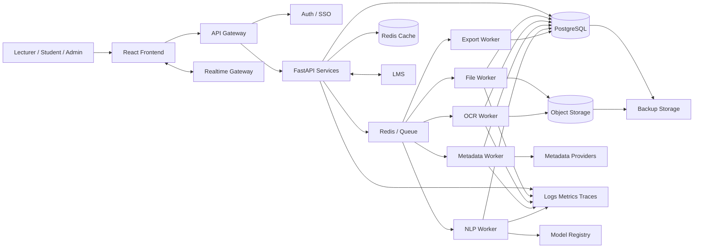

# TrustLens Backend P2 Production & Intelligence Plan v1.0

> **Mục tiêu:** đưa TrustLens từ mức hệ thống nội bộ ổn định sau P0–P1 lên mức sẵn sàng triển khai thực tế, có khả năng mở rộng, tích hợp, quan sát, bảo vệ dữ liệu, nâng cao chất lượng AI/NLP và hỗ trợ vận hành dài hạn.
>
> **Điều kiện tiên quyết:** P0 và P1 đã hoàn tất, integration test pass, không còn mock trong staging, pipeline end-to-end ổn định.
>
> **Đối tượng sử dụng:** Backend Developer, AI/NLP Engineer, Data/ML Engineer, Frontend Developer, DevOps, QA, BA/Product Owner, người phụ trách bảo mật và vận hành.
>
> **Phạm vi P2:** OCR, citation-in-context, plagiarism signal ở mức hỗ trợ, realtime, student portal, LMS integration, multi-tenant readiness, production security, observability nâng cao, MLOps, evaluation framework, autoscaling, backup/DR, cost control, accessibility và governance.

---

# 1. Mục tiêu chiến lược P2

P2 nhằm giải quyết các giới hạn còn lại sau MVP và P1:

1. Hỗ trợ file scan thông qua OCR.
2. Phân tích trích dẫn trong ngữ cảnh nội dung.
3. Kiểm tra mức độ khớp giữa citation in-text và reference.
4. Cung cấp tín hiệu đạo văn hoặc tái sử dụng nội dung ở mức hỗ trợ.
5. Hỗ trợ realtime job progress.
6. Mở rộng vai trò sinh viên.
7. Tích hợp LMS.
8. Chuẩn bị multi-tenant cho khoa/trường.
9. Chuẩn hóa AI/NLP lifecycle.
10. Có benchmarking, drift detection và human evaluation.
11. Có monitoring, alerting, tracing và SLO.
12. Có backup, disaster recovery và data lifecycle hoàn chỉnh.
13. Tối ưu chi phí triển khai.
14. Có security hardening cho production.
15. Có governance và audit ở mức vận hành dài hạn.

---

# 2. Điều kiện chuyển từ P1 sang P2

Không bắt đầu P2 nếu còn một trong các lỗi sau:

- [ ] Job queue chưa ổn định.
- [ ] Batch processing chưa chạy đúng.
- [ ] Scoring preset chưa version hóa.
- [ ] Report revision chưa hoạt động.
- [ ] Provider fallback chưa có.
- [ ] Audit log chưa có.
- [ ] Soft delete và retention chưa có.
- [ ] Export DOCX/XLSX chưa ổn định.
- [ ] Ownership còn lỗi.
- [ ] Staging còn mock fallback.
- [ ] Chưa có baseline benchmark.

P2 phải được triển khai trên nền tảng đã ổn định, không dùng P2 để che lỗi kiến trúc từ P0 hoặc P1.

---

# 3. Phạm vi P2

## 3.1. Trong phạm vi

| Nhóm | Nội dung |
|---|---|
| OCR | Xử lý PDF scan, ảnh chụp và hybrid PDF |
| Citation-in-context | Mapping citation trong nội dung với reference cuối bài |
| Context relevance | Đánh giá mức độ citation hỗ trợ câu/đoạn văn |
| Plagiarism signal | Tín hiệu tương đồng nội dung, không kết luận pháp lý |
| Realtime | WebSocket hoặc SSE cho job/batch progress |
| Student portal | Upload, xem trạng thái, nhận phản hồi |
| LMS integration | LTI, webhook hoặc REST integration |
| Multi-tenant readiness | Tenant isolation, quota, config riêng |
| Production security | SSO, secret rotation, malware scan, WAF/rate limiting |
| Observability nâng cao | Tracing, metrics, logs, SLO, alerting |
| MLOps | Model registry, evaluation, rollout, rollback |
| Data quality | Validation, drift, anomaly detection |
| Explainability nâng cao | Evidence provenance, model/version trace |
| Deployment | Containerization, CI/CD, autoscaling |
| Backup/DR | Backup, restore, RPO/RTO |
| Cost management | Usage accounting, quotas, caching |
| Governance | Model card, data card, risk register, approval workflow |

## 3.2. Ngoài phạm vi mặc định

- Đánh giá pháp lý tuyệt đối về đạo văn.
- Truy cập full-text có paywall trái phép.
- Tự động kết luận tạp chí săn mồi mang tính pháp lý.
- Chấm điểm học thuật thay giảng viên.
- Tự động xử phạt sinh viên.
- Thu thập dữ liệu nhạy cảm ngoài phạm vi cần thiết.
- Dùng LLM cloud gửi toàn bộ bài nộp nếu chưa có phê duyệt.

---

# 4. Kiến trúc mục tiêu P2



---

# 5. OCR pipeline

## 5.1. Mục tiêu

Hỗ trợ:

- PDF scan hoàn toàn.
- PDF hybrid.
- Ảnh PNG/JPG nếu mở rộng.
- Phát hiện trang có hoặc không có text layer.
- OCR theo trang.
- Lưu confidence và bounding box.
- Giữ traceability tới trang gốc.

---

## 5.2. Quy trình OCR

```text
Upload
→ MIME validation
→ PDF inspection
→ page classification
→ direct text extraction nếu có text layer
→ OCR nếu không có text layer
→ merge page text
→ normalize layout
→ detect reference section
→ continue pipeline
```

---

## 5.3. Page classification

```python
class PageTextMode(str, Enum):
    TEXT = "text"
    IMAGE = "image"
    HYBRID = "hybrid"
    EMPTY = "empty"
```

---

## 5.4. OCR engine options

### Local-first

- Tesseract OCR.
- PaddleOCR.
- EasyOCR.

### Cloud optional

- Google Document AI.
- Azure AI Document Intelligence.
- AWS Textract.

P2 nên ưu tiên local-first nếu mục tiêu là giảm chi phí và bảo vệ dữ liệu.

---

## 5.5. OCR data model

### `document_pages`

```text
id UUID PK
file_id UUID FK
page_number INT
text_mode VARCHAR
raw_text TEXT NULL
ocr_text TEXT NULL
ocr_confidence NUMERIC NULL
width INT NULL
height INT NULL
created_at TIMESTAMP
```

### `ocr_blocks`

```text
id UUID PK
document_page_id UUID FK
block_type VARCHAR
text TEXT
confidence NUMERIC
bbox JSONB
reading_order INT
created_at TIMESTAMP
```

---

## 5.6. OCR confidence rule

```text
confidence >= 0.90 → high
0.75–0.89 → medium
< 0.75 → low
```

Nếu OCR confidence thấp:

- Không kết luận chắc chắn.
- Hiển thị warning.
- Cho phép review thủ công.
- Giảm report confidence.

---

## 5.7. OCR API

```http
POST /api/v1/submissions/{submission_id}/ocr
GET  /api/v1/submissions/{submission_id}/ocr-status
GET  /api/v1/submissions/{submission_id}/pages/{page_number}
```

Trong flow production, OCR nên được gọi tự động từ pipeline, không bắt buộc frontend gọi riêng.

---

## 5.8. OCR acceptance criteria

- [ ] PDF scan 10 trang được xử lý.
- [ ] Page number được giữ.
- [ ] Vietnamese Unicode đúng.
- [ ] Reference section detect được.
- [ ] OCR confidence được lưu.
- [ ] Không gửi file ra ngoài nếu chưa có consent.
- [ ] OCR failure không làm mất file gốc.
- [ ] Có manual retry.

---

# 6. Citation-in-context alignment

## 6.1. Mục tiêu

Xác định citation trong nội dung có liên kết đúng với reference cuối bài hay không.

Ví dụ:

```text
"In transformer models, self-attention improves parallelization [3]."
```

Cần map `[3]` tới reference thứ 3.

---

## 6.2. Các style cần hỗ trợ

- IEEE numeric: `[1]`, `[2]–[4]`.
- APA author-year: `(Nguyen, 2024)`.
- MLA basic.
- ACM numeric/author-year.
- Footnote style mức cơ bản.

---

## 6.3. Pipeline

```text
Extract full text
→ detect in-text citation markers
→ normalize marker
→ resolve reference target
→ extract context window
→ compute context-reference relevance
→ generate alignment result
```

---

## 6.4. Data model

### `in_text_citations`

```text
id UUID PK
submission_id UUID FK
page_number INT
paragraph_index INT
raw_marker VARCHAR
normalized_marker VARCHAR
context_before TEXT
context_sentence TEXT
context_after TEXT
detected_style VARCHAR
detection_confidence NUMERIC
created_at TIMESTAMP
```

### `citation_alignments`

```text
id UUID PK
in_text_citation_id UUID FK
reference_citation_id UUID FK NULL
alignment_status VARCHAR
alignment_confidence NUMERIC
context_relevance_score NUMERIC NULL
evidence JSONB
created_at TIMESTAMP
```

---

## 6.5. Alignment status

```python
class AlignmentStatus(str, Enum):
    MATCHED = "matched"
    AMBIGUOUS = "ambiguous"
    MISSING_REFERENCE = "missing_reference"
    UNUSED_REFERENCE = "unused_reference"
    INVALID_MARKER = "invalid_marker"
    UNKNOWN = "unknown"
```

---

## 6.6. Context relevance

So sánh:

```text
context sentence / paragraph
vs
reference title + abstract + keywords
```

Có thể dùng:

- Sentence Transformers.
- BM25 + embedding hybrid.
- Cross-encoder reranking nếu tài nguyên cho phép.

---

## 6.7. Context warning examples

```text
IN_TEXT_CITATION_MISSING_REFERENCE
REFERENCE_NOT_CITED_IN_TEXT
CONTEXT_RELEVANCE_LOW
AUTHOR_YEAR_AMBIGUOUS
NUMERIC_MARKER_OUT_OF_RANGE
```

---

# 7. Plagiarism signal module

## 7.1. Nguyên tắc

TrustLens không nên tự tuyên bố:

```text
"Đạo văn"
```

Chỉ nên cung cấp:

```text
"Tín hiệu tương đồng nội dung cần kiểm tra"
```

---

## 7.2. Phạm vi an toàn

- So sánh với tập bài nội bộ được phép.
- So sánh với nguồn mở hợp pháp.
- Không thu thập trái phép.
- Không vượt paywall.
- Không kết luận kỷ luật tự động.

---

## 7.3. Các tín hiệu

- Exact phrase overlap.
- N-gram similarity.
- Semantic similarity.
- Large copied block.
- Self-reuse.
- Repeated template similarity.

---

## 7.4. Data model

### `similarity_checks`

```text
id UUID PK
submission_id UUID FK
source_type VARCHAR
source_id VARCHAR
similarity_score NUMERIC
matched_segments JSONB
method VARCHAR
model_version VARCHAR
created_at TIMESTAMP
```

---

## 7.5. Threshold example

```text
>= 0.90 exact/near-exact → high review priority
0.75–0.89 → medium
0.60–0.74 → low
< 0.60 → ignore
```

Threshold cần hiệu chỉnh bằng dataset nội bộ.

---

## 7.6. UI language

Dùng:

- “Đoạn tương đồng cao”.
- “Cần kiểm tra thủ công”.
- “Nguồn so sánh”.
- “Phương pháp phát hiện”.
- “Mức confidence”.

Không dùng:

- “Sinh viên đạo văn”.
- “Vi phạm chắc chắn”.
- “Gian lận”.

---

# 8. Realtime progress

## 8.1. Lựa chọn

### Server-Sent Events

Phù hợp nếu chỉ cần server → client.

### WebSocket

Phù hợp nếu cần hai chiều.

P2 có thể ưu tiên SSE vì đơn giản hơn cho job progress.

---

## 8.2. SSE endpoint

```http
GET /api/v1/jobs/{job_id}/events
Accept: text/event-stream
```

Event:

```text
event: job.progress
data: {
  "job_id": "uuid",
  "status": "verifying_metadata",
  "progress": 68
}
```

---

## 8.3. Realtime rules

- JWT required.
- Ownership check.
- Reconnect support.
- Last-Event-ID support nếu dùng SSE.
- Fallback polling.
- Không gửi dữ liệu citation nhạy cảm qua event không cần thiết.

---

# 9. Student portal

## 9.1. Vai trò

Sinh viên có thể:

- Xem assignment được giao.
- Upload bài nếu giảng viên cho phép.
- Xem trạng thái.
- Xem phản hồi được công bố.
- Tải report rút gọn.
- Không xem cấu hình nội bộ hoặc audit log.

---

## 9.2. Permission matrix

| Chức năng | Student |
|---|---|
| Xem assignment | Có, nếu được enroll |
| Upload submission | Có, nếu assignment mở |
| Xem job của mình | Có |
| Xem report của mình | Có, nếu lecturer publish |
| Xem report của người khác | Không |
| Export | Có, nếu được bật |
| Retry analysis | Không mặc định |
| Xem scoring config chi tiết | Không |
| Ghi chú phản hồi | Có thể cho phép |
| Xem audit log | Không |

---

## 9.3. Data model

### `enrollments`

```text
id UUID PK
class_id UUID FK
student_user_id UUID FK
student_code VARCHAR
status VARCHAR
created_at TIMESTAMP
```

### `report_publications`

```text
id UUID PK
report_id UUID FK
published_by UUID FK
published_at TIMESTAMP
visibility VARCHAR
message TEXT NULL
```

---

# 10. LMS integration

## 10.1. Mục tiêu

Tích hợp:

- Moodle.
- Canvas.
- Google Classroom qua API phù hợp.
- LMS nội bộ.

---

## 10.2. Integration patterns

- REST pull.
- Webhook push.
- LTI 1.3.
- CSV import/export fallback.

---

## 10.3. Data model

### `lms_integrations`

```text
id UUID PK
tenant_id UUID NULL
provider VARCHAR
base_url VARCHAR
client_id VARCHAR
secret_ref VARCHAR
status VARCHAR
created_at TIMESTAMP
updated_at TIMESTAMP
```

### `lms_sync_jobs`

```text
id UUID PK
integration_id UUID FK
sync_type VARCHAR
status VARCHAR
started_at TIMESTAMP
completed_at TIMESTAMP NULL
error JSONB NULL
```

---

## 10.4. Sync scope

- Course.
- Class.
- Assignment.
- Student enrollment.
- Submission metadata.
- Grade/feedback push-back nếu được phép.

---

## 10.5. LMS security

- OAuth2/LTI 1.3.
- Secret rotation.
- Scope tối thiểu.
- Không lưu password LMS.
- Audit mọi sync.
- Idempotency key.
- Retry có backoff.

---

# 11. Multi-tenant readiness

## 11.1. Mục tiêu

Hỗ trợ nhiều khoa hoặc nhiều đơn vị sử dụng chung nhưng dữ liệu tách biệt.

---

## 11.2. Data model

### `tenants`

```text
id UUID PK
code VARCHAR UNIQUE
name VARCHAR
status VARCHAR
default_scoring_preset_id UUID NULL
created_at TIMESTAMP
```

Bổ sung `tenant_id` vào:

- users.
- classes.
- assignments.
- submissions.
- reports.
- audit_logs.
- scoring_presets.
- metadata_provider_configs.

---

## 11.3. Isolation options

### Row-level tenant isolation

Phù hợp giai đoạn đầu.

### Schema per tenant

Phức tạp hơn.

### Database per tenant

Dành cho enterprise lớn.

P2 nên dùng row-level isolation cộng PostgreSQL Row-Level Security nếu cần.

---

## 11.4. Tenant rules

- Mọi query có tenant context.
- Admin tenant không truy cập tenant khác.
- Super admin riêng biệt.
- Provider config có thể riêng theo tenant.
- Quota riêng.
- Branding riêng nếu cần.

---

# 12. SSO và identity

## 12.1. Hỗ trợ

- Google Workspace.
- Microsoft Entra ID.
- OIDC.
- SAML nếu cần.

---

## 12.2. Account linking

```text
external_identity_id
provider
user_id
email
last_login_at
```

---

## 12.3. Security rules

- Không tin email claim nếu chưa verified.
- Kiểm tra issuer/audience.
- Token expiration.
- PKCE cho frontend public client.
- Logout local và provider nếu phù hợp.
- Role mapping có kiểm soát.

---

# 13. Malware scanning

## 13.1. Mục tiêu

Quét file upload trước khi xử lý.

---

## 13.2. Công nghệ

- ClamAV local.
- Cloud malware scanner optional.

---

## 13.3. Flow

```text
Upload temp
→ checksum
→ malware scan
→ nếu clean: move to object storage
→ nếu infected: quarantine + reject
```

---

## 13.4. Status

```python
class MalwareScanStatus(str, Enum):
    PENDING = "pending"
    CLEAN = "clean"
    INFECTED = "infected"
    ERROR = "error"
```

---

# 14. Object storage

## 14.1. Mục tiêu

Chuyển khỏi local storage khi deploy production.

---

## 14.2. Options

- MinIO.
- Supabase Storage.
- S3-compatible storage.

---

## 14.3. Rules

- Private bucket.
- Signed URL ngắn hạn.
- Server-side encryption.
- Không public URL trực tiếp.
- Lifecycle rule.
- Versioning nếu cần.
- Checksum verification.

---

# 15. Production security hardening

## 15.1. Network

- HTTPS bắt buộc.
- HSTS.
- Reverse proxy.
- Restrict internal services.
- Redis/PostgreSQL không public.
- WAF hoặc gateway rate limiting.
- CORS whitelist.

---

## 15.2. API

- Request size limit.
- Rate limiting.
- Idempotency key.
- Replay protection cho webhook.
- Schema validation strict.
- Error không lộ stack trace.
- Security headers.

---

## 15.3. Secret management

- Không commit `.env`.
- Secret manager.
- Rotation.
- Separate dev/staging/prod.
- Least privilege.

---

## 15.4. Dependency security

- `pip-audit`.
- `npm audit`.
- Dependabot/Renovate.
- SBOM.
- Image scan.

---

## 15.5. Container security

- Non-root user.
- Read-only filesystem nếu có thể.
- Minimal base image.
- Drop Linux capabilities.
- Resource limits.
- Image signing.

---

# 16. Observability nâng cao

## 16.1. Three pillars

- Logs.
- Metrics.
- Traces.

---

## 16.2. Distributed tracing

Dùng OpenTelemetry.

Trace qua:

```text
API request
→ queue publish
→ worker task
→ provider call
→ DB write
→ report generation
```

---

## 16.3. Correlation IDs

Mọi log có:

```text
request_id
trace_id
job_id
submission_id
tenant_id
user_id
```

---

## 16.4. SLO

| SLO | Mục tiêu |
|---|---:|
| API availability | 99.5% |
| Job completion success | >= 95% |
| Report API p95 | <= 1.5 s |
| Job status p95 | <= 500 ms |
| Batch 20 file success | >= 90% |
| Provider fallback success | >= 80% khi provider chính lỗi |
| Export success | >= 98% |

---

## 16.5. Alerting

Cảnh báo khi:

- Job failure rate tăng.
- Queue backlog vượt ngưỡng.
- Worker không heartbeat.
- Provider timeout tăng.
- Database connection pool cạn.
- Disk/object storage gần đầy.
- Export failure tăng.
- Unauthorized access spike.

---

# 17. Model registry và MLOps

## 17.1. Mục tiêu

Quản lý version:

- Embedding model.
- Cross-encoder.
- OCR model.
- Heuristic rules.
- Scoring config.
- Prompt template nếu có LLM.

---

## 17.2. Data model `model_versions`

```text
id UUID PK
model_type VARCHAR
name VARCHAR
version VARCHAR
artifact_uri VARCHAR
checksum VARCHAR
status VARCHAR
metrics JSONB
created_at TIMESTAMP
activated_at TIMESTAMP NULL
retired_at TIMESTAMP NULL
```

---

## 17.3. Model status

```python
class ModelStatus(str, Enum):
    EXPERIMENTAL = "experimental"
    STAGING = "staging"
    ACTIVE = "active"
    RETIRED = "retired"
```

---

## 17.4. Report provenance

Report phải lưu:

```text
embedding_model_version
ocr_model_version
parser_version
metadata_resolver_version
scoring_config_version
prompt_version nếu có
```

---

# 18. Evaluation framework

## 18.1. Dataset structure

```text
evaluation/
├── extraction/
├── citation_parsing/
├── metadata_matching/
├── relevance/
├── style_detection/
├── duplicate_detection/
├── ocr/
└── end_to_end/
```

---

## 18.2. Metrics

### Extraction

- Precision.
- Recall.
- F1.
- Section boundary accuracy.

### Parsing

- Field-level precision/recall/F1.
- DOI accuracy.
- Year accuracy.
- Author accuracy.

### Metadata matching

- Top-1 accuracy.
- MRR.
- Verified precision.
- False verified rate.

### Relevance

- Spearman correlation với human rating.
- Pairwise agreement.
- Classification F1.

### OCR

- CER.
- WER.
- Reference section recovery rate.

### End-to-end

- Report score agreement với giảng viên.
- Warning precision.
- Review time reduction.

---

## 18.3. Gold dataset

Mỗi sample cần:

```text
file
reference section
citation boundaries
parsed fields
metadata ground truth
relevance labels
style labels
duplicate labels
expected warnings
human score
```

---

## 18.4. Human evaluation

Tối thiểu hai người đánh giá.

Đo:

- Cohen’s Kappa.
- Krippendorff’s Alpha nếu nhiều annotator.
- Inter-rater agreement.

---

# 19. Drift detection

## 19.1. Loại drift

- Input format drift.
- Citation style drift.
- Language drift.
- Provider response drift.
- Model embedding drift.
- Score distribution drift.

---

## 19.2. Metrics

```text
citation_count_distribution
reference_section_detection_rate
unknown_rate
ambiguous_rate
provider_success_rate
trust_score_distribution
confidence_distribution
```

---

## 19.3. Trigger

- Unknown rate tăng > 20%.
- Provider success giảm mạnh.
- Score distribution shift.
- OCR confidence giảm.
- Parser failure tăng.

---

# 20. LLM integration governance

Nếu sử dụng LLM:

## 20.1. Allowed use cases

- Gợi ý diễn giải warning.
- Chuẩn hóa ngôn ngữ recommendation.
- Hỗ trợ classification khó.
- Không dùng làm nguồn quyết định duy nhất.

---

## 20.2. Prohibited use cases

- Gửi toàn bộ bài nộp nhạy cảm lên dịch vụ cloud không được phê duyệt.
- Tự kết luận gian lận.
- Tự sửa điểm.
- Tạo citation giả.
- Bỏ qua metadata evidence.

---

## 20.3. Prompt injection defense

- Tách nội dung tài liệu khỏi system instruction.
- Không cho document text điều khiển tool.
- Allowlist tool.
- Sanitize output.
- Validate schema.
- Log model version và prompt version.

---

## 20.4. LLM response schema

```json
{
  "reason_code": "LOW_RELEVANCE",
  "explanation": "...",
  "recommendation": "...",
  "confidence": 0.72
}
```

Phải validate bằng schema trước khi lưu.

---

# 21. CI/CD

## 21.1. Pipeline

```text
lint
→ type check
→ unit test
→ integration test
→ security scan
→ build image
→ image scan
→ deploy staging
→ smoke test
→ manual approval
→ deploy production
```

---

## 21.2. Branch policy

- Protected main.
- PR review.
- Required checks.
- No direct push.
- Conventional commits.
- Semantic versioning.

---

## 21.3. Database migration

- Migration forward-only.
- Backup trước migration lớn.
- Dry-run staging.
- Rollback plan.
- Không chạy migration destructive tự động production.

---

# 22. Deployment

## 22.1. Container services

```text
api
worker-file
worker-ocr
worker-metadata
worker-nlp
worker-export
scheduler
redis
postgres
object-storage
reverse-proxy
monitoring
```

---

## 22.2. Autoscaling

Scale theo:

- Queue length.
- CPU.
- Memory.
- Task latency.

OCR và NLP worker nên tách riêng vì tài nguyên khác nhau.

---

## 22.3. Resource limits

Ví dụ:

```yaml
api:
  cpu: 0.5
  memory: 512Mi

worker-ocr:
  cpu: 2
  memory: 2Gi

worker-nlp:
  cpu: 2
  memory: 4Gi
```

Giá trị phải benchmark thực tế.

---

# 23. Backup và disaster recovery

## 23.1. Backup scope

- PostgreSQL.
- Object storage metadata.
- Report export.
- Scoring preset.
- Model registry.
- Audit log.

---

## 23.2. RPO/RTO đề xuất

| Mức | Giá trị |
|---|---:|
| RPO | 24 giờ |
| RTO | 4 giờ |

Môi trường nội bộ nhỏ có thể dùng mục tiêu này trước.

---

## 23.3. Backup policy

- Daily incremental.
- Weekly full.
- Retention 30 ngày.
- Encrypt backup.
- Test restore hàng tháng.
- Lưu khác location.

---

## 23.4. Restore drill

- Restore DB.
- Restore object storage.
- Verify checksum.
- Run smoke test.
- Document thời gian restore.

---

# 24. Cost management

## 24.1. Usage accounting

Theo dõi:

- Số file.
- Tổng dung lượng.
- OCR pages.
- Provider calls.
- NLP inference time.
- Export count.
- Storage usage.

---

## 24.2. Quota

Ví dụ:

```text
files per assignment
max batch size
max pages per file
max OCR pages per day
max exports per day
```

---

## 24.3. Cache

Cache:

- DOI metadata.
- Title search.
- Embeddings.
- Export.
- Provider health.

---

## 24.4. Cost-aware routing

```text
Local model first
→ cache
→ open provider
→ paid API only when enabled
```

---

# 25. Data privacy và governance

## 25.1. Data classification

| Loại | Ví dụ |
|---|---|
| Public | Metadata học thuật công khai |
| Internal | Scoring config |
| Confidential | Bài nộp sinh viên |
| Sensitive | Email, student code |

---

## 25.2. Privacy controls

- Data minimization.
- Purpose limitation.
- Retention.
- Access control.
- Export redaction.
- Consent nếu dùng dữ liệu thật.
- Anonymization cho demo.

---

## 25.3. Data access report

Admin có thể xem:

- Ai truy cập file.
- Ai export.
- Ai xem report.
- Ai thay config.

---

# 26. Accessibility

Frontend và report cần:

- WCAG 2.1 AA mục tiêu.
- Keyboard navigation.
- Screen reader labels.
- Contrast phù hợp.
- Không chỉ dùng màu để biểu thị trạng thái.
- PDF có text selectable.
- DOCX heading đúng.

---

# 27. Internationalization

P2 có thể hỗ trợ:

- Vietnamese.
- English.

Không hard-code message.

```text
error_code
message_key
localized_message
```

---

# 28. Advanced report capabilities

## 28.1. Report comparison

So sánh:

- Revision cũ/mới.
- Preset cũ/mới.
- Provider result thay đổi.
- Score delta.

---

## 28.2. Trend analytics

Theo:

- Assignment.
- Class.
- Semester.
- Citation style.
- Source type.
- Warning type.

---

## 28.3. Aggregate dashboard

Không hiển thị dữ liệu cá nhân ngoài phạm vi.

---

# 29. API additions P2

## OCR

```text
GET  /submissions/{id}/pages
GET  /submissions/{id}/pages/{page}
POST /submissions/{id}/ocr/retry
```

## In-text citation

```text
GET /reports/{id}/in-text-citations
GET /reports/{id}/citation-alignments
```

## Student

```text
GET  /student/assignments
POST /student/assignments/{id}/submissions
GET  /student/submissions/{id}
GET  /student/reports/{id}
```

## LMS

```text
POST /admin/lms-integrations
POST /admin/lms-integrations/{id}/sync
GET  /admin/lms-integrations/{id}/status
POST /webhooks/lms/{provider}
```

## Tenant

```text
POST /platform/tenants
GET  /platform/tenants
PUT  /platform/tenants/{id}
```

## Model registry

```text
GET  /admin/models
POST /admin/models
POST /admin/models/{id}/activate
POST /admin/models/{id}/rollback
```

---

# 30. Data model additions P2

- `document_pages`
- `ocr_blocks`
- `in_text_citations`
- `citation_alignments`
- `similarity_checks`
- `enrollments`
- `report_publications`
- `lms_integrations`
- `lms_sync_jobs`
- `tenants`
- `external_identities`
- `malware_scan_results`
- `model_versions`
- `evaluation_runs`
- `drift_snapshots`
- `usage_records`
- `quota_policies`
- `backup_runs`

---

# 31. Test strategy P2

## 31.1. OCR

- Scan PDF.
- Hybrid PDF.
- Vietnamese.
- Low-quality image.
- Encrypted PDF.
- Large page count.

## 31.2. In-text citation

- IEEE.
- APA.
- Missing reference.
- Unused reference.
- Ambiguous author-year.
- Citation range.

## 31.3. Student portal

- Student chỉ xem bài mình.
- Report chưa publish.
- Report đã publish.
- Assignment đóng upload.

## 31.4. LMS

- Sync success.
- Webhook duplicate.
- OAuth expired.
- Retry.
- Partial sync.

## 31.5. Multi-tenant

- Tenant isolation.
- Cross-tenant access.
- Tenant admin.
- Provider config riêng.

## 31.6. Security

- Malware file.
- SSRF.
- Path traversal.
- Token replay.
- Rate limit.
- CORS.
- Signed URL expiration.

## 31.7. MLOps

- Model activation.
- Rollback.
- Report provenance.
- Drift trigger.

---

# 32. Acceptance test matrix P2

| ID | Kiểm thử | Kết quả |
|---|---|---|
| P2-AT-01 | PDF scan | OCR thành công |
| P2-AT-02 | OCR confidence thấp | Warning + confidence giảm |
| P2-AT-03 | IEEE in-text | Mapping đúng |
| P2-AT-04 | APA ambiguous | Status ambiguous |
| P2-AT-05 | Missing reference | Warning |
| P2-AT-06 | Unused reference | Warning |
| P2-AT-07 | Student xem report chưa publish | 403 |
| P2-AT-08 | Student xem report đã publish | 200 |
| P2-AT-09 | LMS sync | Idempotent |
| P2-AT-10 | Cross-tenant access | 403 |
| P2-AT-11 | Malware upload | Quarantine |
| P2-AT-12 | Signed URL hết hạn | 403 |
| P2-AT-13 | SSE reconnect | Tiếp tục progress |
| P2-AT-14 | Model rollback | Report mới dùng version cũ |
| P2-AT-15 | Drift threshold | Alert sinh ra |
| P2-AT-16 | Restore drill | Đạt RTO |
| P2-AT-17 | Queue overload | Autoscaling hoặc backpressure |
| P2-AT-18 | Provider outage | Hệ thống degrade có kiểm soát |
| P2-AT-19 | Tenant quota | Chặn đúng |
| P2-AT-20 | Full end-to-end production smoke | Pass |

---

# 33. Performance targets P2

| Tác vụ | Mục tiêu |
|---|---:|
| OCR 20 trang | <= 5 phút local |
| Job status p95 | <= 300 ms |
| Report p95 | <= 1 s |
| SSE update latency | <= 2 s |
| Batch 50 file | Không block API |
| Metadata cache hit | >= 50% sau warm-up |
| Queue recovery | <= 5 phút |
| Backup restore test | <= 4 giờ |

---

# 34. SLO và error budget

Ví dụ tháng:

```text
Availability SLO: 99.5%
Error budget: khoảng 3 giờ 39 phút/tháng
```

Nếu vượt error budget:

- Dừng feature rollout.
- Ưu tiên reliability.
- Root cause analysis.

---

# 35. Incident response

## 35.1. Severity

```text
SEV-1: mất dữ liệu, toàn hệ thống down
SEV-2: pipeline chính lỗi diện rộng
SEV-3: provider/export lỗi cục bộ
SEV-4: lỗi UI nhỏ
```

---

## 35.2. Runbook

Mỗi incident cần:

- Detection.
- Owner.
- Mitigation.
- Communication.
- Root cause.
- Corrective action.
- Prevention.

---

# 36. Rollout strategy

## 36.1. Feature flags

Áp dụng cho:

- OCR.
- Student portal.
- LMS.
- New model.
- New scoring rule.
- Plagiarism signal.
- Multi-tenant.

---

## 36.2. Rollout stages

```text
local
→ internal staging
→ pilot class
→ pilot department
→ production
```

---

## 36.3. Canary

Model mới:

- 5%.
- 20%.
- 50%.
- 100%.

Theo dõi metric trước khi tăng.

---

# 37. Documentation bắt buộc P2

- `P2_Architecture.md`
- `OCR_Pipeline_Spec.md`
- `Citation_Context_Alignment_Spec.md`
- `LMS_Integration_Guide.md`
- `Tenant_Isolation_Spec.md`
- `Security_Hardening_Guide.md`
- `Observability_Runbook.md`
- `Model_Card.md`
- `Data_Card.md`
- `Backup_Restore_Runbook.md`
- `Incident_Response_Plan.md`
- `Production_Deployment_Guide.md`

---

# 38. Commit plan P2

### Commit 1

```text
docs: define p2 production intelligence architecture
```

### Commit 2

```text
feat(ocr): add scanned pdf processing
```

### Commit 3

```text
feat(context): align in-text citations with references
```

### Commit 4

```text
feat(similarity): add review-only plagiarism signals
```

### Commit 5

```text
feat(realtime): stream job progress via sse
```

### Commit 6

```text
feat(student): add student submission and report access
```

### Commit 7

```text
feat(lms): add lms integration framework
```

### Commit 8

```text
feat(tenant): add tenant isolation and quotas
```

### Commit 9

```text
fix(security): add malware scanning and production hardening
```

### Commit 10

```text
feat(mlops): add model registry and evaluation runs
```

### Commit 11

```text
feat(observability): add tracing slo and alerts
```

### Commit 12

```text
feat(dr): add backup restore and disaster recovery automation
```

### Commit 13

```text
test(p2): add production-grade end-to-end scenarios
```

---

# 39. Phân công đề xuất

| Hạng mục | Owner chính | Reviewer |
|---|---|---|
| OCR | AI/NLP + BE | QA |
| Citation alignment | AI/NLP | BA |
| Similarity signal | AI/NLP | BA |
| Realtime | BE + FE | QA |
| Student portal | FE + BE | BA |
| LMS | BE | Security |
| Multi-tenant | BE | Security |
| SSO | BE/DevOps | Security |
| Malware scan | DevOps + BE | Security |
| Object storage | DevOps | BE |
| Observability | DevOps + BE | QA |
| MLOps | AI/NLP + DevOps | BA |
| Evaluation | AI/NLP + QA | BA |
| Backup/DR | DevOps | Security |
| Cost control | DevOps + Product | BA |

---

# 40. Rủi ro P2

## OCR sai

Giảm thiểu:

- Confidence.
- Manual review.
- Page preview.
- Không kết luận chắc chắn.

## Citation alignment sai

Giảm thiểu:

- Rule-based trước.
- Confidence.
- Human evaluation.
- Không phạt mạnh khi ambiguous.

## Similarity signal bị hiểu sai

Giảm thiểu:

- Không gọi là plagiarism verdict.
- Hiển thị source và matched segment.
- Manual review bắt buộc.

## Multi-tenant leak

Giảm thiểu:

- Tenant context bắt buộc.
- RLS.
- Cross-tenant tests.
- Security audit.

## Model drift

Giảm thiểu:

- Evaluation dataset.
- Monitoring.
- Rollback.

## Cost tăng

Giảm thiểu:

- Local-first.
- Cache.
- Quota.
- Usage accounting.

---

# 41. Definition of Done P2

## OCR

- [ ] Scan PDF.
- [ ] Hybrid PDF.
- [ ] Confidence.
- [ ] Page traceability.
- [ ] Manual review.

## Context alignment

- [ ] IEEE.
- [ ] APA.
- [ ] Missing reference.
- [ ] Unused reference.
- [ ] Context relevance.
- [ ] Confidence.

## Similarity signal

- [ ] Exact overlap.
- [ ] Semantic overlap.
- [ ] Source evidence.
- [ ] Review-only language.
- [ ] No automatic accusation.

## Realtime

- [ ] SSE/WebSocket.
- [ ] Auth.
- [ ] Ownership.
- [ ] Reconnect.
- [ ] Polling fallback.

## Student

- [ ] Enrollment.
- [ ] Upload.
- [ ] Status.
- [ ] Published report.
- [ ] Isolation.

## LMS

- [ ] Integration config.
- [ ] Sync.
- [ ] Webhook.
- [ ] Idempotency.
- [ ] Audit.

## Tenant

- [ ] Tenant table.
- [ ] Tenant context.
- [ ] Cross-tenant protection.
- [ ] Quota.
- [ ] Config isolation.

## Security

- [ ] SSO/OIDC.
- [ ] Malware scan.
- [ ] Object storage private.
- [ ] Signed URL.
- [ ] Secret rotation.
- [ ] Dependency scan.
- [ ] Container non-root.

## Observability

- [ ] Logs.
- [ ] Metrics.
- [ ] Traces.
- [ ] SLO.
- [ ] Alerts.
- [ ] Runbook.

## MLOps

- [ ] Model registry.
- [ ] Evaluation run.
- [ ] Model card.
- [ ] Rollback.
- [ ] Drift detection.
- [ ] Provenance in report.

## DR

- [ ] Daily backup.
- [ ] Restore test.
- [ ] RPO.
- [ ] RTO.
- [ ] Documented runbook.

## QA

- [ ] Security tests.
- [ ] Tenant tests.
- [ ] OCR tests.
- [ ] Context tests.
- [ ] LMS tests.
- [ ] Production smoke test.
- [ ] Load test.
- [ ] Restore drill.

---

# 42. Thứ tự ưu tiên P2

Nếu nguồn lực hạn chế:

1. OCR.
2. Citation-in-context.
3. Realtime progress.
4. Production security.
5. Observability.
6. Backup/DR.
7. Model registry và evaluation.
8. Student portal.
9. LMS.
10. Multi-tenant.
11. Similarity signal.
12. Autoscaling nâng cao.

---

# 43. Tiêu chí production-ready

TrustLens được xem là production-ready khi:

```text
- Không còn single point of failure rõ ràng.
- Có backup và restore test.
- Có monitoring và alert.
- Có tenant/ownership isolation.
- Có malware scan.
- Có secret management.
- Có model/version provenance.
- Có rollback.
- Có SLO.
- Có incident runbook.
- Có benchmark định lượng.
- Có human evaluation.
- Có data retention.
- Có audit đầy đủ.
```

---

# 44. Kết luận

P2 là giai đoạn chuyển TrustLens từ một hệ thống dự thi hoặc MVP thành nền tảng có thể vận hành dài hạn.

Trọng tâm không phải chỉ thêm AI, mà là:

```text
AI có kiểm chứng
+ dữ liệu có quản trị
+ hệ thống có khả năng quan sát
+ bảo mật có kiểm soát
+ mô hình có version
+ kết quả có provenance
+ vận hành có backup và rollback
```

Sau P2, TrustLens phải trả lời được:

- File scan được xử lý như thế nào?
- Citation trong nội dung có map đúng reference không?
- Model nào đã dùng?
- Version nào đã tạo điểm?
- Dữ liệu thuộc tenant nào?
- Ai đã truy cập?
- Provider nào thất bại?
- Có thể restore khi mất dữ liệu không?
- Có thể rollback model không?
- Có bằng chứng định lượng về độ chính xác không?
