```table-of-contents
```

# TrustLens v1.0 — Diagram Specification

**Tài liệu:** Bộ diagram tổng hợp cho SRS TrustLens v1.0  
**Mã tài liệu:** TL-DIAGRAMS-2026-v1.0  
**Phiên bản:** 1.0  
**Mục đích:** Chuẩn hóa toàn bộ sơ đồ nghiệp vụ, kiến trúc, dữ liệu, pipeline xử lý, API, bảo mật, vận hành và phạm vi MVP của TrustLens.  
**Cách sử dụng:** Có thể mở trực tiếp bằng Markdown viewer hỗ trợ Mermaid, VS Code + Mermaid Preview, Obsidian, GitHub hoặc Mermaid Live Editor.

---

## 0. Quy ước chung

| Ký hiệu | Ý nghĩa |
|---|---|
| `Frontend` | React + Tailwind CSS |
| `Backend API` | FastAPI + SQLAlchemy + JWT Auth |
| `Worker` | Celery worker xử lý bất đồng bộ |
| `Database` | PostgreSQL |
| `Storage` | Local/Supabase Storage tùy môi trường triển khai MVP |
| `Metadata API` | Crossref hoặc nguồn metadata mở hợp pháp |
| `Trust Score Engine` | Module tính điểm dựa trên format, existence, credibility, recency, relevance |
| `MVP v1.0` | Phiên bản phục vụ demo cuộc thi, ưu tiên pipeline end-to-end chạy được |

---

## 1. Danh mục diagram

| Mã | Tên diagram | Loại diagram | Mục đích |
|---|---|---|---|
| D01 | System Context | Flowchart | Xác định TrustLens trong bối cảnh người dùng và hệ thống ngoài |
| D02 | MVP Scope Boundary | Flowchart | Phân định phạm vi có/không có trong v1.0 |
| D03 | High-level End-to-End Workflow | Flowchart | Luồng tổng thể từ file báo cáo đến report |
| D04 | C4 Container Architecture | Flowchart | Các container kỹ thuật chính |
| D05 | Layered Architecture | Flowchart | Phân tách layer frontend, backend, worker, data, external |
| D06 | Deployment Topology | Flowchart | Mô hình triển khai MVP |
| D07 | Functional Module Map | Flowchart | Nhóm chức năng chính của hệ thống |
| D08 | Actor & Use Case Overview | Flowchart | Tác nhân và use case chính |
| D09 | Role Permission Map | Flowchart | Quyền của giảng viên, quản trị, sinh viên mở rộng |
| D10 | UI Navigation Map | Flowchart | Cấu trúc điều hướng giao diện |
| D11 | Upload-to-Report Activity Flow | Flowchart | Quy trình nghiệp vụ khi phân tích bài nộp |
| D12 | Processing Job State Machine | State diagram | Trạng thái job xử lý file |
| D13 | Upload & Async Analysis Sequence | Sequence diagram | Tương tác giữa UI, API, queue, worker, DB |
| D14 | File Processing Pipeline | Flowchart | Pipeline xử lý PDF/DOCX |
| D15 | Reference Section Extraction | Flowchart | Phát hiện và tách danh mục tài liệu tham khảo |
| D16 | Citation Normalization Pipeline | Flowchart | Chuẩn hóa citation thành các trường dữ liệu |
| D17 | Metadata Verification Decision Flow | Flowchart | Ra quyết định xác minh DOI/title/author/year |
| D18 | Metadata Lookup Sequence | Sequence diagram | Trình tự lookup metadata và fallback |
| D19 | NLP Relevance Pipeline | Flowchart | Tính mức phù hợp bằng embedding |
| D20 | Trust Score Computation | Flowchart | Mô hình tính điểm Trust Score |
| D21 | Warning Generation Flow | Flowchart | Sinh cảnh báo và gợi ý chỉnh sửa |
| D22 | Report Generation & Export | Flowchart | Sinh dashboard và xuất PDF/DOCX/XLSX |
| D23 | Entity Relationship Diagram | ERD | Mô hình dữ liệu chính |
| D24 | Data Lifecycle | Flowchart | Vòng đời dữ liệu từ upload đến audit |
| D25 | API Resource Map | Flowchart | Quan hệ nhóm endpoint REST |
| D26 | Authentication & Authorization Flow | Sequence diagram | Xác thực JWT và kiểm tra quyền |
| D27 | API Error Handling Flow | Flowchart | Chuẩn xử lý lỗi API |
| D28 | Retry & Partial Result Flow | Flowchart | Xử lý lỗi metadata provider và retry |
| D29 | Admin Scoring Config Lifecycle | State diagram | Vòng đời cấu hình điểm |
| D30 | Observability & Audit Logging | Flowchart | Logging, audit và theo dõi lỗi |
| D31 | Test Strategy Map | Flowchart | Kiểm thử unit, integration, E2E, acceptance |
| D32 | MVP Release Dependency Map | Flowchart | Phụ thuộc triển khai v1.0 |
| D33 | Requirement Traceability Map | Flowchart | Liên kết yêu cầu với module triển khai |
| D34 | Future Extension Roadmap | Flowchart | Hướng mở rộng sau v1.0 |

---

# D01. System Context

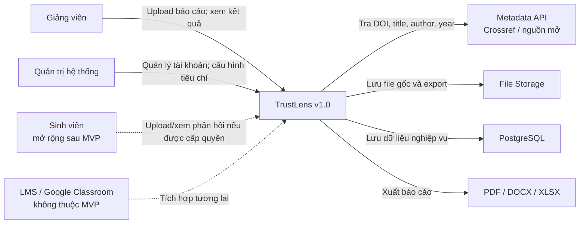

---

# D02. MVP Scope Boundary

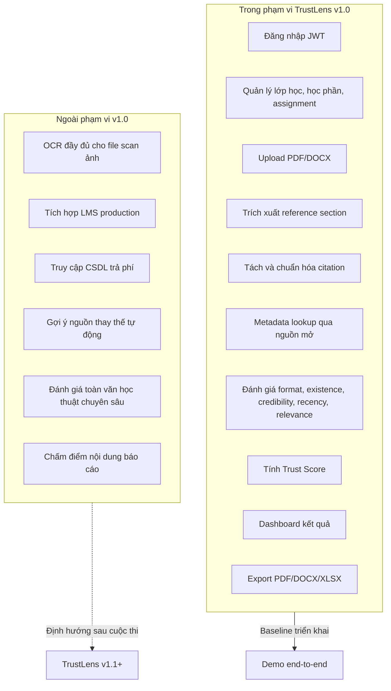

---

# D03. High-level End-to-End Workflow

```mermaid
flowchart LR
    I["Input:<br/>File báo cáo PDF/DOCX"] --> P1["Validate file"]
    P1 --> P2["Extract text"]
    P2 --> P3["Detect reference section"]
    P3 --> P4["Split citations"]
    P4 --> P5["Normalize citation fields"]
    P5 --> P6["Verify metadata"]
    P6 --> P7["Score credibility, recency, relevance, format"]
    P7 --> P8["Compute Trust Score"]
    P8 --> P9["Generate warnings"]
    P9 --> O["Output:<br/>Dashboard + report export"]
```

---

# D04. C4 Container Architecture

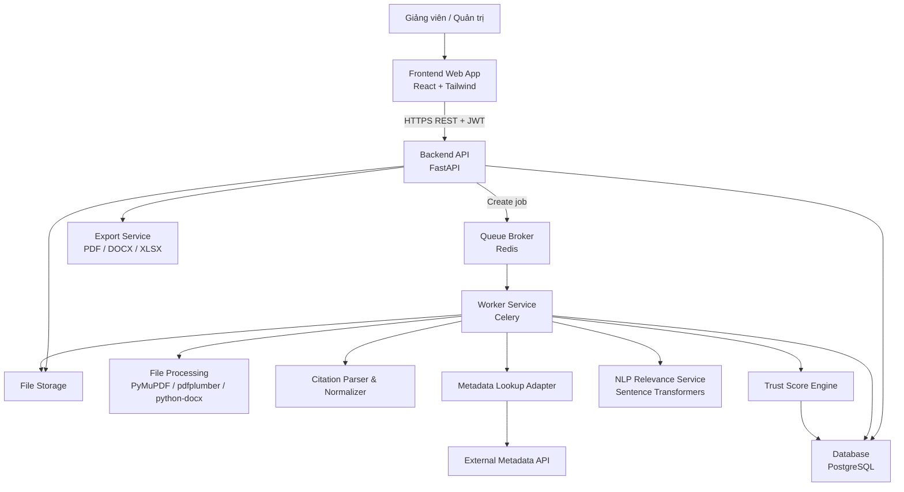

---

# D05. Layered Architecture

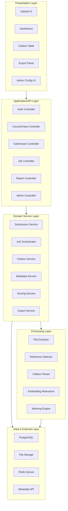

---

# D06. Deployment Topology

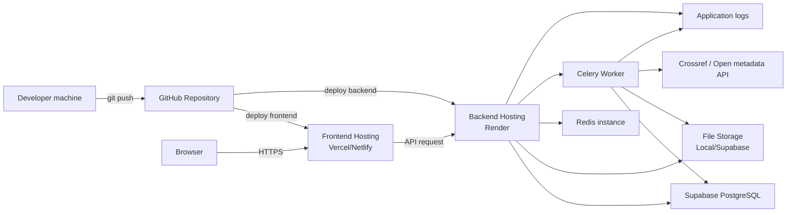

---

# D07. Functional Module Map

```mermaid
flowchart TB
    TL["TrustLens v1.0"] --> M1["User & Role Management"]
    TL --> M2["Course/Class/Assignment Management"]
    TL --> M3["Submission Upload"]
    TL --> M4["File Processing"]
    TL --> M5["Reference Extraction"]
    TL --> M6["Citation Normalization"]
    TL --> M7["Academic Existence Verification"]
    TL --> M8["Source Credibility Evaluation"]
    TL --> M9["Recency Evaluation"]
    TL --> M10["Relevance Evaluation"]
    TL --> M11["Trust Score & Warning"]
    TL --> M12["Report & Export"]
    TL --> M13["Admin Configuration"]
    TL --> M14["Audit & Monitoring"]
```

---

# D08. Actor & Use Case Overview

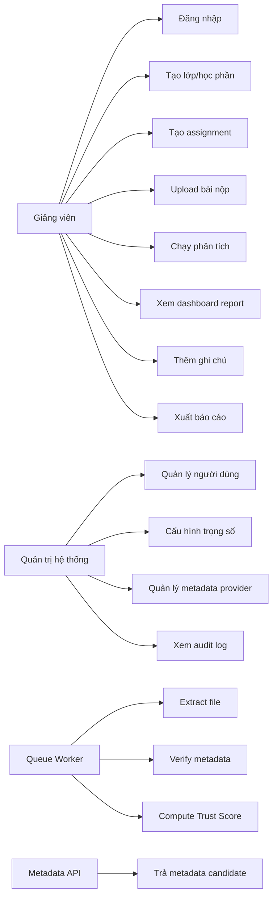

---

# D09. Role Permission Map

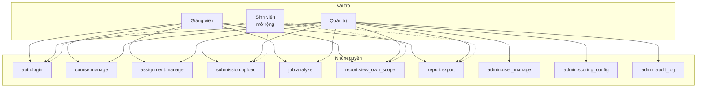

---

# D10. UI Navigation Map

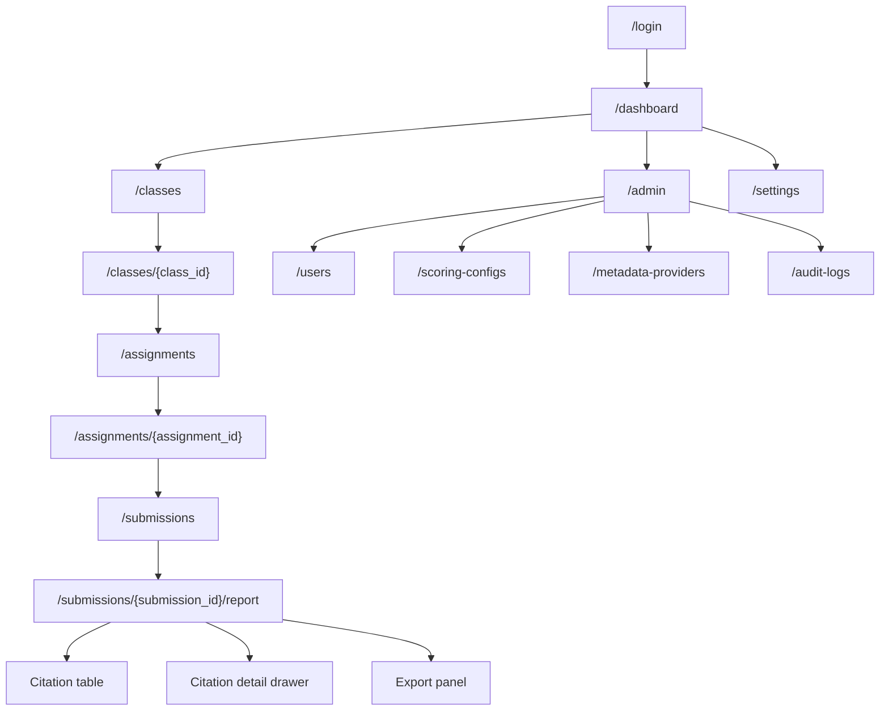

---

# D11. Upload-to-Report Activity Flow

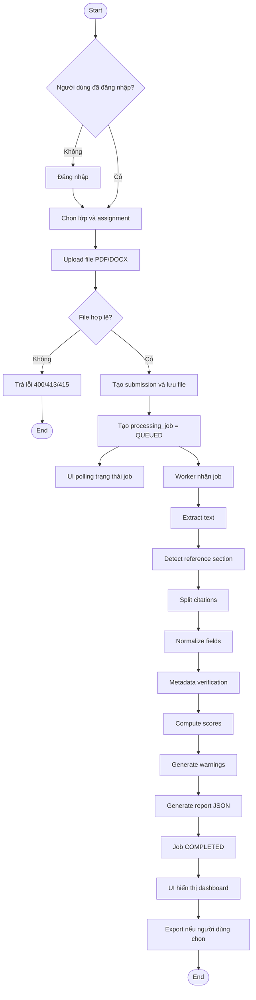

---

# D12. Processing Job State Machine

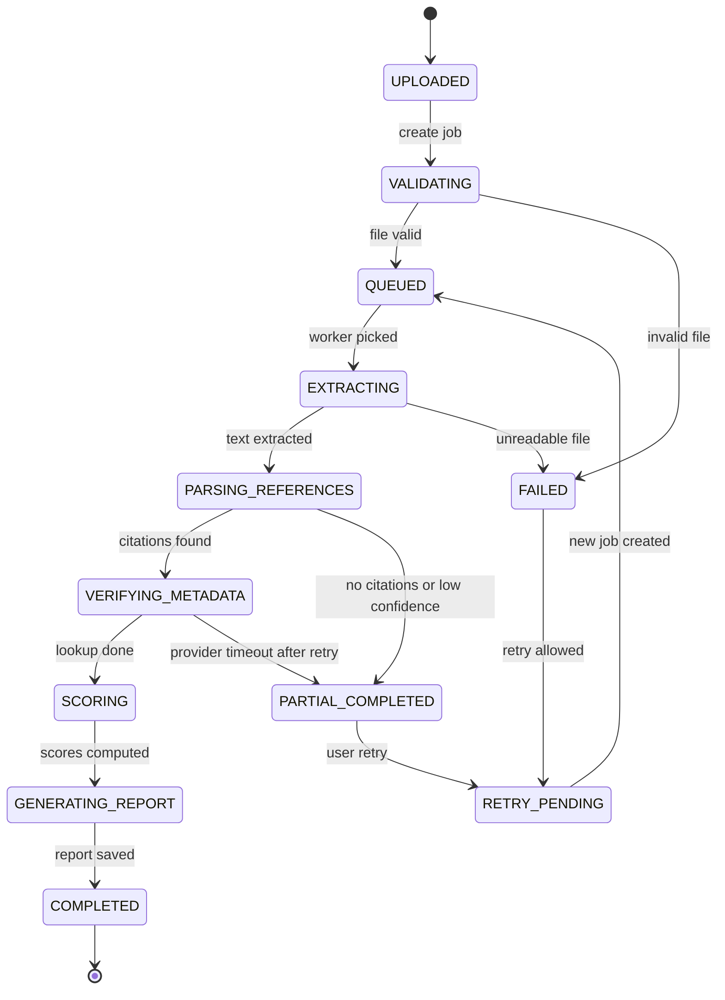

---

# D13. Upload & Async Analysis Sequence

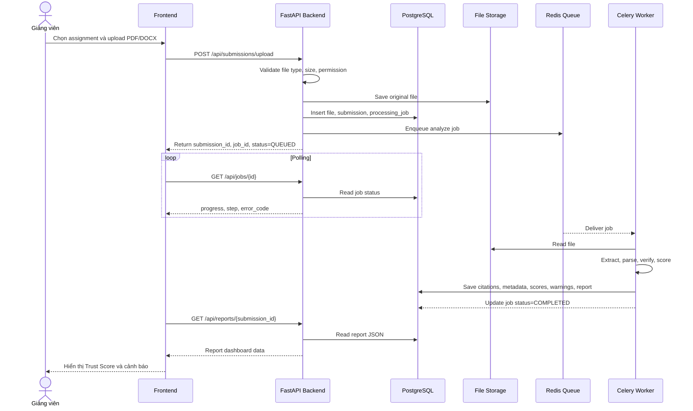

---

# D14. File Processing Pipeline

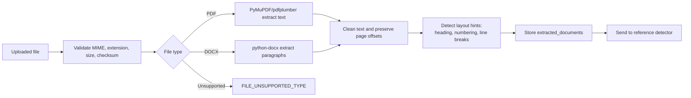

---

# D15. Reference Section Extraction

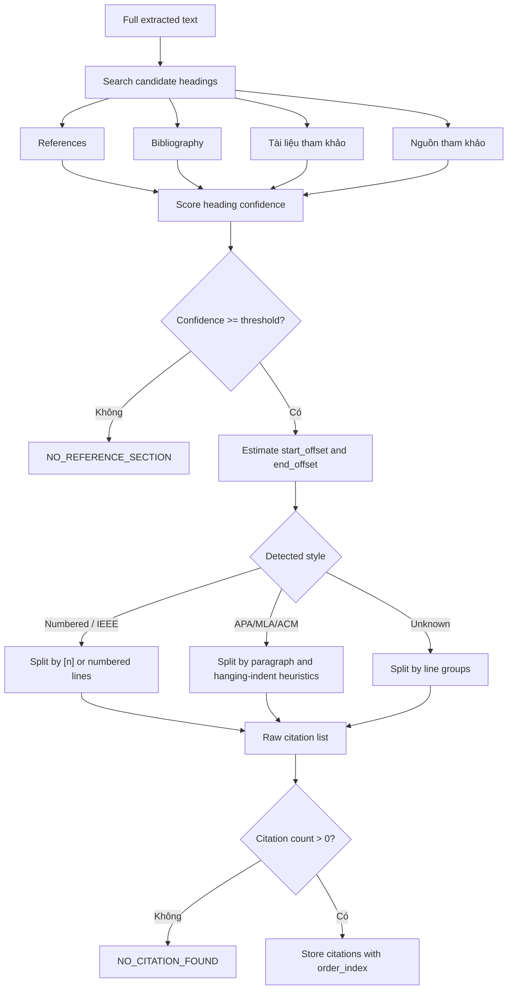

---

# D16. Citation Normalization Pipeline

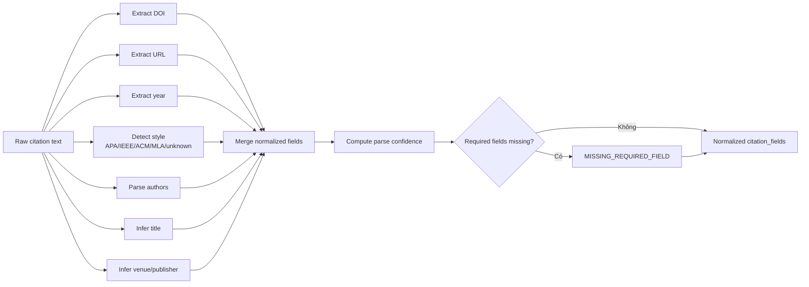

---

# D17. Metadata Verification Decision Flow

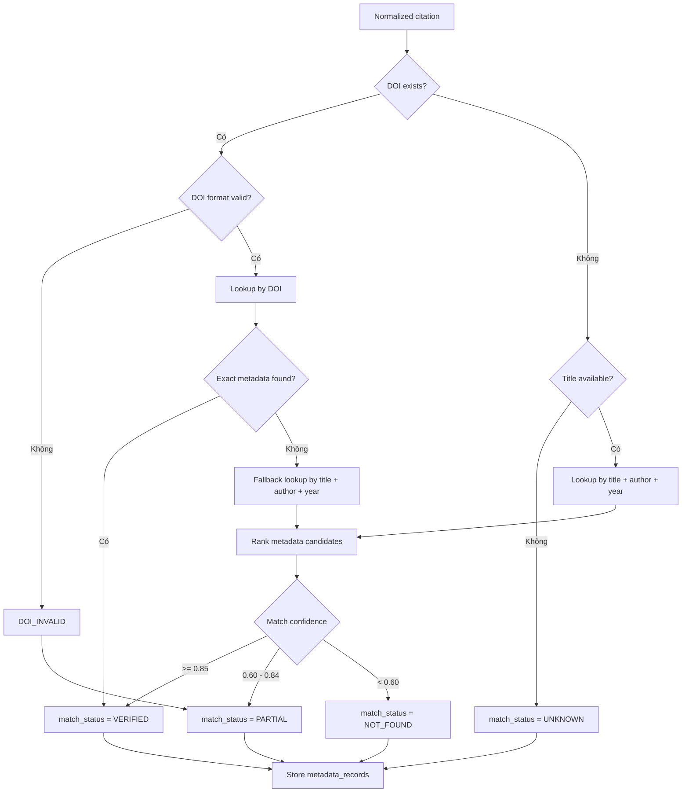

---

# D18. Metadata Lookup Sequence

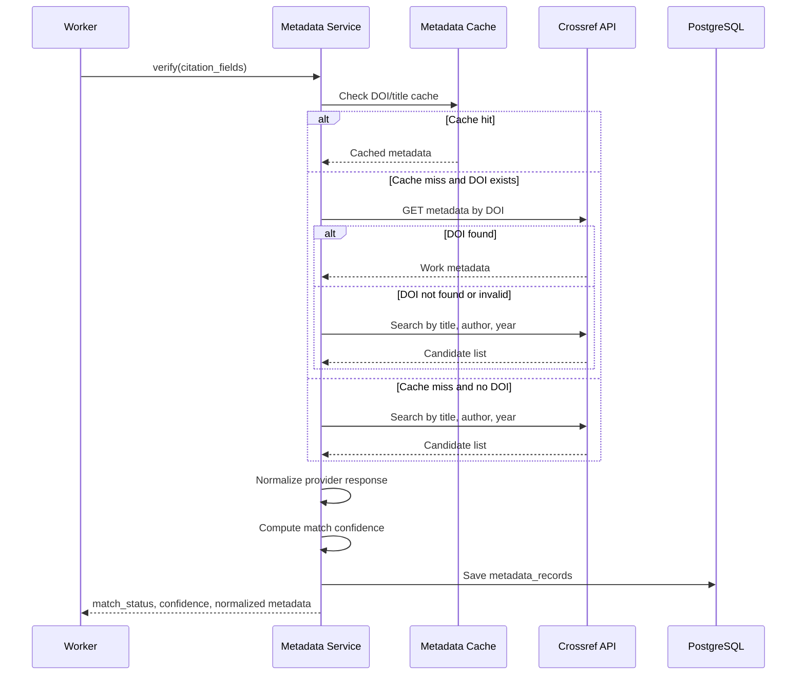

---

# D19. NLP Relevance Pipeline

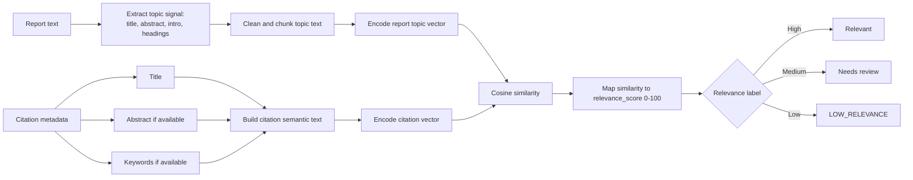

---

# D20. Trust Score Computation

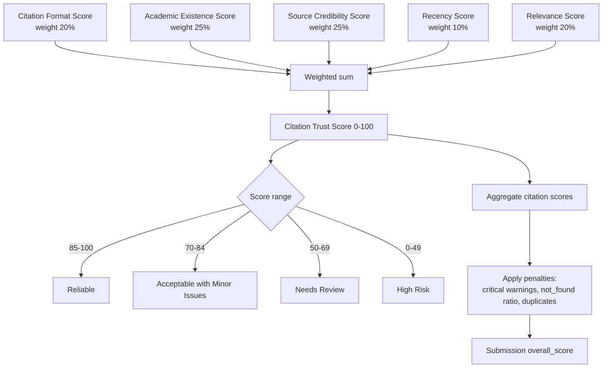

---

# D21. Warning Generation Flow

```mermaid
flowchart TD
    INPUT["Citation fields + metadata + scores"] --> Rules["Rule engine"]

    Rules --> R1{"Reference section missing?"}
    R1 -- "Có" --> W1["NO_REFERENCE_SECTION<br/>critical"]

    Rules --> R2{"Style mismatch?"}
    R2 -- "Có" --> W2["STYLE_MISMATCH<br/>medium"]

    Rules --> R3{"Missing author/year/title?"}
    R3 -- "Có" --> W3["MISSING_REQUIRED_FIELD<br/>medium/high"]

    Rules --> R4{"DOI invalid or source not found?"}
    R4 -- "Có" --> W4["DOI_INVALID / SOURCE_NOT_FOUND<br/>high"]

    Rules --> R5{"Low credibility source?"}
    R5 -- "Có" --> W5["LOW_CREDIBILITY_SOURCE<br/>high"]

    Rules --> R6{"Outdated reference?"}
    R6 -- "Có" --> W6["OUTDATED_REFERENCE<br/>medium"]

    Rules --> R7{"Low relevance?"}
    R7 -- "Có" --> W7["LOW_RELEVANCE<br/>high"]

    W1 --> OUT["warnings table"]
    W2 --> OUT
    W3 --> OUT
    W4 --> OUT
    W5 --> OUT
    W6 --> OUT
    W7 --> OUT
    OUT --> Suggest["Suggested action + explanation"]
```

---

# D22. Report Generation & Export

```mermaid
flowchart LR
    DB["PostgreSQL:<br/>citations, metadata, scores, warnings"] --> Builder["Report Builder"]
    Builder --> Summary["Summary JSON:<br/>overall_score, label, counts"]
    Builder --> Detail["Citation detail rows"]
    Builder --> Warnings["Critical warning list"]
    Builder --> Notes["Lecturer notes"]

    Summary --> Dashboard["Dashboard report"]
    Detail --> Dashboard
    Warnings --> Dashboard
    Notes --> Dashboard

    Dashboard --> ExportChoice{"Export format"}
    ExportChoice -- "PDF" --> PDF["WeasyPrint / ReportLab"]
    ExportChoice -- "DOCX" --> DOCX["python-docx"]
    ExportChoice -- "XLSX" --> XLSX["openpyxl"]

    PDF --> ST["Save export path"]
    DOCX --> ST
    XLSX --> ST
    ST --> Download["User downloads file"]
```

---

# D23. Entity Relationship Diagram

```mermaid
erDiagram
    users ||--o{ classes : teaches
    users ||--o{ audit_logs : creates
    courses ||--o{ classes : contains
    terms ||--o{ classes : schedules
    classes ||--o{ assignments : has
    assignments ||--o{ submissions : receives
    scoring_configs ||--o{ assignments : configures
    submissions ||--|| files : stores
    submissions ||--o{ processing_jobs : processed_by
    submissions ||--|| extracted_documents : has
    submissions ||--|| reference_sections : has
    submissions ||--o{ citations : contains
    citations ||--|| citation_fields : normalizes_to
    citations ||--o{ metadata_records : verifies_with
    citations ||--|| score_components : has
    citations ||--|| trust_scores : has
    citations ||--o{ warnings : triggers
    submissions ||--o{ reports : generates
    metadata_providers ||--o{ metadata_records : supplies

    users {
        uuid id PK
        string email UK
        string full_name
        string role
        string password_hash
        boolean is_active
        datetime created_at
    }

    courses {
        uuid id PK
        string code
        string name
        text description
    }

    classes {
        uuid id PK
        uuid course_id FK
        uuid term_id FK
        uuid lecturer_id FK
        string class_code
        string name
    }

    assignments {
        uuid id PK
        uuid class_id FK
        string title
        datetime due_date
        string required_style
        uuid scoring_config_id FK
    }

    submissions {
        uuid id PK
        uuid assignment_id FK
        string owner_label
        uuid file_id FK
        string status
        float overall_score
    }

    files {
        uuid id PK
        string original_name
        string stored_path
        string mime_type
        integer size_bytes
        string checksum
        uuid uploaded_by FK
    }

    processing_jobs {
        uuid id PK
        uuid submission_id FK
        string status
        integer progress
        string error_code
        datetime started_at
        datetime finished_at
    }

    citations {
        uuid id PK
        uuid submission_id FK
        text raw_text
        integer order_index
        float confidence
        uuid duplicate_of
    }

    citation_fields {
        uuid citation_id PK
        string title
        string authors
        integer year
        string doi
        string url
        string venue
        string publisher
        string style_detected
    }

    metadata_records {
        uuid id PK
        uuid citation_id FK
        uuid metadata_provider_id FK
        string provider
        string match_status
        float confidence
        json raw_json
        json normalized_json
    }

    score_components {
        uuid citation_id PK
        float format_score
        float existence_score
        float credibility_score
        float recency_score
        float relevance_score
    }

    trust_scores {
        uuid id PK
        uuid citation_id FK
        uuid submission_id FK
        float score
        string label
        string config_version
        text explanation
    }

    warnings {
        uuid id PK
        uuid citation_id FK
        uuid submission_id FK
        string code
        string severity
        text message
        text suggested_action
    }

    reports {
        uuid id PK
        uuid submission_id FK
        datetime generated_at
        uuid generated_by FK
        json summary_json
        json export_paths
    }
```

---

# D24. Data Lifecycle

```mermaid
flowchart TD
    A["1. User uploads file"] --> B["2. Store file metadata and binary path"]
    B --> C["3. Extract full_text"]
    C --> D["4. Store extracted_documents"]
    D --> E["5. Detect reference_sections"]
    E --> F["6. Store raw citations"]
    F --> G["7. Store normalized citation_fields"]
    G --> H["8. Lookup and store metadata_records"]
    H --> I["9. Store score_components"]
    I --> J["10. Store trust_scores"]
    J --> K["11. Store warnings"]
    K --> L["12. Generate reports"]
    L --> M["13. Save export files"]
    M --> N["14. Audit user actions and system events"]
```

---

# D25. API Resource Map

```mermaid
flowchart TB
    API["/api"] --> Auth["/auth"]
    Auth --> Login["POST /auth/login"]
    Auth --> Refresh["POST /auth/refresh"]

    API --> Users["/users"]
    Users --> Me["GET /users/me"]

    API --> Courses["/courses"]
    Courses --> GetCourses["GET /courses"]
    Courses --> PostCourses["POST /courses"]

    API --> Classes["/classes"]
    Classes --> GetClasses["GET /classes"]
    Classes --> PostClasses["POST /classes"]

    API --> Assignments["/assignments"]
    Assignments --> GetAssignments["GET /assignments"]
    Assignments --> PostAssignments["POST /assignments"]

    API --> Submissions["/submissions"]
    Submissions --> Upload["POST /submissions/upload"]
    Submissions --> GetSubmission["GET /submissions/{id}"]
    Submissions --> Analyze["POST /submissions/{id}/analyze"]

    API --> Jobs["/jobs"]
    Jobs --> GetJob["GET /jobs/{id}"]
    Jobs --> RetryJob["POST /jobs/{id}/retry"]

    API --> Reports["/reports"]
    Reports --> GetReport["GET /reports/{submission_id}"]
    Reports --> Citations["GET /reports/{id}/citations"]
    Reports --> Export["GET /reports/{id}/export"]
    Reports --> Notes["POST /reports/{id}/notes"]

    API --> Admin["/admin"]
    Admin --> Scoring["/admin/scoring-configs"]
    Admin --> Audit["/admin/audit-logs"]
    API --> Health["GET /health"]
```

---

# D26. Authentication & Authorization Flow

```mermaid
sequenceDiagram
    actor U as User
    participant FE as Frontend
    participant API as Backend API
    participant DB as PostgreSQL

    U->>FE: Submit email/password
    FE->>API: POST /api/auth/login
    API->>DB: Find active user by email
    DB-->>API: user + password_hash + role
    API->>API: Verify password hash
    alt Valid credentials
        API->>API: Create access_token and refresh_token
        API-->>FE: tokens + user profile
        FE->>FE: Store token securely
    else Invalid credentials
        API-->>FE: 401 UNAUTHORIZED
    end

    U->>FE: Request protected page
    FE->>API: API request with Bearer JWT
    API->>API: Verify signature and expiration
    API->>DB: Load permissions for role
    alt Permission allowed
        API-->>FE: 200 response data
    else Permission denied
        API-->>FE: 403 FORBIDDEN
    end
```

---

# D27. API Error Handling Flow

```mermaid
flowchart TD
    Req["Incoming API request"] --> Auth{"Endpoint requires auth?"}
    Auth -- "Có" --> Token{"JWT valid?"}
    Token -- "Không" --> E401["401 UNAUTHORIZED / TOKEN_EXPIRED"]
    Token -- "Có" --> Perm{"Permission valid?"}
    Auth -- "Không" --> Validate
    Perm -- "Không" --> E403["403 FORBIDDEN"]
    Perm -- "Có" --> Validate["Validate request payload"]

    Validate --> Valid{"Payload valid?"}
    Valid -- "Không" --> E400["400 VALIDATION_ERROR"]
    Valid -- "Có" --> Execute["Execute service logic"]

    Execute --> Conflict{"Conflict?"}
    Conflict -- "Có" --> E409["409 DUPLICATE or CONFLICT"]
    Conflict -- "Không" --> Dependency{"Dependency available?"}
    Dependency -- "Không" --> E503["503 PROVIDER_UNAVAILABLE"]
    Dependency -- "Có" --> Success["2xx response"]

    E401 --> ErrorBody["Standard error body + trace_id"]
    E403 --> ErrorBody
    E400 --> ErrorBody
    E409 --> ErrorBody
    E503 --> ErrorBody
    Success --> Audit["Audit log if needed"]
```

---

# D28. Retry & Partial Result Flow

```mermaid
flowchart TD
    Job["Worker processing job"] --> Step["Metadata lookup step"]
    Step --> Provider{"Provider response"}
    Provider -- "Success" --> Continue["Continue scoring"]
    Provider -- "Timeout / 429" --> Retry1["Retry with exponential backoff"]
    Retry1 --> Provider2{"Retry success?"}
    Provider2 -- "Có" --> Continue
    Provider2 -- "Không" --> MarkUnknown["Mark citation metadata UNKNOWN"]
    MarkUnknown --> Partial["Job PARTIAL_COMPLETED"]
    Partial --> UI["UI shows partial result and retry option"]
    UI --> UserRetry{"User retries?"}
    UserRetry -- "Không" --> End1["Keep partial report"]
    UserRetry -- "Có" --> NewJob["Create new processing_job linked to same submission"]
    NewJob --> Queue["Queue retry job"]
    Queue --> Job
```

---

# D29. Admin Scoring Config Lifecycle

```mermaid
stateDiagram-v2
    [*] --> DRAFT
    DRAFT --> VALIDATING: admin saves config
    VALIDATING --> DRAFT: invalid weights or thresholds
    VALIDATING --> ACTIVE: total weight = 100 and thresholds valid
    ACTIVE --> VERSIONED: create new version
    VERSIONED --> ACTIVE: activate new version
    ACTIVE --> DEPRECATED: replaced by newer config
    DEPRECATED --> ARCHIVED: no longer used by new assignments
    ARCHIVED --> [*]
```

---

# D30. Observability & Audit Logging

```mermaid
flowchart LR
    FE["Frontend events"] --> API["Backend request logs"]
    API --> TRACE["trace_id"]
    API --> AUDIT["audit_logs table"]
    API --> ERR["error logs"]

    WORKER["Worker job events"] --> JOBLOG["job status history"]
    WORKER --> ERR
    WORKER --> METRIC["processing metrics"]

    META["Metadata provider calls"] --> METRIC
    META --> ERR

    AUDIT --> AdminUI["Admin audit log screen"]
    ERR --> Debug["Developer debugging"]
    METRIC --> Health["Health check / monitoring"]
    JOBLOG --> UI["Job status panel"]
```

---

# D31. Test Strategy Map

```mermaid
flowchart TB
    TEST["TrustLens v1.0 Test Strategy"] --> U["Unit Test"]
    TEST --> I["Integration Test"]
    TEST --> E["End-to-End Test"]
    TEST --> A["Acceptance Test"]
    TEST --> N["Non-functional Test"]

    U --> U1["Citation parser rules"]
    U --> U2["DOI normalization"]
    U --> U3["Trust Score formula"]
    U --> U4["Warning rule engine"]

    I --> I1["Upload -> job -> DB"]
    I --> I2["Metadata API mock"]
    I --> I3["Export service"]
    I --> I4["Auth and permission"]

    E --> E1["Lecturer login"]
    E --> E2["Upload sample report"]
    E --> E3["View dashboard"]
    E --> E4["Export report"]

    A --> A1["PDF/DOCX accepted"]
    A --> A2["Overall Trust Score displayed"]
    A --> A3["Critical warnings explained"]
    A --> A4["Demo stable"]

    N --> N1["Performance <= 120 seconds for sample"]
    N --> N2["API returns job_id <= 5 seconds"]
    N --> N3["Unauthorized access returns 401/403"]
```

---

# D32. MVP Release Dependency Map

```mermaid
flowchart TD
    Base["v1.0 MVP running product"] --> FE["Frontend screens"]
    Base --> BE["Backend API"]
    Base --> DB["Database schema"]
    Base --> Worker["Async worker"]
    Base --> DS["NLP/scoring rules"]
    Base --> Demo["Demo data and script"]

    FE --> FE1["Login"]
    FE --> FE2["Assignment detail + upload"]
    FE --> FE3["Job status panel"]
    FE --> FE4["Report dashboard"]
    FE --> FE5["Export UI"]

    BE --> BE1["Auth endpoints"]
    BE --> BE2["Class/assignment endpoints"]
    BE --> BE3["Upload endpoint"]
    BE --> BE4["Job endpoint"]
    BE --> BE5["Report endpoint"]

    DB --> DB1["Core entities"]
    DB --> DB2["Citation and metadata entities"]
    DB --> DB3["Score and report entities"]

    Worker --> W1["File extraction"]
    Worker --> W2["Citation parsing"]
    Worker --> W3["Metadata lookup"]
    Worker --> W4["Scoring and warning"]

    DS --> DS1["Trust Score config"]
    DS --> DS2["Warning dictionary"]
    DS --> DS3["Relevance scoring baseline"]

    Demo --> D1["Clean sample report"]
    Demo --> D2["Risky sample report"]
    Demo --> D3["Pitch demo flow"]
```

---

# D33. Requirement Traceability Map

```mermaid
flowchart LR
    subgraph REQ["Requirement groups"]
        R1["FR-01..FR-04<br/>Auth & role"]
        R2["FR-05..FR-09<br/>Course/class/assignment"]
        R3["FR-10..FR-16<br/>Upload and extraction"]
        R4["FR-17..FR-25<br/>Metadata and evaluation"]
        R5["FR-26..FR-29<br/>Trust Score and warning"]
        R6["FR-30..FR-36<br/>Report, export, retry"]
        R7["NFR-01..NFR-25<br/>Quality attributes"]
    end

    subgraph MOD["Implementation modules"]
        M1["Auth module"]
        M2["Classroom module"]
        M3["Submission module"]
        M4["Processing worker"]
        M5["Metadata adapter"]
        M6["Scoring engine"]
        M7["Report/export module"]
        M8["Security, logging, testing"]
    end

    R1 --> M1
    R2 --> M2
    R3 --> M3
    R3 --> M4
    R4 --> M5
    R4 --> M6
    R5 --> M6
    R6 --> M7
    R6 --> M4
    R7 --> M8
    R7 --> M1
    R7 --> M3
    R7 --> M4
```

---

# D34. Future Extension Roadmap

```mermaid
flowchart LR
    V10["v1.0<br/>MVP demo"] --> V11["v1.1<br/>Better citation parser"]
    V11 --> V12["v1.2<br/>OCR for scanned PDFs"]
    V12 --> V13["v1.3<br/>LMS integration"]
    V13 --> V14["v1.4<br/>Citation recommendation"]
    V14 --> V20["v2.0<br/>Institution-scale academic integrity platform"]

    V10 --> F1["Upload, analyze, dashboard, export"]
    V11 --> F2["More citation styles and better heuristics"]
    V12 --> F3["OCR pipeline and layout recovery"]
    V13 --> F4["Moodle / Google Classroom sync"]
    V14 --> F5["Suggest higher-quality replacement sources"]
    V20 --> F6["Multi-tenant deployment, analytics, policy templates"]
```

---

## Phụ lục A. Công thức Trust Score v1.0

```text
Citation Trust Score =
0.20 * Citation Format Score
+ 0.25 * Academic Existence Score
+ 0.25 * Source Credibility Score
+ 0.10 * Recency Score
+ 0.20 * Relevance Score
```

## Phụ lục B. Checklist dùng diagram trong báo cáo kỹ thuật

| Diagram nên đưa vào báo cáo 20 trang | Lý do |
|---|---|
| D01 System Context | Giải thích bài toán và người dùng |
| D03 High-level End-to-End Workflow | Thể hiện input-process-output |
| D04 C4 Container Architecture | Trình bày kiến trúc kỹ thuật |
| D12 Processing Job State Machine | Chứng minh xử lý bất đồng bộ và kiểm soát lỗi |
| D19 NLP Relevance Pipeline | Trình bày phần AI/NLP |
| D20 Trust Score Computation | Trình bày mô hình điểm |
| D23 Entity Relationship Diagram | Trình bày cơ sở dữ liệu |
| D31 Test Strategy Map | Trình bày kiểm thử và nghiệm thu |

## Phụ lục C. Checklist dùng diagram trong slide pitching

| Slide | Diagram đề xuất | Cách dùng |
|---|---|---|
| Vấn đề | D01 | Nêu vai trò giảng viên và bài toán kiểm tra nguồn |
| Giải pháp | D03 | Minh họa luồng từ báo cáo đến Trust Score |
| Kiến trúc | D04 hoặc D05 | Trình bày năng lực kỹ thuật |
| AI/NLP | D19 + D20 | Tóm tắt relevance scoring và Trust Score |
| Demo | D11 hoặc D13 | Giải thích quá trình demo upload-report |
| Hướng phát triển | D34 | Chốt khả năng mở rộng sau cuộc thi |
