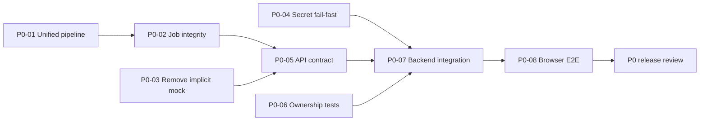

# TrustLens P0 — Kế hoạch khắc phục Release Gate

## 1. Mục tiêu

P0 loại bỏ các lỗi có thể làm hệ thống:

- báo hoàn thành khi chưa có kết quả phân tích thật;
- báo thao tác thành công bằng dữ liệu mock khi backend thất bại;
- tạo nhiều job xử lý trùng cho cùng một submission;
- vận hành với secret JWT mặc định;
- vượt qua kiểm tra giao diện nhưng không chứng minh được tính đúng của luồng end-to-end.

Sau P0, TrustLens phải đạt trạng thái **MVP có thể nghiệm thu trong môi trường kiểm thử có kiểm soát**. P0 chưa nhằm chứng nhận production-ready.

## 2. Nguồn chuẩn

Thứ tự ưu tiên khi có mâu thuẫn:

1. Router và endpoint đang được mount.
2. Service được endpoint gọi trực tiếp.
3. Model, migration và constraint.
4. API schema.
5. Frontend API client và route.
6. Integration/E2E test đã chạy.
7. `docs/v1.2`.
8. Tài liệu cũ trong `archive/`.

Các nguồn nghiệp vụ chính:

- `docs/v1.2/requirements/SRS.md`
- `docs/v1.2/requirements/Use_Cases.md`
- `docs/v1.2/scoring/Trust_Score_Specification.md`
- `docs/v1.2/testing/Test_Plan.md`
- `docs/v1.2/planning/Known_Gaps_and_Decisions.md`
- `docs/v1.2/security/Security_and_Privacy.md`

## 3. Phạm vi

### 3.1. Trong phạm vi

| Nhóm | Nội dung |
|---|---|
| Pipeline | Một pipeline chuẩn cho analyze, process và retry |
| Job integrity | Chặn active job trùng; sửa truy vấn latest job; giữ retry lineage |
| Frontend integrity | Chỉ dùng mock trong explicit mock mode |
| Secret | Loại bỏ JWT secret mặc định; fail-fast ngoài môi trường development |
| API contract | Đồng nhất job status, error schema và report navigation |
| Authorization | Kiểm tra ownership âm tính cho toàn bộ tài nguyên chính |
| Testing | Integration test và browser E2E cho luồng P0 |
| Documentation | Cập nhật SRS, API, test plan và gap register theo mã nguồn sau sửa |

### 3.2. Ngoài phạm vi

- OCR cho PDF scan.
- Batch processing.
- Multi-tenancy.
- LMS integration.
- WebSocket/SSE.
- Auto-scaling.
- MLOps.
- Benchmark học thuật quy mô đầy đủ.
- Thay toàn bộ `BackgroundTasks` bằng distributed worker; nội dung này thuộc P1.

## 4. Điều kiện hoàn tất P0

P0 chỉ được đánh dấu `Done` khi đồng thời thỏa tất cả điều kiện:

- [ ] `POST /api/v1/submissions/{submission_id}/analyze` là endpoint orchestration chuẩn.
- [ ] `/process` đã bị loại bỏ, chuyển internal, hoặc gọi cùng pipeline chuẩn.
- [ ] Retry tạo job mới và thực thi pipeline thật.
- [ ] Job chỉ được `COMPLETED` khi có report hợp lệ và `report_id`.
- [ ] Không có implicit mock fallback khi backend lỗi.
- [ ] Không thể tạo hai active job cho cùng submission.
- [ ] `get_latest_job_by_submission_id()` không phát sinh `MultipleResultsFound`.
- [ ] Production/staging không khởi động bằng JWT secret mặc định.
- [ ] Luồng upload → analyze → poll → report → export chạy qua PostgreSQL thật.
- [ ] Lecturer B không truy cập được dữ liệu thuộc Lecturer A.
- [ ] Unit, integration và E2E gate bắt buộc đều pass.
- [ ] Tài liệu v1.2 khớp với implementation.

---

# 5. Danh mục công việc P0

## P0-01 — Hợp nhất pipeline xử lý

**Mức:** Critical  
**Owner chính:** Backend  
**Phụ thuộc:** Không

### Hiện trạng

- `analyze_submission_endpoint()` gọi `run_analysis_pipeline`.
- `/jobs/submissions/{submission_id}/process` và `/jobs/{job_id}/retry` gọi `run_submission_processing_pipeline`.
- `run_submission_processing_pipeline` chỉ cập nhật trạng thái và có thể đánh dấu `COMPLETED` mà không tạo metadata, score hoặc report.

### Quyết định

`run_analysis_pipeline` là pipeline canonical. Không tồn tại một pipeline thứ hai chỉ mô phỏng stage.

### Công việc backend

1. Chọn một trong hai phương án:
   - xóa endpoint `/process`; hoặc
   - giữ endpoint vì tương thích nhưng chuyển nó thành alias gọi orchestration chuẩn.
2. Sửa retry để gọi `run_analysis_pipeline(str(new_job.id))`.
3. Xóa hoặc deprecate `run_submission_processing_pipeline`.
4. Tách các hàm dùng chung nếu cần:
   - `create_or_reuse_active_job`;
   - `execute_analysis_job`;
   - `fail_job`;
   - `complete_job`.
5. Bảo đảm transaction cuối chỉ đặt:
   - `job.status = COMPLETED`;
   - `job.progress = 100`;
   - `job.report_id != null`;
   - `submission.status = COMPLETED`

   sau khi report đã được lưu thành công.
6. Khi report build thất bại, job phải ở `FAILED_INTERNAL` hoặc mã lỗi cụ thể; không được completed.
7. Giữ audit:
   - `ANALYSIS_STARTED`;
   - `ANALYSIS_COMPLETED`;
   - `ANALYSIS_FAILED`;
   - `ANALYSIS_RETRIED`.

### File dự kiến

- `app/api/v1/endpoints/submissions.py`
- `app/api/v1/endpoints/jobs.py`
- `app/services/analysis_pipeline_service.py`
- `app/services/job_service.py`
- `app/models/processing_job.py`
- `app/schemas/job_schema.py`

### Acceptance criteria

- [ ] Analyze, process alias và retry đều đi qua cùng implementation.
- [ ] Không còn hàm placeholder có thể đặt `COMPLETED`.
- [ ] Job completed luôn có `report_id`.
- [ ] Retry sau lỗi tạo được report mới hoặc cập nhật report theo policy đã khóa.
- [ ] Audit log phân biệt lần phân tích đầu và retry.

### Test bắt buộc

- Happy path PDF.
- Happy path DOCX.
- Không có reference section.
- PDF không có text layer.
- Provider timeout nhưng pipeline degrade được.
- Report build exception.
- Retry từ failed job.
- Retry không làm job cũ mất lịch sử.

---

## P0-02 — Chặn job trùng và sửa truy vấn latest job

**Mức:** Critical  
**Owner chính:** Backend/Database  
**Phụ thuộc:** P0-01

### Hiện trạng

- Upload có thể tạo job ban đầu.
- Analyze tiếp tục tạo job mới.
- Endpoint chưa dùng nhất quán `get_active_job_for_submission`.
- `get_latest_job_by_submission_id()` sử dụng `scalar_one_or_none()` trên truy vấn có thể trả nhiều dòng.

### Quyết định

Mỗi submission chỉ có tối đa một job active tại một thời điểm. Retry chỉ hợp lệ khi job đích đã ở trạng thái terminal.

### Công việc

1. Định nghĩa tập trạng thái active duy nhất:
   - `QUEUED`;
   - `VALIDATING`;
   - `EXTRACTING`;
   - `DETECTING_REFERENCES`;
   - `PARSING_CITATIONS`;
   - `NORMALIZING`;
   - `VERIFYING_METADATA`;
   - `SCORING`;
   - `BUILDING_REPORT`.
2. Viết service:
   ```python
   create_analysis_job(
       submission_id,
       created_by,
       retry_of_job_id=None,
       reject_if_active=True
   )
   ```
3. Sửa latest query thành:
   ```python
   select(ProcessingJob)
       .where(ProcessingJob.submission_id == submission_id)
       .order_by(ProcessingJob.created_at.desc())
       .limit(1)
   ```
4. Thêm database constraint hoặc cơ chế locking phù hợp để chống race condition.
5. Xác định rõ upload:
   - chỉ tạo `Submission` và `File`; hoặc
   - tạo job draft nhưng analyze phải reuse;

   không được vừa tạo job ở upload vừa tạo job active mới không kiểm soát.
6. Retry:
   - chỉ từ terminal status;
   - lưu `retry_of_job_id` hoặc `parent_job_id`;
   - không retry job đang chạy.
7. Chuẩn hóa lỗi:
   - `ACTIVE_JOB_EXISTS`;
   - `JOB_NOT_RETRYABLE`;
   - `JOB_NOT_FOUND`.

### File dự kiến

- `app/services/job_service.py`
- `app/services/submission_service.py`
- `app/api/v1/endpoints/jobs.py`
- `app/api/v1/endpoints/submissions.py`
- `app/models/processing_job.py`
- `alembic/versions/*_job_integrity.py`

### Acceptance criteria

- [ ] Hai request analyze đồng thời không tạo hai active job.
- [ ] Latest endpoint luôn trả đúng job mới nhất.
- [ ] Retry job active bị từ chối.
- [ ] Retry giữ lineage.
- [ ] Không còn `MultipleResultsFound`.

---

## P0-03 — Loại bỏ implicit mock fallback

**Mức:** Critical  
**Owner chính:** Frontend  
**Phụ thuộc:** Không

### Hiện trạng

User-management service fallback sang mock khi API thật lỗi, kể cả khi `VITE_USE_MOCK` không được bật.

### Quyết định

Mock chỉ được sử dụng khi:

```text
VITE_USE_MOCK=true
```

Ngoài chế độ này, lỗi backend phải được truyền tới UI và hiển thị rõ.

### Công việc frontend

1. Xóa `try/catch` fallback sang `MOCK_USERS` khỏi:
   - `getUsers`;
   - `createUser`;
   - `updateUser`;
   - `deleteUser`.
2. Dùng một helper duy nhất:
   ```ts
   const useMock = import.meta.env.VITE_USE_MOCK === 'true';
   ```
3. Tách mock adapter khỏi production service.
4. Không nhận `mock-*` ID trong production mode.
5. Chuẩn hóa error toast/form state:
   - HTTP status;
   - `error_code`;
   - message hành động được;
   - request/correlation ID nếu có.
6. Build production phải kiểm tra `VITE_USE_MOCK !== true`.
7. Thêm test xác minh backend 500 không biến thành thao tác thành công.

### File dự kiến

- `src/services/adminService.ts`
- `src/services/jobService.ts`
- `src/services/*Service.ts`
- `src/mocks/*`
- `.env.example`
- `vite.config.ts`
- test frontend tương ứng

### Acceptance criteria

- [ ] Backend tắt → UI báo lỗi.
- [ ] Create/update/delete user không sửa state giả khi API lỗi.
- [ ] Mock mode vẫn hoạt động khi bật explicit.
- [ ] Production build không tự bật mock.

---

## P0-04 — Secret fail-fast và cấu hình môi trường

**Mức:** Critical  
**Owner chính:** Backend/DevOps  
**Phụ thuộc:** Không

### Hiện trạng

`SECRET_KEY` có giá trị mặc định công khai.

### Quyết định

- Development có thể dùng secret riêng trong `.env` không commit.
- Staging/production bắt buộc inject secret.
- Ứng dụng phải fail-fast nếu secret thiếu, quá ngắn hoặc bằng giá trị cấm.

### Công việc

1. Xóa default secret khỏi `Settings`.
2. Thêm validator:
   - không rỗng;
   - tối thiểu độ dài đã thống nhất;
   - không thuộc deny-list;
   - không bằng sample/example.
3. Thêm `APP_ENV=development|test|staging|production`.
4. Chỉ development/test được dùng cấu hình đơn giản.
5. Cập nhật `.env.example` bằng placeholder, không chứa secret thật.
6. Thêm secret scan trong test/CI ở P1; P0 tối thiểu có unit test config.
7. Kiểm tra repository history thủ công trước release; nếu từng có secret thật, rotate.

### File dự kiến

- `app/core/config.py`
- `.env.example`
- `README.md`
- `docs/v1.2/operations/Deployment_and_Operations.md`
- test config

### Acceptance criteria

- [ ] Không có secret mặc định trong mã nguồn.
- [ ] Production thiếu secret → ứng dụng không khởi động.
- [ ] Secret yếu hoặc sample → ứng dụng không khởi động.
- [ ] Test environment có fixture secret riêng.

---

## P0-05 — Đồng nhất API contract và error schema

**Mức:** High, bắt buộc trong P0 vì ảnh hưởng E2E  
**Owner chính:** Backend + Frontend  
**Phụ thuộc:** P0-01, P0-02

### Mục tiêu

Một vocabulary duy nhất cho job status, error và report navigation.

### Công việc

1. Chuẩn hóa status casing:
   - backend lưu enum chuẩn;
   - API trả một quy ước duy nhất;
   - frontend normalize tại boundary, không rải `.toLowerCase()`.
2. Error schema chuẩn:
   ```json
   {
     "error_code": "ACTIVE_JOB_EXISTS",
     "message": "A processing job is already active.",
     "details": {},
     "retryable": false,
     "correlation_id": "..."
   }
   ```
3. Global exception handler cho:
   - validation;
   - authorization;
   - conflict;
   - internal error.
4. Không trả raw stack trace, file path hoặc provider secret.
5. Khi job completed, response phải có `report_id`.
6. Frontend điều hướng report bằng `report_id`; không fallback mơ hồ sang `submission_id` nếu route không hỗ trợ.
7. Cập nhật OpenAPI/API documentation.

### File dự kiến

- `app/main.py`
- `app/core/exceptions.py`
- `app/schemas/error_schema.py`
- `app/schemas/job_schema.py`
- `src/services/axiosClient.ts`
- `src/services/jobService.ts`
- `src/features/analyzing/AnalyzingScreen.tsx`
- `docs/v1.2/api/README.md`

### Acceptance criteria

- [ ] Cùng lỗi cho cùng điều kiện ở mọi endpoint.
- [ ] Frontend đọc đúng lỗi backend.
- [ ] Không có completed job thiếu report.
- [ ] Không lộ path/stack trace trong response production.

---

## P0-06 — Authorization và ownership negative tests

**Mức:** High  
**Owner chính:** Backend/QA  
**Phụ thuộc:** P0-05

### Tài nguyên phải kiểm tra

- Course theo policy đã khóa.
- Class.
- Assignment.
- Submission.
- File download.
- Processing job.
- Report.
- Report export.
- Audit/provider/admin endpoint.

### Ma trận tối thiểu

| Trường hợp | Kỳ vọng |
|---|---|
| Không token | 401 |
| Token hết hạn | 401 |
| Lecturer A truy cập dữ liệu A | Thành công |
| Lecturer B truy cập dữ liệu A | 403 hoặc 404 theo policy |
| Lecturer tự đổi role | Bị từ chối |
| User inactive refresh token | Bị từ chối |
| Student gọi lecturer endpoint | Bị từ chối |
| Admin đúng quyền | Thành công |
| Resource soft-deleted | Không truy cập được |

### Acceptance criteria

- [ ] Không có IDOR trên đường dẫn sử dụng UUID.
- [ ] Authorization thực hiện tại backend.
- [ ] Frontend route guard không được xem là kiểm soát duy nhất.
- [ ] Audit ghi nhận hành động nhạy cảm phù hợp.

---

## P0-07 — Integration test end-to-end ở backend

**Mức:** Critical release evidence  
**Owner chính:** Backend/QA  
**Phụ thuộc:** P0-01 đến P0-06

### Hạ tầng test

- PostgreSQL test instance.
- Temporary file storage.
- Provider adapter stub/mock server có kiểm soát.
- Alembic migration chạy từ database rỗng.
- Fixture PDF và DOCX nhỏ.
- Không dùng SQLite để thay thế hoàn toàn PostgreSQL cho release gate.

### Luồng bắt buộc

```text
Register/Login
→ Create course
→ Create class
→ Create assignment
→ Upload
→ Analyze
→ Poll real job
→ Read report
→ Export PDF/DOCX/XLSX
→ Download
```

### Ca kiểm thử

1. Happy path PDF.
2. Happy path DOCX.
3. PDF scan.
4. MIME spoof.
5. File quá kích thước.
6. Assignment đóng.
7. Không có reference section.
8. Provider timeout/degrade.
9. Duplicate citation.
10. Active job conflict.
11. Retry từ failed job.
12. Cross-user access.
13. Soft-deleted submission.
14. Export file vật lý bị thiếu.
15. Migration up từ database rỗng.

### Acceptance criteria

- [ ] Test chạy tự động bằng một lệnh.
- [ ] Không phụ thuộc dữ liệu developer local.
- [ ] Có cleanup deterministic.
- [ ] Có assertion trên database, không chỉ HTTP 200.

---

## P0-08 — Frontend browser E2E

**Mức:** High release evidence  
**Owner chính:** Frontend/QA  
**Phụ thuộc:** P0-03, P0-05, P0-07

### Luồng bắt buộc

1. Login.
2. Chọn hoặc tạo class/assignment.
3. Upload PDF.
4. Bắt đầu analyze.
5. Xem progress thật.
6. Điều hướng tới report thật.
7. Export và tải file.
8. Backend lỗi → UI hiển thị lỗi, không mock.
9. Retry job failed.
10. User khác không xem được resource.

### Acceptance criteria

- [ ] Chạy trên build production.
- [ ] `VITE_USE_MOCK=false`.
- [ ] Không dùng network interception để giả luồng happy path chính.
- [ ] Có screenshot/trace khi thất bại.

---

# 6. Thứ tự triển khai



Khuyến nghị triển khai theo nhánh riêng:

1. `fix/p0-unified-pipeline`
2. `fix/p0-job-integrity`
3. `fix/p0-explicit-mock-only`
4. `fix/p0-secret-fail-fast`
5. `fix/p0-api-error-contract`
6. `test/p0-integration-e2e`

Không gộp toàn bộ P0 thành một commit lớn.

# 7. Ma trận file cần cập nhật

## Backend

| File/nhóm | Nội dung | Ưu tiên |
|---|---|---:|
| `app/services/analysis_pipeline_service.py` | Pipeline canonical | P0 |
| `app/services/job_service.py` | Job creation, latest query, retry lineage | P0 |
| `app/api/v1/endpoints/submissions.py` | Analyze orchestration | P0 |
| `app/api/v1/endpoints/jobs.py` | Process/retry consistency | P0 |
| `app/models/processing_job.py` | Constraint/lineage/state | P0 |
| `app/schemas/job_schema.py` | Contract chuẩn | P0 |
| `app/core/config.py` | Secret fail-fast | P0 |
| `app/core/exceptions.py` | Error schema/global handler | P0 |
| `alembic/versions/*` | Migration job integrity | P0 |
| `tests/integration/*` | End-to-end API | P0 |
| `tests/security/*` | Ownership negative | P0 |

## Frontend

| File/nhóm | Nội dung | Ưu tiên |
|---|---|---:|
| `src/services/adminService.ts` | Xóa implicit fallback | P0 |
| `src/services/jobService.ts` | Contract và retry | P0 |
| `src/services/axiosClient.ts` | Error normalization | P0 |
| `src/features/analyzing/AnalyzingScreen.tsx` | Polling và report navigation | P0 |
| `src/mocks/*` | Tách explicit mock adapter | P0 |
| `.env.example` | Mock mode rõ ràng | P0 |
| `e2e/*` | Browser E2E | P0 |

## Root docs

| File | Nội dung |
|---|---|
| `docs/v1.2/requirements/SRS.md` | Cập nhật trạng thái requirement |
| `docs/v1.2/requirements/Use_Cases.md` | UC-09 từ Partial sang Implemented khi pass |
| `docs/v1.2/api/README.md` | Endpoint và error contract |
| `docs/v1.2/testing/Test_Plan.md` | Test evidence và lệnh chạy |
| `docs/v1.2/planning/Known_Gaps_and_Decisions.md` | Đóng GAP tương ứng |
| `docs/v1.2/archive/Source_Baseline.md` | Snapshot mới sau release |

# 8. Lệnh gate dự kiến

Tên lệnh có thể điều chỉnh theo toolchain thực tế, nhưng release phải có tương đương:

```bash
# Backend
alembic upgrade head
pytest tests/unit
pytest tests/integration
pytest tests/security

# Frontend
npm ci
npm run lint
npm run build
npm run test
npm run e2e
```

Không chấp nhận chỉ chạy `npm run build` hoặc chỉ kiểm tra thủ công.

# 9. Rủi ro thực hiện

| Rủi ro | Tác động | Kiểm soát |
|---|---|---|
| Sửa pipeline làm thay đổi report cũ | Không tương thích dữ liệu | Migration/compatibility test |
| Chặn job trùng gây false conflict | Người dùng không phân tích được | Terminal-state cleanup + timeout policy |
| Retry ghi đè report | Mất lịch sử | Khóa revision policy trước code |
| Xóa mock làm lộ API chưa hoàn thiện | UI phát sinh lỗi thật | Sửa API contract, không khôi phục fallback |
| Secret validator làm dev không chạy | Cản trở phát triển | `.env.example` và test fixture rõ ràng |
| E2E không ổn định | Gate thiếu tin cậy | Seed deterministic, stub provider, trace |

# 10. Definition of Done

Mỗi hạng mục P0 phải có:

- requirement ID liên quan;
- issue/PR riêng;
- code review;
- migration nếu thay schema;
- unit test;
- integration hoặc E2E test phù hợp;
- negative authorization test;
- cập nhật API/docs;
- không còn mock implicit;
- không còn secret mặc định;
- không có critical/high defect chưa được chấp thuận bằng quyết định có owner.

# 11. Quyết định release

Chỉ đổi trạng thái dự án từ `Release Gate: FAIL` sang `P0 Ready` khi có bằng chứng test thực thi. Việc source code “trông có vẻ đúng” hoặc tài liệu đánh dấu `Implemented` không đủ làm bằng chứng nghiệm thu.
