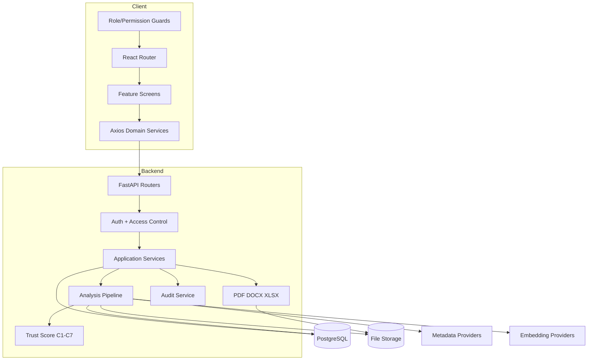

```mermaid
flowchart TB
    subgraph Client
        Routes[React Router]
        Features[Feature Screens]
        Services[Axios Domain Services]
        Auth[Role/Permission Guards]
    end
    subgraph Backend
        Routers[FastAPI Routers]
        Access[Auth + Access Control]
        Domain[Application Services]
        Pipeline[Analysis Pipeline]
        Scoring[Trust Score C1-C7]
        Export[PDF DOCX XLSX]
        Audit[Audit Service]
    end
    DB[(PostgreSQL)]
    Files[(File Storage)]
    Metadata[Metadata Providers]
    Embedding[Embedding Providers]
    Routes --> Features
    Features --> Services
    Auth --> Routes
    Services --> Routers
    Routers --> Access
    Access --> Domain
    Domain --> Pipeline
    Pipeline --> Scoring
    Domain --> Export
    Domain --> Audit
    Domain --> DB
    Pipeline --> DB
    Pipeline --> Files
    Pipeline --> Metadata
    Pipeline --> Embedding
    Export --> Files

```
