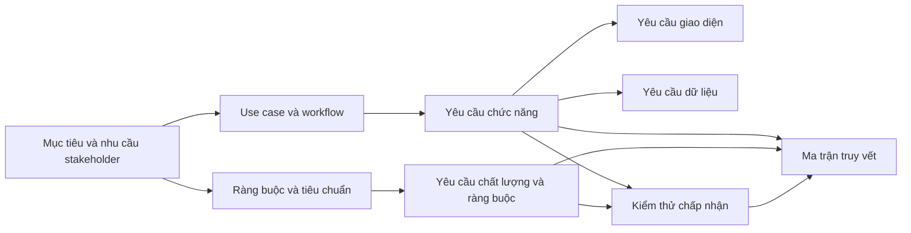
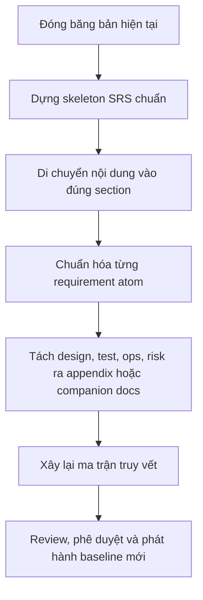

# Đánh giá chuẩn hóa SRS TrustLens theo IEEE và ISO

## Tóm tắt điều hành

Đến ngày 2026-06-07, chuẩn tham chiếu chính cho yêu cầu và đặc tả yêu cầu vẫn là **ISO/IEC/IEEE 29148:2018**. Trang chuẩn chính thức của ISO xác nhận đây là **Edition 2**, xuất bản tháng 11-2018, đã được **review và confirmed năm 2024**, và hiện ở trạng thái **to be revised** trong chu kỳ 2026; vì vậy đây vẫn là bản chuẩn hiện hành để đối chiếu. Trang chuẩn chính thức của IEEE cũng mô tả 29148-2018 là **Active Standard**. Đồng thời, IEEE xác nhận bản 29148:2011 đã **thay thế IEEE 830-1998**, IEEE 1233-1998 và IEEE 1362-1998; do đó, khi đánh giá SRS hiện nay, **29148 là chuẩn hiện hành**, còn **IEEE 830 là chuẩn legacy** để tham chiếu cấu trúc SRS truyền thống. citeturn14view0turn14view4turn39view0turn16view0

Tài liệu **TrustLens_SRS_Chi_Tiet_v1.0** có độ phủ nội dung cao: đã có kiểm soát tài liệu, giới thiệu, mô tả tổng quan hệ thống, vai trò người dùng, quy trình và use case, yêu cầu chức năng, yêu cầu phi chức năng, yêu cầu dữ liệu, AI/NLP, API, UI, bảo mật – quyền riêng tư, kiểm thử – nghiệm thu, triển khai – vận hành – bảo trì, ma trận truy vết, rủi ro và phụ lục. Về mặt thực chất, đây **không phải là một tài liệu yếu**; ngược lại, nó đã gần mức “baseline triển khai”. Tuy nhiên, xét theo logic của IEEE 830 legacy và ISO/IEC/IEEE 29148 current, tài liệu này **chưa phải một SRS thuần chuẩn** mà là một **tài liệu lai** giữa SRS, architecture note, API spec, test/acceptance note, deployment/ops note và risk register. fileciteturn0file0

Kết luận ngắn gọn là: **TrustLens hiện ở mức “tuân thủ một phần”**. Điểm mạnh nằm ở độ đầy đủ nội dung; điểm chưa đạt nằm ở **trật tự information item**, **ranh giới giữa requirement và design**, **mức độ quy chuẩn hóa theo từng requirement atom**, và **cách đặt các artifact phụ trợ**. Nói cách khác, phần lớn nội dung hiện có **không cần bỏ**, nhưng cần **sắp xếp lại**, **đánh nhãn lại**, và **tách bớt** sang phụ lục hoặc tài liệu đồng hành. citeturn14view1turn39view0turn51view1 fileciteturn0file0

Khuyến nghị trọng tâm là: giữ **các yêu cầu** trong SRS lõi; chuyển **chi tiết implementation-specific** như stack, pipeline AI nội bộ, endpoint catalog quá chi tiết, kế hoạch kiểm thử đầy đủ, triển khai – backup – maintenance procedure, risk register sang **appendix informative** hoặc **companion documents**; đồng thời chuẩn hóa mọi FR/NFR về dạng **có ID, có nguồn gốc, có tiêu chí chấp nhận, có truy vết hai chiều**. Cách làm này phù hợp với thực tế tiêu chuẩn 29148 nhấn mạnh vào **required information items**, **required contents**, và **format guidance**, thay vì bắt buộc một bộ tên chương cứng nhắc. citeturn14view1turn39view0turn51view1

## Cơ sở chuẩn và giới hạn nguồn

Cơ sở đánh giá của báo cáo này được xếp theo thứ tự ưu tiên: **nguồn chính thức của ISO/IEEE** để xác nhận bản chuẩn hiện hành, phạm vi áp dụng, và bản chất “required information items / required contents”; sau đó mới dùng **các tóm tắt công khai** để tái dựng khung chương mục legacy của IEEE 830 trong trường hợp toàn văn chuẩn không mở công khai trên web. Đây là lựa chọn có chủ đích để tránh dựa vào các bản sao không được cấp phép. citeturn14view0turn14view1turn39view0turn16view0

| Nguồn | Loại | Giá trị đối chiếu chính |
|---|---|---|
| **ISO/IEC/IEEE 29148:2018** trên trang ISO chính thức citeturn14view0turn14view1 | Sơ cấp | Xác nhận bản hiện hành, abstract, và việc chuẩn này quy định **required processes**, **required information items**, **required contents** và **format guidelines** |
| **IEEE/ISO/IEC 29148-2018** trên trang IEEE chính thức citeturn39view0 | Sơ cấp | Xác nhận đây là **Active Standard**; mô tả chuẩn này định nghĩa **construct of a good requirement**, các **attributes/characteristics**, và các **information items** cùng nội dung của chúng |
| **IEEE/ISO/IEC 29148-2011** trên trang IEEE chính thức citeturn16view0 | Sơ cấp | Xác nhận chuỗi thay thế: **29148** thay cho **IEEE 830-1998**, **1233-1998**, **1362-1998** |
| Tóm tắt công khai về cấu trúc IEEE 830 legacy và chất lượng SRS tốt citeturn51view0turn51view1 | Thứ cấp công khai | Cho biết khung **Introduction – Overall Description – Specific Requirements** và 8 thuộc tính chất lượng thường được quy về IEEE 830 legacy |
| Tóm tắt công khai về cấu trúc SRS theo 29148/2011 citeturn50view0 | Thứ cấp công khai | Củng cố nhóm nội dung hiện đại như **operating environment**, **user documentation**, **assumptions/dependencies**, **external interfaces**, **non-functional requirements**, **appendices/models** |

Giới hạn quan trọng là: các trang chính thức ISO và IEEE công khai **metadata + abstract**, nhưng **không công khai toàn văn clause/annex** trên web mở; vì vậy, báo cáo này **không kiểm định theo tên heading tuyệt đối**, mà kiểm định theo **lớp thông tin**: phần nào là giới thiệu, mô tả tổng thể, yêu cầu cụ thể, ràng buộc, giao diện, dữ liệu, truy vết, và phần nào thực chất đã trượt sang thiết kế hay vận hành. Cách đọc này phù hợp hơn với tinh thần 29148, vì chuẩn nhấn mạnh vào **information item** và **content**, không chỉ vào tiêu đề chương. citeturn14view1turn39view0turn51view1

Về trục legacy, các tóm tắt công khai nhất quán mô tả SRS kiểu IEEE 830 bằng ít nhất ba khối chính: **Introduction**, **Overall/General Description**, và **Specific Requirements**; trong đó Introduction bao gồm purpose, scope, definitions, references, overview; Overall Description bao gồm product perspective, product functions, user characteristics, constraints, assumptions/dependencies; Specific Requirements bao gồm FR, NFR, interfaces, performance, quality, và các ràng buộc còn lại. Public summary này cũng liệt kê tám thuộc tính của một SRS tốt: **correct, unambiguous, complete, consistent, ranked, verifiable, modifiable, traceable**. Các thuộc tính này rất hữu ích như rubric phụ để chấm chất lượng câu requirement. citeturn51view0turn51view1

Từ các nguồn trên, báo cáo này dùng rubric sau để đánh giá: **độ phủ information item**, **độ đúng chỗ của information item**, **độ thuần requirement so với design**, **khả năng kiểm chứng**, và **khả năng truy vết**. citeturn14view1turn39view0turn51view0

## Đối chiếu tài liệu TrustLens với chuẩn

TrustLens hiện là một tài liệu rất giàu nội dung. Nó đã có đầy đủ các nhóm mà một nhóm phát triển hoặc nhóm học thuật thường cần để triển khai: mô tả sản phẩm, tác nhân, workflow, use case, bảng FR/NFR, dữ liệu, ma trận truy vết, bảo mật, test, deployment, và risk. Vấn đề chính không nằm ở “thiếu nội dung”, mà nằm ở chỗ **nhiều nội dung đang ở đúng dự án nhưng sai artifact**. fileciteturn0file0

| Cụm nội dung chuẩn | Theo IEEE/ISO nên có ở đâu | TrustLens hiện trạng | Đánh giá |
|---|---|---|---|
| Mục đích, phạm vi, thuật ngữ, tham chiếu, overview tài liệu | Introduction | Có, nhưng phần **references** còn nghiêng về tài liệu nền nội bộ; overview tài liệu đang thiên về mục lục hơn là “reading guide” | **Một phần** |
| Product perspective, product functions, user classes | Overall Description | Có mạnh ở phần mô tả hệ thống, người dùng, use case | **Đạt** |
| Operating environment | Overall Description | Có rải rác ở ràng buộc kỹ thuật và triển khai, nhưng chưa gom thành một mục môi trường vận hành rõ ràng | **Một phần** |
| Constraints / standards / assumptions / dependencies | Overall Description | Có, nhưng trộn với lựa chọn công nghệ, bối cảnh cuộc thi và giải pháp triển khai | **Một phần** |
| User documentation | Overall Description | Có report/output, nhưng chưa có mục user documentation đứng độc lập | **Thiếu riêng mục** |
| External interface requirements | Specific Requirements | Có ở phần API, UI, tích hợp, nhưng đang phân tán thay vì gom dưới một cụm interface requirements | **Một phần** |
| Functional requirements | Specific Requirements | Có bảng FR rõ ràng, giàu nghiệp vụ | **Đạt** |
| Non-functional / quality requirements | Specific Requirements | Có NFR phong phú, nhưng một số câu đang là process/implementation requirement hơn là product requirement | **Đạt nhưng cần chuẩn hóa** |
| Data / logical information requirements | Specific Requirements | Có dữ liệu, mô hình dữ liệu, entity, report fields | **Đạt** |
| Acceptance criteria / verification linkage | Gắn với từng requirement hoặc appendix verification | Có phần kiểm thử – nghiệm thu và traceability matrix, nhưng chưa đồng mức cho mọi FR/NFR atom | **Một phần** |
| Traceability | Thuộc tính chất lượng + appendix | Có ma trận truy vết ở mức module/chức năng | **Một phần** |
| Design / architecture detail | Chỉ giữ nếu là externally imposed constraint; còn lại nên tách | Có khá nhiều chi tiết stack, AI pipeline, endpoint, triển khai, backup | **Vượt phạm vi SRS lõi** |

*Ghi chú nguồn đối chiếu:* trục chuẩn lấy từ ISO/IEEE 29148 current và công khai legacy IEEE 830. Nguồn tài liệu hiện tại lấy từ TrustLens_SRS_Chi_Tiet_v1.0. citeturn14view1turn39view0turn51view1 fileciteturn0file0

Nhìn theo góc độ “tuân thủ hình thức”, TrustLens **chưa đạt** vì chưa tổ chức đúng information-item taxonomy. Nhưng nhìn theo góc độ “tuân thủ nội dung cốt lõi”, TrustLens lại **đạt tương đối cao** vì FR, NFR, actors, workflows, data, acceptance và traceability đều đã hiện diện. Vì vậy, phán quyết hợp lý nhất là: **partial compliance, high content coverage, medium structural compliance, low artifact purity**. Nhận định này là suy luận trực tiếp từ phép đối chiếu giữa cấu trúc legacy/current và tài liệu hiện có. citeturn14view1turn39view0turn51view1 fileciteturn0file0

Phần lệch chuẩn lớn nhất nằm ở **ranh giới giữa “what” và “how”**. Theo tinh thần 29148 và rubric legacy IEEE 830, SRS nên ưu tiên mô tả **nhu cầu, hành vi mong đợi, ràng buộc bên ngoài và thuộc tính chất lượng**. Trong TrustLens hiện tại, các lựa chọn như stack cụ thể, pipeline AI/NLP, endpoint API quá chi tiết, quy trình backup/deployment/maintenance, và risk register đang làm tài liệu trở thành một gói tổng hợp. Nếu các chi tiết này là **ràng buộc ngoại sinh** từ nhà tài trợ, cuộc thi, hay hạ tầng bắt buộc, chúng có thể ở lại dưới dạng **constraints**; nếu không, nên tách sang tài liệu thiết kế hoặc vận hành. citeturn39view0turn51view0turn51view1 fileciteturn0file0

Một điểm mạnh đáng giữ nguyên là các bảng requirement của TrustLens đã đi khá xa theo hướng **verifiable** và **traceable**, hai thuộc tính được public summaries của IEEE 830 nhấn mạnh. Tuy vậy, để đạt “chuẩn hóa” hơn, mỗi requirement nên được atom hóa theo mẫu thống nhất: **ID – nguồn gốc – mô tả shall – tiền/hậu điều kiện – đầu vào/đầu ra – tiêu chí chấp nhận – phương pháp kiểm chứng – truy vết lên/xuống**. Hiện tại, TrustLens đã có một phần của chuỗi này nhưng chưa đồng bộ cho mọi dòng FR/NFR. citeturn39view0turn51view0 fileciteturn0file0

Bảng dưới đây tách rõ nội dung nào là **lõi SRS**, nội dung nào nên là **phụ lục informative**, và nội dung nào nên là **companion document**.

| Loại nội dung hiện có | Xử lý đề xuất |
|---|---|
| Mục đích, phạm vi, thuật ngữ, references | Giữ trong **SRS lõi** |
| Product vision / perspective / functions / users / assumptions / constraints | Giữ trong **SRS lõi** |
| FR / NFR / data requirements / externally visible UI / interfaces | Giữ trong **SRS lõi** |
| Use case, workflow, ERD, mockup, glossary, traceability matrix | Chuyển thành **Appendix informative** |
| API endpoint catalog quá chi tiết | Chuyển thành **API companion spec** hoặc appendix riêng |
| Stack công nghệ, kiến trúc logic, pipeline AI nội bộ, schema vật lý DB | Chuyển thành **design/architecture document**; chỉ giữ lại phần là constraint |
| Kế hoạch kiểm thử chi tiết, test procedure, deployment, backup, vận hành, maintenance | Chuyển thành **test spec** / **ops guide** |
| Risk register | Chuyển thành **risk log/project artifact**; chỉ giữ risk-derived constraints trong SRS |

*Ghi chú nguồn:* phân loại trên là tái cấu trúc theo information-item của SRS chuẩn; nó không phủ nhận giá trị nội dung hiện có, mà chỉ đặt lại đúng artifact. citeturn14view1turn39view0turn51view1 fileciteturn0file0

## Cấu trúc SRS chuẩn hóa và mẫu nội dung

Cấu trúc đề xuất dưới đây cố ý **bảo tồn gần như toàn bộ nội dung đang có**, nhưng đặt chúng lại vào một khung “SRS chuẩn hóa” gần với legacy IEEE 830 và phù hợp hơn với cách đọc của ISO/IEC/IEEE 29148. Cách này đặc biệt phù hợp cho một tài liệu đang quá giàu nội dung: thay vì xóa bỏ, ta **chuyển chỗ và đổi nhãn**. citeturn14view1turn39view0turn50view0turn51view1

Sơ đồ dưới mô tả quan hệ giữa các khối chính trong SRS chuẩn hóa và các artifact phụ trợ. Cấu trúc quan hệ này phản ánh đúng logic “goal/use case → requirement → test/traceability”, đồng thời tách interface/data như các lớp hỗ trợ. citeturn39view0turn48search1turn48search4



### Phiên bản đầy đủ

| ID | Mục | Mục đích | Nội dung tối thiểu nên có |
|---|---|---|---|
| FM-01 | Metadata tài liệu | Định danh tài liệu | Tên tài liệu, mã tài liệu, phiên bản, trạng thái, ngày ban hành |
| FM-02 | Lịch sử phiên bản và phê duyệt | Kiểm soát thay đổi | Ai sửa, sửa gì, khi nào, phê duyệt bởi ai |
| FM-03 | Mục lục | Điều hướng | TOC tự động |
| 1.1 | Purpose | Nêu mục đích của SRS | Tài liệu này dùng để làm gì, để ai dùng, quyết định nào dựa trên nó |
| 1.2 | Scope | Định biên sản phẩm | Bài toán, biên hệ thống, những gì có/không có trong release này |
| 1.3 | Definitions, acronyms, conventions | Chuẩn hóa thuật ngữ | Glossary, viết tắt, quy ước “shall/should/may”, quy ước ID |
| 1.4 | References | Nêu nguồn chuẩn và tài liệu liên quan | Chuẩn IEEE/ISO, tài liệu luật/chính sách, tài liệu nghiệp vụ, URL hoặc bibliographic info |
| 1.5 | Intended audience and document overview | Hướng dẫn đọc | Ai đọc phần nào, tài liệu được tổ chức ra sao |
| 2.1 | Product perspective | Đặt hệ thống vào bối cảnh | Hệ thống mới hay mở rộng; quan hệ với LMS, CSDL, dịch vụ ngoài |
| 2.2 | Product functions | Tóm tắt chức năng | Danh sách chức năng mức cao, không đi vào thuật toán nội bộ |
| 2.3 | User classes and characteristics | Mô tả người dùng | Vai trò, quyền, kinh nghiệm, tần suất sử dụng |
| 2.4 | Operating environment | Môi trường vận hành | Trình duyệt, OS, mạng, môi trường máy chủ, external services |
| 2.5 | Constraints, standards, business rules | Ràng buộc áp đặt từ ngoài | Pháp lý, bảo mật, contest constraints, policy, standard bắt buộc, công nghệ bắt buộc nếu thật sự bắt buộc |
| 2.6 | User documentation | Tài liệu người dùng | User guide, help, report interpretation, admin guide nếu có |
| 2.7 | Assumptions and dependencies | Giả định và phụ thuộc | Giả định về dữ liệu, service ngoài, lịch vận hành, bên thứ ba |
| 3.1 | External interface requirements | Gom tất cả interface | UI, software interfaces, communication interfaces, hardware nếu có |
| 3.2 | Functional requirements | Hạt nhân của SRS | Mỗi FR có ID, shall statement, input/output, rule, acceptance, traceability |
| 3.3 | Data / information requirements | Chuẩn hóa dữ liệu nghiệp vụ | Logical entities, data dictionary, retention, integrity, data quality rules |
| 3.4 | Quality requirements | Mô tả NFR đo được | Performance, security/privacy, reliability, availability, usability/accessibility, maintainability/portability |
| 3.5 | Design/implementation constraints | Chỉ giữ constraint thật sự ngoại sinh | Ví dụ: phải deploy trong môi trường trường học hiện hữu; phải dùng SSO có sẵn của tổ chức |
| APP-A | Glossary | Phụ lục tham chiếu | Thuật ngữ miền nghiệp vụ và kỹ thuật |
| APP-B | Use cases, workflows, models | Phụ lục mô hình | Use case text, process flow, ERD, state model |
| APP-C | Traceability matrix | Truy vết hai chiều | Objective ↔ UC ↔ FR/NFR ↔ Test ↔ Component |
| APP-D | Deferred items / open issues | Quản trị phạm vi | TBD, out-of-scope, future releases |
| APP-E | Companion specs | Tách artifact khác | API spec, test spec, ops/deployment guide, architecture/design spec |

*Ghi chú nguồn:* cấu trúc này là một tái tổ chức “chuẩn hóa” dựa trên 29148 current và khung legacy IEEE 830 công khai. citeturn14view1turn39view0turn50view0turn51view1

### Phiên bản tối giản cho bối cảnh học thuật

| ID | Mục | Nội dung tối thiểu |
|---|---|---|
| FM | Metadata, version, TOC | 1–2 trang đầu |
| 1 | Introduction | Purpose, scope, definitions, references |
| 2 | Overall description | Product perspective, product functions, users, constraints, assumptions |
| 3.1 | Functional requirements | FR có ID và acceptance criteria |
| 3.2 | Non-functional requirements | Hiệu năng, bảo mật, usability, maintainability, portability |
| 3.3 | Interface requirements | UI, API, external systems |
| 3.4 | Data requirements | Data model logic, report fields, integrity rules |
| 4 | Appendices | Use case, workflow, ERD, traceability, mockup |

Phiên bản tối giản này phù hợp với đồ án/môn học vì giữ được trục chuẩn của SRS, nhưng không buộc phải tách quá nhiều tài liệu đồng hành. Nếu vẫn cần nộp “một tài liệu duy nhất”, các phần như API chi tiết, sơ đồ deployment, kịch bản kiểm thử và rủi ro nên được đẩy xuống **Appendix informative**, thay vì để ngang hàng với FR/NFR trong thân SRS. citeturn51view1turn50view0

### Mẫu trường nên dùng cho từng requirement

Mẫu cho **functional requirement**:

```text
ID:
Tên requirement:
Nguồn gốc:
Ưu tiên:
Mô tả chuẩn hóa:
Tác nhân / kích hoạt:
Tiền điều kiện:
Dữ liệu vào:
Phản hồi / xử lý mong đợi:
Dữ liệu ra:
Ngoại lệ / lỗi:
Tiêu chí chấp nhận:
Phương pháp kiểm chứng:
Truy vết lên:
Truy vết xuống:
Ghi chú / rationale:
```

Mẫu cho **non-functional requirement**:

```text
ID:
Nhóm chất lượng:
Nguồn gốc:
Ưu tiên:
Mô tả chuẩn hóa:
Đối tượng áp dụng:
Thước đo:
Ngưỡng chấp nhận:
Điều kiện đo:
Phương pháp kiểm chứng:
Tiêu chí chấp nhận:
Truy vết lên:
Truy vết xuống:
```

Các mẫu trên phản ánh đúng tinh thần “good requirement” và yêu cầu về information item content: requirement phải **rõ nghĩa, kiểm chứng được, sửa đổi được và truy vết được**. citeturn39view0turn51view0

## Ánh xạ từ cấu trúc hiện tại sang cấu trúc chuẩn

Bảng dưới đây cho biết từng mục trong outline hiện tại của TrustLens nên đi về đâu trong cấu trúc chuẩn hóa. Mục tiêu của bảng này là **không làm mất nội dung**, chỉ di chuyển nó đến đúng information item. fileciteturn0file0

| Mục gốc trong TrustLens | Đích trong cấu trúc chuẩn | Hành động |
|---|---|---|
| 0. Kiểm soát tài liệu | FM-01 | Giữ nguyên |
| 0.1 Lịch sử phiên bản | FM-02 | Giữ nguyên |
| 0.2 Tài liệu nền | 1.4 References | Mở rộng thành danh mục tham chiếu chuẩn hóa; tách internal docs và external standards |
| 0.3 Mục lục cấu trúc tài liệu | FM-03 | Giữ nguyên |
| 1. Giới thiệu | 1.1–1.5 | Giữ, nhưng chuẩn hóa lại thành purpose/scope/definitions/references/overview |
| 2. Mô tả tổng quan hệ thống | 2.1–2.7 | Giữ, nhưng tách rõ product perspective, product functions, environment, constraints, assumptions |
| 3. Người dùng, vai trò, phân quyền | 2.3 và 3.4.2 | Người dùng sang user classes; matrix phân quyền sang security/authorization requirements |
| 4. Quy trình nghiệp vụ và use case | APP-B và liên kết tới 3.2 | Chuyển thành appendix mô hình; FR chỉ trích những hành vi chuẩn hóa cần hệ thống đáp ứng |
| 5. Yêu cầu chức năng | 3.2 | Giữ làm lõi SRS; chuẩn hóa từng FR thành atomic item |
| 6. Yêu cầu phi chức năng | 3.4 | Giữ làm lõi SRS; tách thành performance / security / reliability / usability / maintainability |
| 7. Yêu cầu dữ liệu và mô hình dữ liệu | 3.3 và APP-B | Logic data requirement ở 3.3; ERD/data dictionary sang appendix |
| 8. Yêu cầu AI/NLP và mô hình Trust Score | 3.2 / 3.4 / 2.5 / Companion design doc | Giữ semantic outcome và threshold như requirement; chuyển pipeline/model choice nội bộ sang design doc |
| 9. API và tích hợp hệ thống | 3.1.3 và 3.1.4; chi tiết sang APP-E | Giữ contract mức requirement; endpoint catalog chi tiết sang API companion spec |
| 10. Giao diện người dùng và báo cáo | 3.1.1 và 3.2 | Giữ UI behavior + report fields trong SRS; wireframe/mockup chi tiết ở APP-B |
| 11. Bảo mật, quyền riêng tư và tuân thủ | 3.4.2 và 2.5 | Giữ; tách đúng phần quality requirement và phần compliance constraint |
| 12. Kiểm thử và nghiệm thu | APP-E + acceptance gắn vào từng requirement | Không để là khối ngang hàng với FR/NFR; giữ summary trong appendix, acceptance criteria đặt tại từng FR/NFR |
| 13. Triển khai, vận hành và bảo trì | 2.4 / 2.5 / APP-E | Chỉ giữ operating environment và externally imposed constraints; chi tiết triển khai/vận hành tách riêng |
| 14. Ma trận truy vết yêu cầu | APP-C | Giữ, nhưng tăng granularity tới từng requirement |
| 15. Rủi ro và biện pháp kiểm soát | APP-D hoặc artifact quản trị rủi ro riêng | Chỉ giữ những risk-derived constraints trong SRS lõi |
| 16. Phụ lục | APP-A…APP-E | Giữ nhưng chia nhỏ rõ ràng theo loại phụ lục |

*Ghi chú nguồn:* toàn bộ mục nguồn lấy từ TrustLens_SRS_Chi_Tiet_v1.0; đích đến được suy ra từ khung SRS chuẩn hóa ở trên. fileciteturn0file0 citeturn14view1turn39view0turn50view0turn51view1

Một nguyên tắc quan trọng khi di chuyển là: **không xóa một section chỉ vì nó “không phải SRS”**. Thay vào đó, đổi trạng thái của nó thành **informative appendix** hoặc **companion specification**. Đây là cách ít tốn công nhất để biến TrustLens từ “hybrid dossier” sang “SRS chuẩn hóa + phụ lục/tài liệu đồng hành”. citeturn14view1turn39view0 fileciteturn0file0

## Checklist chuyển đổi và ví dụ đặc tả

Quy trình chuyển đổi nên diễn ra theo thứ tự “đóng băng hiện trạng → dựng skeleton chuẩn → di chuyển nội dung → chuẩn hóa từng requirement → khôi phục truy vết → phát hành baseline mới”. Trình tự này giúp hạn chế rủi ro mất nội dung khi đang refactor tài liệu. fileciteturn0file0



| Bước | Việc cần làm | Ưu tiên | Nỗ lực |
|---|---|---|---|
| Đóng băng baseline | Gán mã version cho bản hiện tại, chép nguyên văn sang thư mục archive | Cao | Nhỏ |
| Dựng skeleton mới | Tạo khung FM / Introduction / Overall Description / Specific Requirements / Appendices | Cao | Nhỏ |
| Di chuyển front matter | Chuyển 0, 0.1, 0.3 sang FM; đổi 0.2 thành References chuẩn hóa | Cao | Nhỏ |
| Chuẩn hóa Introduction | Viết lại purpose, scope, references, audience/overview theo mẫu chuẩn | Cao | Nhỏ |
| Gom Overall Description | Di chuyển user roles, high-level workflow summary, constraints, assumptions, environment vào phần 2 | Cao | Trung bình |
| Chuẩn hóa FR | Mỗi FR thành một item có ID, shall statement, input/output, acceptance, traceability | Rất cao | Lớn |
| Chuẩn hóa NFR | Đổi mọi NFR mơ hồ thành NFR đo được; tách process requirement khỏi product requirement | Rất cao | Lớn |
| Gom Interface Requirements | Gom UI/API/integration vào 3.1; chỉ giữ interface commitment ở thân tài liệu | Cao | Trung bình |
| Tách detail thiết kế | Chuyển stack, thuật toán nội bộ, endpoint catalog chi tiết, deployment steps sang appendix hoặc companion docs | Cao | Trung bình |
| Xây lại traceability | Tạo liên kết Objective ↔ Use case ↔ FR/NFR ↔ Test | Rất cao | Trung bình |
| Rà soát chồng lặp | Xóa câu yêu cầu trùng, giải quyết xung đột giữa section 5/6/11/12/13 | Cao | Trung bình |
| Phát hành SRS v2 | Review cuối, chốt baseline, cập nhật revision history và approval | Cao | Nhỏ |

*Ghi chú:* mức nỗ lực là ước lượng định tính cho tài liệu ở quy mô hiện tại; phần tốn công nhất gần như chắc chắn là **atom hóa FR/NFR** và **khôi phục traceability xuống từng requirement**. fileciteturn0file0

### Ví dụ FR chuẩn hóa

Ví dụ dưới đây dùng miền bài toán của TrustLens, nhưng được format lại theo hướng chuẩn hóa hơn: một requirement atom, có ID, có nguồn gốc, có acceptance criteria, có verification và traceability. Điều này phù hợp với tinh thần 29148 về “good requirement” và với yêu cầu legacy về tính verifiable/traceable. citeturn39view0turn51view0 fileciteturn0file0

```text
ID: FR-REF-007
Tên requirement: Xác minh DOI của trích dẫn

Section: 3.2 Functional Requirements
Nguồn gốc: OBJ-02, UC-05
Ưu tiên: MUST
Rationale: Hệ thống phải hỗ trợ người dùng kiểm tra độ tin cậy của nguồn học thuật.

Mô tả chuẩn hóa:
Khi một trích dẫn chứa DOI hợp lệ về cú pháp, hệ thống shall tra cứu metadata từ nhà cung cấp đã cấu hình và shall gán cho trích dẫn một trạng thái kết quả thuộc tập {verified, not_found, ambiguous, unknown}.

Tác nhân / kích hoạt:
- Lecturer hoặc Student nộp tài liệu có chứa DOI
- Job phân tích citation được khởi chạy

Tiền điều kiện:
- Tài liệu đã được parse xong
- DOI đã được trích xuất
- Dịch vụ metadata đang khả dụng hoặc có timeout policy

Dữ liệu vào:
- citation_id
- doi
- submission_id

Phản hồi / xử lý mong đợi:
- Gửi yêu cầu tra cứu metadata
- So khớp thông tin tối thiểu
- Lưu trạng thái xác minh
- Ghi audit log

Dữ liệu ra:
- match_status
- metadata_snapshot
- verified_at
- provider_name

Ngoại lệ / lỗi:
- Không phản hồi từ provider trong thời gian timeout -> unknown
- Có nhiều kết quả xung đột -> ambiguous

Tiêu chí chấp nhận:
AC-01: Với DOI hợp lệ và provider trả về một bản ghi metadata duy nhất, match_status = verified.
AC-02: Với DOI đúng cú pháp nhưng provider không có bản ghi, match_status = not_found.
AC-03: Với timeout hoặc lỗi mạng, match_status = unknown và hệ thống không được gán sai thành not_found.
AC-04: Mọi thay đổi trạng thái phải được ghi vào audit log.

Phương pháp kiểm chứng:
- Integration test
- Negative test với timeout
- Log inspection

Truy vết lên:
- OBJ-02
- UC-05

Truy vết xuống:
- IF-API-003
- DATA-CIT-012
- TC-INT-021
- TC-NEG-006
```

### Ví dụ NFR chuẩn hóa

TrustLens hiện đã có nhiều NFR liên quan đến hiệu năng, bảo mật, ổn định và trải nghiệm. Ví dụ dưới đây cho thấy cách biến một NFR “đúng ý” thành một requirement đo được, kiểm được và truy vết được. citeturn39view0turn51view0 fileciteturn0file0

```text
ID: NFR-PERF-003
Nhóm chất lượng: Performance

Section: 3.4.1 Performance Requirements
Nguồn gốc: OBJ-01
Ưu tiên: MUST
Rationale: Trải nghiệm người dùng yêu cầu tiến trình phân tích hoàn thành trong thời gian chấp nhận được cho một bài nộp thông thường.

Mô tả chuẩn hóa:
Đối với một tài liệu PDF hoặc DOCX có kích thước không vượt quá 20 trang và chứa không quá 40 trích dẫn, hệ thống shall hoàn thành quy trình phân tích end-to-end trong không quá 120 giây tại môi trường MVP chuẩn.

Đối tượng áp dụng:
- Pipeline xử lý upload -> parsing -> citation extraction -> verification -> scoring -> report generation

Thước đo:
- End-to-end processing time (giây)

Ngưỡng chấp nhận:
- <= 120 giây ở p95 trên 10 lần chạy thử trong môi trường chuẩn hóa

Điều kiện đo:
- 1 worker tiêu chuẩn
- Dữ liệu đầu vào không lỗi định dạng
- Kết nối tới external metadata provider trong điều kiện mạng bình thường

Phương pháp kiểm chứng:
- Performance test script
- Job timing log
- Repeated benchmark run

Tiêu chí chấp nhận:
AC-01: p95 <= 120 giây
AC-02: Không có lần chạy nào thất bại do memory exhaustion
AC-03: Hệ thống vẫn ghi trạng thái tiến trình đầy đủ trong suốt quá trình phân tích

Truy vết lên:
- OBJ-01

Truy vết xuống:
- TC-PERF-004
- OPS-MON-002
- DASH-METRIC-005
```

## Công cụ, phiên bản hóa và truy vết

Nếu mục tiêu chính là **nộp học thuật hoặc review bằng Word**, nên duy trì một **master template .docx** với heading styles, auto TOC, revision table, và quy ước ID requirement cố định. Nếu mục tiêu là **docs-as-code**, nên dùng **Markdown + Git + Mermaid + Pandoc**. Git có sẵn nhóm lệnh và luồng cho **branching, merging, log, notes, workflows**; Mermaid cho phép tạo **diagram từ text/code**; còn Pandoc hỗ trợ chuyển đổi giữa nhiều định dạng, bao gồm **Markdown, HTML, LaTeX, docx** và xuất **PDF**. Điều này khiến Markdown trở thành lựa chọn tốt cho SRS cần vừa review diffs tốt vừa xuất bản nhiều định dạng. citeturn36view0turn35view1turn35view2

| Nhu cầu | Công cụ đề xuất | Khi nào nên dùng | Ghi chú thực hành |
|---|---|---|---|
| Review nhiều người, nộp .docx | Word template | Môn học, hội đồng, khách hàng không dùng Git | Khóa heading styles, không cho sửa ID requirement bằng tay |
| Docs-as-code, diff rõ | Markdown + Git | Team phát triển, nhiều vòng sửa, cần lịch sử thay đổi | Một requirement một khối riêng; commit message gắn mã requirement |
| Nhiều sơ đồ nhưng vẫn text-based | Mermaid | Flowchart, section relationship, ER mức nhẹ | Lưu sơ đồ cùng tài liệu để tránh “doc rot” citeturn35view1 |
| Xuất bản đa định dạng | Pandoc | Muốn một nguồn phát sinh DOCX/PDF/HTML | Dùng template riêng cho report học thuật hoặc enterprise citeturn35view2 |
| Dàn trang rất chặt, luận văn | LaTeX | Cần kiểm soát mạnh về định dạng/citation | Có thể sinh từ Markdown qua Pandoc nếu muốn giữ nguồn plaintext citeturn35view2 |

Về định danh và truy vết, nên áp dụng một hệ ID bền vững, không phụ thuộc vào việc section được di chuyển hay đổi tên. Một cách đơn giản là dùng các prefix riêng: **OBJ-**, **UC-**, **FR-**, **NFR-**, **IF-UI-**, **IF-API-**, **DATA-**, **TC-**. Khi đó, bạn có thể xây ma trận hoặc đồ thị truy vết theo hướng **nguồn gốc → requirement → test → artifact triển khai**. Trong public summaries của traceability, ma trận truy vết được mô tả là hình thức chuẩn để đối chiếu quan hệ nhiều-nhiều giữa các artifact; còn yêu cầu về traceability cũng được xem là một thuộc tính cốt lõi của SRS tốt trong legacy IEEE 830. citeturn48search1turn48search4turn51view0

Trong bối cảnh TrustLens, thực hành quản trị phù hợp nhất là:
- giữ **SRS lõi** ở một file chính;
- tách **API spec**, **test spec**, **ops/deployment guide**, **architecture/design note** thành tài liệu đồng hành;
- duy trì một **traceability matrix** ở appendix hoặc file riêng;
- buộc mọi commit thay đổi requirement phải chạm đồng thời vào **requirement item** và **trace link** tương ứng. Cách này giúp không phá hỏng truy vết khi tài liệu phát triển theo thời gian. citeturn36view0turn48search1turn48search4

Về mặt thực hành, nếu chỉ được nộp **một tài liệu duy nhất**, phương án tốt nhất không phải là cố ép mọi thứ vào thân SRS, mà là ghi nhãn rõ:
- **Normative core**: Introduction, Overall Description, Specific Requirements.
- **Informative appendices**: use cases, workflow, ERD, mockup, traceability, test summary.
- **Companion references**: API contract, deployment, operations, architecture.  
Cách gắn nhãn này giúp tài liệu vẫn “một file”, nhưng người đọc vẫn phân biệt được đâu là **requirement phải thực hiện**, đâu là **thông tin hỗ trợ**. citeturn14view1turn39view0turn51view1