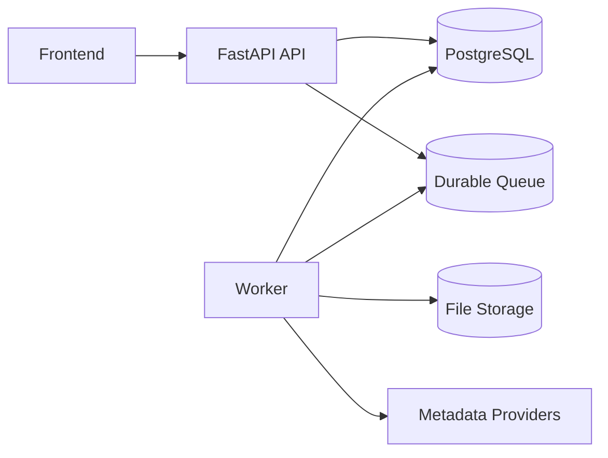
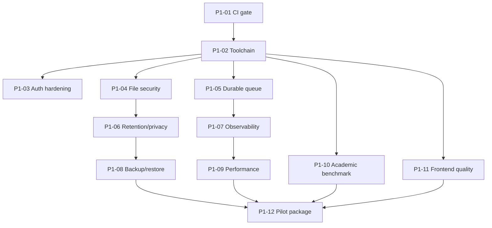

# TrustLens P1 — Kế hoạch hoàn thiện trước Pilot

## 1. Mục tiêu

P1 chuyển TrustLens từ **MVP đã qua release gate** sang **hệ thống đủ điều kiện pilot có kiểm soát với người dùng thật**.

P1 tập trung vào:

- độ bền của xử lý bất đồng bộ;
- an toàn tài khoản và file;
- CI và chất lượng phát hành;
- quyền riêng tư và vòng đời dữ liệu;
- quan sát vận hành;
- benchmark và hiệu chỉnh Trust Score;
- hiệu năng và khả dụng ở quy mô pilot.

P1 chỉ bắt đầu khi toàn bộ gate P0 đã pass.

## 2. Điều kiện tiên quyết

- [ ] Analyze và retry dùng cùng pipeline thật.
- [ ] Không còn implicit mock fallback.
- [ ] Job integrity và ownership test đã pass.
- [ ] Secret fail-fast đã áp dụng.
- [ ] Backend integration và frontend E2E chạy tự động.
- [ ] Docs v1.2 đã cập nhật theo snapshot sau P0.

## 3. Phạm vi

### 3.1. Trong phạm vi

| Nhóm | Nội dung |
|---|---|
| CI/CD | Quality gate tự động cho backend, frontend, migration và docs |
| Dependency management | Tách runtime/dev dependency, khóa phiên bản và audit |
| Auth hardening | Password policy, rate limit, token lifecycle |
| File security | Quarantine, scan, quota, validation sâu |
| Durable processing | Worker queue, retry bền vững, recovery sau restart |
| Privacy | Retention, purge, provider disclosure, minimization |
| Observability | Structured log, correlation ID, metrics, health/readiness |
| Backup/restore | Backup dữ liệu và diễn tập restore |
| Performance | Pagination, timeout, concurrency và benchmark kỹ thuật |
| Academic validation | Tập benchmark có nhãn và calibration Trust Score |
| Accessibility | Loading/error/accessibility/browser coverage |
| Operations | Runbook, incident response, release/rollback checklist |

### 3.2. Ngoài phạm vi mặc định

- OCR production.
- Batch processing quy mô lớn.
- Student portal hoàn chỉnh.
- Multi-tenancy.
- LMS integration.
- Billing.
- SSO enterprise.
- Autoscaling đa vùng.
- Plagiarism detection.
- Citation-in-context.
- Full-text crawling sau paywall.

Các hạng mục trên chỉ được đưa vào P1 nếu có yêu cầu pilot cụ thể và owner chấp thuận thay đổi phạm vi.

## 4. Điều kiện hoàn tất P1

- [ ] Mọi PR bắt buộc qua CI gate.
- [ ] Worker restart không làm job biến mất.
- [ ] Có cơ chế retry/backoff và idempotency.
- [ ] Auth endpoint có rate limit.
- [ ] Password policy không còn mức tối thiểu yếu.
- [ ] File upload đi qua quarantine và scan policy.
- [ ] Có retention và purge job đã test.
- [ ] Có backup/restore drill.
- [ ] Có log cấu trúc và correlation ID.
- [ ] Có health và readiness check.
- [ ] List API chính có pagination.
- [ ] Có benchmark corpus và báo cáo calibration.
- [ ] Trust Score được mô tả đúng giới hạn; không dùng như phán quyết tự động.
- [ ] Pilot runbook và incident procedure được phê duyệt.

---

# 5. Danh mục công việc P1

## P1-01 — Thiết lập CI quality gate

**Mức:** High  
**Owner chính:** DevOps + Backend + Frontend  
**Phụ thuộc:** P0 hoàn tất

### Pipeline tối thiểu

1. Secret scan.
2. Backend dependency install.
3. Backend lint/format/type-check.
4. Unit test.
5. PostgreSQL migration up từ database rỗng.
6. Integration test.
7. Security negative test.
8. Frontend `npm ci`.
9. Frontend lint/type-check/build.
10. Component/service test.
11. Browser E2E smoke.
12. Dependency vulnerability audit.
13. Markdown link/lint check.
14. Xuất test artifact và coverage summary.

### Quy tắc branch protection

- Không merge khi gate bắt buộc fail.
- Không bỏ qua test bằng sửa workflow không có review.
- Migration và code phải đi cùng PR.
- Docs thay đổi contract phải đi cùng code.

### File dự kiến

- `.github/workflows/backend-ci.yml`
- `.github/workflows/frontend-ci.yml`
- `.github/workflows/e2e.yml`
- `.github/dependabot.yml` hoặc công cụ tương đương
- cấu hình lint/type/test
- root `CONTRIBUTING.md`

### Acceptance criteria

- [ ] PR backend lỗi test không merge được.
- [ ] Migration lỗi không merge được.
- [ ] Frontend build hoặc E2E lỗi không merge được.
- [ ] Artifact lưu được log và report cần thiết.

---

## P1-02 — Chuẩn hóa dependency và developer toolchain

**Mức:** High  
**Owner chính:** Backend/Frontend  
**Phụ thuộc:** P1-01

### Backend

Tách:

```text
requirements.txt
requirements-dev.txt
```

hoặc dùng package manager thống nhất có dependency groups.

Dev dependencies tối thiểu:

- pytest;
- coverage;
- API test client;
- formatter;
- linter;
- type-checker;
- security/dependency scanner.

### Frontend

- Khóa lockfile.
- Không dùng dependency không xác định phiên bản.
- Bổ sung test runner và browser runner.
- Kiểm tra bundle và dependency audit.

### Acceptance criteria

- [ ] Cài môi trường sạch có thể lặp lại.
- [ ] Runtime image không chứa toàn bộ dev tooling không cần thiết.
- [ ] README có lệnh setup duy nhất và rõ ràng.
- [ ] CI và local dùng cùng command.

---

## P1-03 — Auth hardening

**Mức:** High  
**Owner chính:** Backend/Security  
**Phụ thuộc:** P0 secret fail-fast

### Công việc

1. Tăng password policy:
   - độ dài tối thiểu phù hợp;
   - chặn password phổ biến;
   - không yêu cầu quy tắc hình thức gây yếu password một cách máy móc.
2. Rate limit:
   - login;
   - register;
   - refresh;
   - password reset nếu có;
   - endpoint AI/provider nhạy cảm.
3. Thiết kế refresh token:
   - rotation;
   - revocation;
   - replay detection;
   - logout phía server.
4. Đánh giá token storage frontend:
   - giảm rủi ro `localStorage`;
   - CSP;
   - sanitization;
   - cân nhắc HttpOnly Secure SameSite cookie theo kiến trúc triển khai.
5. Email verification/reset password chỉ thêm khi pilot yêu cầu, nhưng không được triển khai nửa vời.
6. Audit:
   - login success/failure;
   - lockout/throttle;
   - refresh/revoke;
   - admin role change.

### Test

- Brute-force simulation.
- Token hết hạn.
- Refresh replay.
- User inactive.
- Logout/revocation.
- Role escalation.
- XSS-related security header check.

### Acceptance criteria

- [ ] Login brute force bị kiểm soát.
- [ ] Logout làm refresh token không dùng lại được.
- [ ] Role không thể tự sửa.
- [ ] Security policy được mô tả trong docs và UI phù hợp.

---

## P1-04 — File quarantine và malware-scan policy

**Mức:** High  
**Owner chính:** Backend/DevOps/Security  
**Phụ thuộc:** P0 upload test

### Luồng mục tiêu

```text
Upload
→ validate size/type/signature
→ save quarantine
→ scan
→ accepted storage hoặc rejected
→ create/activate submission
```

### Công việc

1. Không tin extension và MIME do client cung cấp.
2. Kiểm tra magic bytes/file signature.
3. Giới hạn:
   - file size;
   - số trang;
   - decompression ratio;
   - request quota.
4. Quarantine file trước khi pipeline đọc.
5. Tích hợp scanner local/free phù hợp với môi trường pilot.
6. Chặn:
   - macro/active content ngoài policy;
   - malformed file;
   - zip bomb;
   - path traversal.
7. Ghi trạng thái scan và audit.
8. Không lưu file bị từ chối trong vùng download bình thường.

### Data model đề xuất

```text
scan_status:
  pending
  clean
  suspicious
  infected
  failed

scan_provider
scan_signature_version
scanned_at
scan_details
```

### Acceptance criteria

- [ ] File chưa scan không được analyze.
- [ ] File nhiễm hoặc đáng ngờ bị từ chối.
- [ ] Scanner unavailable có policy rõ, không tự coi file là sạch.
- [ ] Test có MIME spoof và malformed PDF/DOCX.

---

## P1-05 — Thay BackgroundTasks bằng durable worker queue

**Mức:** High  
**Owner chính:** Backend/DevOps  
**Phụ thuộc:** P0 unified pipeline

### Mục tiêu

- Job không mất khi API process restart.
- Worker có thể retry.
- Có concurrency control.
- API không trực tiếp thực thi workload dài.

### Kiến trúc



### Công việc

1. Chọn worker/queue có thể vận hành trong hạ tầng hiện tại.
2. API:
   - tạo job trong DB;
   - enqueue sau khi transaction hợp lệ;
   - trả `202`.
3. Worker:
   - claim job;
   - heartbeat;
   - retry/backoff;
   - timeout;
   - dead-letter/failure handling.
4. Idempotency:
   - không chạy hai worker cho cùng job;
   - re-delivery không tạo report trùng.
5. Recovery:
   - worker restart;
   - API restart;
   - queue unavailable;
   - provider timeout.
6. Graceful shutdown.
7. Không phụ thuộc sleep/timer frontend để tạo progress.

### Acceptance criteria

- [ ] Restart API không làm job mất.
- [ ] Restart worker cho phép job tiếp tục hoặc retry có kiểm soát.
- [ ] Duplicate delivery không tạo hai report.
- [ ] Queue failure trả lỗi vận hành rõ ràng.
- [ ] Có metrics queue depth, age và failure count.

---

## P1-06 — Retention, purge và privacy controls

**Mức:** High  
**Owner chính:** Product + Privacy + Backend  
**Phụ thuộc:** P1-04, P1-05

### Quyết định cần khóa

| Dữ liệu | Retention | Căn cứ | Xóa |
|---|---|---|---|
| File gốc | TBD bởi owner | Nhu cầu học thuật/pilot | Soft delete → purge |
| Extracted text | TBD | Tối thiểu cần thiết | Theo submission |
| Metadata response | TBD | Cache/reproducibility | Expire/purge |
| Report | TBD | Course policy | Versioned retention |
| Export | TBD | User convenience | Expire/purge |
| Audit | Dài hơn nghiệp vụ | Security/compliance | Controlled purge |
| Token/session | Ngắn | Security | Expiry/revoke |

Không được để `TBD` khi bắt đầu pilot.

### Công việc

1. Viết retention policy được phê duyệt.
2. Thêm purge scheduler/job.
3. Xóa đồng bộ DB record, file storage và export.
4. Giữ audit tối thiểu theo policy.
5. Thêm quyền xóa và kiểm tra ownership.
6. Không log raw report text mặc định.
7. Lưu provider/model/prompt version nhưng không giữ dữ liệu thừa.
8. Tài liệu hóa dữ liệu gửi tới provider ngoài.

### Acceptance criteria

- [ ] Purge chạy trên fixture và xác nhận file vật lý đã bị xóa.
- [ ] Resource đã purge không tải lại được.
- [ ] Audit không chứa nội dung nhạy cảm thừa.
- [ ] Provider disclosure có trong tài liệu pilot.

---

## P1-07 — Observability và health/readiness

**Mức:** High  
**Owner chính:** Backend/DevOps  
**Phụ thuộc:** P1-05

### Structured logging

Mỗi log quan trọng có:

- timestamp;
- level;
- service;
- environment;
- correlation ID;
- user ID được giảm thiểu;
- submission/job/report ID;
- stage;
- duration;
- error code;
- provider;
- retry count.

Không log token, password, raw secret hoặc toàn bộ report text.

### Endpoint

- `/health`: process sống.
- `/ready`: DB, queue và storage sẵn sàng.
- provider health tách riêng, không làm API core chết hoàn toàn nếu có degrade policy.

### Metrics tối thiểu

- request count/error/latency;
- active/queued/completed/failed jobs;
- stage duration;
- provider latency/error;
- report/export success;
- queue depth/age;
- retry count;
- file scan result.

### Acceptance criteria

- [ ] Có thể truy vết một request từ API đến worker bằng correlation ID.
- [ ] Health không đánh đồng process sống với hệ thống sẵn sàng.
- [ ] Dashboard hoặc log query phát hiện job stuck.
- [ ] Alert/runbook cho queue down, DB down, storage down.

---

## P1-08 — Backup, restore và incident runbook

**Mức:** High  
**Owner chính:** DevOps/Operations  
**Phụ thuộc:** P1-06

### Backup

- PostgreSQL.
- File storage.
- Report/export cần giữ.
- Cấu hình triển khai không chứa secret trong backup công khai.

### Restore drill

1. Khởi tạo môi trường sạch.
2. Restore database.
3. Restore file storage.
4. Chạy migration cần thiết.
5. Xác minh:
   - user;
   - class/assignment;
   - submission;
   - report;
   - authorized download.
6. Ghi thời gian và lỗi.

### Runbook sự cố

- JWT secret lộ.
- Database unavailable.
- Queue stuck.
- Provider unavailable.
- File storage mất file.
- Malware alert.
- Data deletion request.
- Sai Trust Score do cấu hình.

### Acceptance criteria

- [ ] Có ít nhất một restore drill thành công.
- [ ] Có checklist rotate secret.
- [ ] Có owner và kênh xử lý cho từng loại sự cố.
- [ ] Có rollback procedure cho release.

---

## P1-09 — Pagination, timeout và performance baseline

**Mức:** Medium/High  
**Owner chính:** Backend + Frontend  
**Phụ thuộc:** P1-01

### Công việc

1. Pagination cho:
   - users;
   - courses/classes;
   - assignments;
   - submissions;
   - jobs;
   - reports;
   - audit logs.
2. API contract:
   ```json
   {
     "items": [],
     "page": 1,
     "page_size": 20,
     "total": 0,
     "has_next": false
   }
   ```
3. Provider timeout/retry có giới hạn.
4. Database index cho query theo:
   - ownership;
   - status;
   - created_at;
   - assignment/submission/job.
5. Đo:
   - file size;
   - pages;
   - citations;
   - provider latency;
   - concurrent jobs;
   - export format.
6. Không công bố SLA khi chưa có benchmark.
7. Frontend hỗ trợ pagination/loading/error rõ ràng.

### Acceptance criteria

- [ ] Không endpoint list chính trả toàn bộ bảng không giới hạn.
- [ ] Query plan không có vấn đề hiển nhiên ở dataset pilot.
- [ ] Báo cáo performance ghi hardware, dataset và percentile.
- [ ] Timeout không gây worker treo vô hạn.

---

## P1-10 — Benchmark và calibration Trust Score

**Mức:** High về giá trị học thuật  
**Owner chính:** BA/AI-NLP + Giảng viên chuyên môn + Data/QA  
**Phụ thuộc:** P0 scoring ổn định

### Mục tiêu

Xác định Trust Score có tương quan hợp lý với đánh giá chuyên gia và nhận diện vùng sai lệch.

### Dataset tối thiểu

Bao phủ:

- tiếng Việt và tiếng Anh;
- APA và IEEE;
- DOI đúng/sai/thiếu;
- nguồn journal/conference/book/web;
- metadata đầy đủ/thiếu;
- nguồn cũ nhưng nền tảng;
- nguồn mới nhưng kém phù hợp;
- provider not-found;
- duplicate;
- ambiguous match;
- PDF/DOCX có reference section rõ và khó.

### Quy trình gán nhãn

1. Xây rubric độc lập với output hệ thống.
2. Ít nhất hai người đánh giá cho một phần dữ liệu quan trọng.
3. Đo agreement giữa người đánh giá.
4. Khi bất đồng, adjudication có ghi lý do.
5. Tách train/calibration và validation.
6. Không tối ưu threshold trực tiếp trên toàn bộ tập validation.

### Chỉ số

- parser precision/recall;
- DOI/metadata match precision/recall;
- duplicate precision/recall;
- calibration của confidence;
- correlation hoặc agreement với đánh giá chuyên gia;
- false positive/false negative theo source type/ngôn ngữ;
- coverage của provider.

### Output bắt buộc

- Dataset card.
- Labeling guide.
- Benchmark report.
- Calibration profile.
- Known limitations.
- Changelog scoring version.
- Test vectors cố định.

### Acceptance criteria

- [ ] Không dùng một vài ví dụ demo làm bằng chứng độ chính xác.
- [ ] Report nêu rõ sample bias và vùng chưa bao phủ.
- [ ] Threshold hoặc weight thay đổi phải tăng scoring version.
- [ ] Report cũ vẫn đọc được theo version cũ.
- [ ] Trust Score không được dùng làm phán quyết gian lận tự động.

---

## P1-11 — Khả dụng, accessibility và frontend quality

**Mức:** Medium  
**Owner chính:** Frontend/UX/QA  
**Phụ thuộc:** P0 E2E

### Công việc

1. Loading/progress/success/error nhất quán.
2. Lỗi có hướng xử lý.
3. Report tách:
   - Trust Score;
   - Confidence;
   - Evidence;
   - Warning;
   - Limitation.
4. Keyboard navigation.
5. Focus state.
6. Semantic form/label.
7. Contrast và screen-reader smoke test.
8. Route guard test.
9. Component/service test.
10. Browser E2E trên trình duyệt mục tiêu đã khóa.
11. Không hiển thị `NOT_FOUND` thành “nguồn giả”.

### Acceptance criteria

- [ ] Người dùng hiểu khi nào có thể retry.
- [ ] Report không diễn giải score như kết luận tuyệt đối.
- [ ] Các luồng chính dùng được bằng bàn phím.
- [ ] Accessibility issue nghiêm trọng được xử lý trước pilot.

---

## P1-12 — Tài liệu vận hành và pilot package

**Mức:** High  
**Owner chính:** Project Lead + Operations + QA  
**Phụ thuộc:** P1-01 đến P1-11

### Bộ tài liệu bắt buộc

- Installation guide.
- Environment/configuration guide.
- Deployment guide.
- Migration guide.
- Backup/restore guide.
- Monitoring guide.
- Incident runbook.
- Privacy/retention policy.
- User guide cho lecturer/admin.
- Known limitations.
- Pilot test protocol.
- Release notes.
- Rollback checklist.

### Pilot checklist

- [ ] Môi trường tách development.
- [ ] Dữ liệu demo không lẫn dữ liệu thật.
- [ ] Provider key và secret được quản lý.
- [ ] Retention đã cấu hình.
- [ ] Backup đã chạy.
- [ ] Alert cơ bản hoạt động.
- [ ] Có người chịu trách nhiệm hỗ trợ.
- [ ] Có kênh thu thập phản hồi.
- [ ] Có tiêu chí dừng pilot khi rủi ro xảy ra.

---

# 6. Thứ tự triển khai P1



## Mốc kiểm soát

### Gate P1-A — Engineering foundation

- CI pass.
- Dependency/toolchain chuẩn.
- Auth hardening cơ bản.

### Gate P1-B — Operational integrity

- File quarantine/scan.
- Durable queue.
- Retention.
- Observability.
- Backup/restore.

### Gate P1-C — Pilot validity

- Performance baseline.
- Benchmark/calibration.
- Accessibility/frontend quality.
- Pilot package hoàn chỉnh.

# 7. Ma trận cập nhật tài liệu

| Tài liệu | Nội dung cần cập nhật |
|---|---|
| `requirements/SRS.md` | NFR bảo mật, reliability, retention, observability |
| `requirements/Use_Cases.md` | Retry, operations và admin behavior |
| `architecture/Architecture.md` | Queue/worker, health, storage |
| `architecture/Data_Model.md` | Session, scan, retention, lineage nếu thêm |
| `api/README.md` | Pagination, rate limit, errors, readiness |
| `scoring/Trust_Score_Specification.md` | Calibration profile và version |
| `security/Security_and_Privacy.md` | Auth, scan, retention, provider disclosure |
| `testing/Test_Plan.md` | CI, performance, benchmark, restore drill |
| `operations/Deployment_and_Operations.md` | Queue, monitoring, backup, runbook |
| `planning/Known_Gaps_and_Decisions.md` | Đóng/mở gap và ADR |
| `planning/Roadmap.md` | Chuyển hạng mục hoàn tất; giữ P2 ngoài scope |

# 8. Rủi ro và kiểm soát

| Rủi ro | Tác động | Kiểm soát |
|---|---|---|
| Queue tăng độ phức tạp | Vận hành khó | Modular worker, runbook, local compose |
| Malware scan tạo false positive | Từ chối file hợp lệ | Quarantine + review policy |
| Rate limit chặn người dùng thật | UX kém | Threshold theo endpoint và telemetry |
| Retention purge nhầm dữ liệu | Mất dữ liệu | Dry-run, backup, two-phase purge |
| Benchmark bị thiên lệch | Score không tổng quát | Dataset card, stratification, independent validation |
| Provider thay đổi API | Pipeline lỗi | Adapter, timeout, fallback, contract test |
| Logging lộ dữ liệu | Privacy breach | Redaction test, no raw text default |
| Backup có nhưng restore không được | Recovery giả | Restore drill bắt buộc |
| Accessibility bị xem nhẹ | Pilot không đại diện | Gate và checklist cụ thể |

# 9. Definition of Done P1

Một hạng mục P1 chỉ hoàn tất khi có:

- design/ADR khi thay kiến trúc;
- issue và owner;
- code review;
- test tự động;
- security/privacy review nếu liên quan;
- migration và rollback;
- observability;
- tài liệu vận hành;
- bằng chứng CI;
- không còn gap High/Critical thuộc phạm vi pilot chưa có quyết định chấp thuận.

# 10. Quyết định Pilot Ready

Chỉ đánh dấu `Pilot Ready` khi:

1. P0 đã pass.
2. Gate P1-A, P1-B và P1-C đều pass.
3. Có benchmark và known limitations.
4. Có retention, backup và incident runbook.
5. Có bằng chứng hệ thống chịu được restart và lỗi provider có kiểm soát.
6. Không sử dụng dữ liệu mock để che lỗi.
7. Trust Score được sử dụng như công cụ hỗ trợ rà soát, không phải phán quyết tự động.
