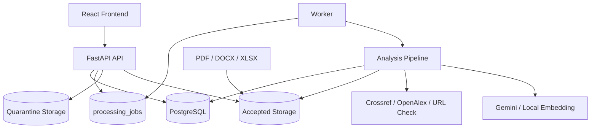

# HƯỚNG DẪN TỰ CẬP NHẬT BỘ TÀI LIỆU TRUSTLENS v1.2

> **Phạm vi:** chỉ cập nhật và chuẩn hóa bộ tài liệu `docs/v1.2/`.  
> **Không thực hiện:** không tạo `v1.2.1`, không đổi `APP_VERSION`, không đổi version frontend, không đổi API version và không đổi scoring version.

---

## 1. Mục tiêu cập nhật

Đợt cập nhật này nhằm làm cho bộ tài liệu `v1.2`:

1. Khớp với mã nguồn backend và frontend hiện tại.
2. Không còn các đoạn mô tả cũ mâu thuẫn với phần cập nhật mới.
3. Không tuyên bố tính năng đã hoàn thành khi chưa có bằng chứng kiểm thử.
4. Xác định rõ endpoint, pipeline, scoring, migration, bảo mật và release gate.
5. Có thể dùng làm baseline chính thức cho phát triển, kiểm thử và báo cáo dự án.

---

## 2. Baseline hiện tại

### 2.1. Repository

| Thành phần | Repository |
|---|---|
| Root | `PhanTanSang-netizen/trustlens` |
| Backend | `PhanTanSang-netizen/TrustLens-Backend` |
| Frontend | `tranquynhnhu102025-hash/Frontend-TrustLens` |

> GitHub có thể hiển thị owner mới do repository đã đổi tên hoặc chuyển hướng. Khi cập nhật tài liệu, sử dụng URL đang hoạt động thực tế nhưng không thay đổi lịch sử dự án nếu chưa cần thiết.

### 2.2. Version phải giữ nguyên

| Thành phần | Version |
|---|---|
| Application | `1.2.0` |
| Backend | `1.2.0` |
| Frontend | `1.2.0` |
| API | `v1` |
| API prefix | `/api/v1` |
| Trust Score | `trust-score-v1.2` |
| Docs folder | `docs/v1.2/` |

### 2.3. Không được thay đổi trong đợt này

Không sửa:

```text
APP_VERSION=1.2.0
package.json version=1.2.0
TRUST_SCORE_VERSION=trust-score-v1.2
docs/v1.2/
```

Không tạo:

```text
docs/v1.2.1/
tag v1.2.1
release v1.2.1
APP_VERSION=1.2.1
```

---

## 3. Quy tắc xác định trạng thái tính năng

Trong toàn bộ tài liệu `v1.2`, sử dụng thống nhất năm trạng thái sau:

| Trạng thái | Ý nghĩa |
|---|---|
| `Implemented` | Có mã nguồn và có đường gọi thực tế |
| `Verified` | Có bằng chứng test đã chạy |
| `Partial` | Có triển khai nhưng thiếu một phần hoặc thiếu kiểm thử |
| `Planned` | Chưa triển khai |
| `Blocked` | Có lỗi hoặc rủi ro khiến chưa thể công nhận hoàn thành |

### Nguyên tắc bằng chứng

Thứ tự ưu tiên:

1. Test integration/E2E/security đã chạy.
2. Router được mount và service được gọi thật.
3. Model và migration.
4. Frontend gọi đúng API.
5. Unit test.
6. Tài liệu hiện hành.
7. Roadmap hoặc tài liệu lưu trữ.

Không được dùng riêng một trong các yếu tố sau để kết luận tính năng hoàn thành:

- chỉ có file test;
- chỉ có giao diện;
- chỉ có roadmap;
- chỉ có model;
- chỉ có endpoint nhưng service chưa chạy;
- chỉ có mô tả trong tài liệu.

---

## 4. Trình tự cập nhật

## Bước 1 — Tạo branch tài liệu

```bash
git checkout main
git pull origin main
git checkout -b docs/update-v1.2
```

Nếu repository dùng submodule:

```bash
git submodule update --init --recursive
git submodule status
```

Ghi lại SHA của:

```text
root
apps/backend
apps/frontend
```

Các SHA này phải được đưa vào `docs/v1.2/archive/Source_Baseline.md`.

---

## Bước 2 — Không sửa trực tiếp toàn bộ cùng lúc

Cập nhật theo thứ tự:

1. `docs/v1.2/README.md`
2. `docs/v1.2/archive/Source_Baseline.md`
3. `docs/v1.2/requirements/SRS.md`
4. `docs/v1.2/architecture/Architecture.md`
5. `docs/v1.2/architecture/Data_Model.md`
6. `docs/v1.2/api/README.md`
7. `docs/v1.2/scoring/Trust_Score_Specification.md`
8. `docs/v1.2/security/Security_and_Privacy.md`
9. `docs/v1.2/testing/Test_Plan.md`
10. `docs/v1.2/operations/Deployment_and_Operations.md`
11. `docs/v1.2/operations/Release_Readiness_Checklist.md`
12. `docs/v1.2/limitations/Known_Limitations.md`
13. `docs/v1.2/planning/P0_P1_Completion_Status.md`
14. `docs/v1.2/planning/V1_2_Completion_Backlog.md`

Chỉ sau khi các file trên đồng nhất mới cập nhật các diagram và file phụ.

---

## Bước 3 — Chuẩn hóa `docs/v1.2/README.md`

README phải thể hiện:

```text
Status: canonical documentation baseline
Application version: 1.2.0
API version: v1
Scoring version: trust-score-v1.2
```

Phải có tuyên bố:

> Source code is the source of truth for implemented behavior.  
> Roadmap and archive files must not be presented as implemented features.

Phải ghi rõ:

- P0 chưa được coi là hoàn tất vô điều kiện.
- Full sign-off cần PostgreSQL integration, ownership negative tests, browser E2E, restore evidence và academic calibration.
- Không tạo thư mục `v1.2.1`.

---

## Bước 4 — Cập nhật Source Baseline

Trong `docs/v1.2/archive/Source_Baseline.md`, ghi:

```markdown
| Component | Repository | Commit SHA | Version |
|---|---|---|---|
| Root | ... | ... | 1.2.0 |
| Backend | ... | ... | 1.2.0 |
| Frontend | ... | ... | 1.2.0 |
```

Thêm danh sách nguồn sự thật:

| Nội dung | File mã nguồn |
|---|---|
| API routers | `app/api/v1/api_router.py` |
| Upload/analyze | `app/api/v1/endpoints/submissions.py` |
| Job/retry/process | `app/api/v1/endpoints/jobs.py` |
| Auth | `app/api/v1/endpoints/auth.py` |
| Role mặc định | `app/services/auth_service.py` |
| Config/version | `app/core/config.py` |
| Trust Score | `app/core/trust_score_definition.py` |
| Scoring runtime | `app/services/scoring_service.py` |
| Metadata | `app/services/metadata_verification_service.py` |
| Frontend analyze | `src/services/uploadService.ts` |

---

## Bước 5 — Viết lại SRS theo mã nguồn

### 5.1. Auth

Ghi đúng trạng thái:

| Requirement | Status |
|---|---|
| Register | Implemented |
| Login | Implemented |
| Refresh token rotation | Implemented |
| Logout/revoke refresh token | Implemented |
| Auth rate limit | Implemented, process-local |
| Public register role safety | Blocked |
| Email verification | Planned |
| Admin approval lecturer | Planned |

### 5.2. Critical security issue phải ghi rõ

Mã nguồn hiện tại tạo user mới với:

```python
role="lecturer"
is_active=True
```

Không được mô tả public registration là hoàn chỉnh về bảo mật.

Trong SRS ghi:

```text
FR-AUTH-006:
Public registration MUST NOT directly create an active lecturer account.

Status: Blocked
```

Và thêm hướng xử lý dự kiến:

```text
PENDING_LECTURER
→ EMAIL_VERIFIED
→ ADMIN_APPROVED
→ LECTURER
```

> Đây chỉ là yêu cầu và backlog của v1.2. Không tuyên bố đã triển khai nếu chưa sửa code.

### 5.3. Job và pipeline

Ghi đúng:

- Canonical endpoint:

```http
POST /api/v1/submissions/{submission_id}/analyze
```

- Alias tương thích:

```http
POST /api/v1/jobs/submissions/{submission_id}/process
```

- Retry:

```http
POST /api/v1/jobs/{job_id}/retry
```

- Queue hiện tại:

```text
processing_jobs table
database-backed worker queue
```

Không tiếp tục mô tả `FastAPI BackgroundTasks` là kiến trúc chính.

### 5.4. Scoring

SRS phải ghi:

```text
Trust Score v1.2 uses C1–C7.
```

Không dùng C1–C8.

| Code | Component | Weight |
|---|---|---:|
| C1 | Metadata completeness | 10 |
| C2 | Metadata verification | 25 |
| C3 | Source credibility | 20 |
| C4 | Relevance | 20 |
| C5 | Recency | 10 |
| C6 | Citation style | 10 |
| C7 | Duplicate/concentration | 5 |

---

## Bước 6 — Viết lại Architecture

Xóa hoặc sửa mọi đoạn ghi:

```text
As-is: FastAPI BackgroundTasks
To-be: durable queue
```

Thay bằng:

```text
As-is: database-backed queue using processing_jobs
Worker command: python -m app.workers.tasks
JOB_QUEUE_MODE=database
JOB_QUEUE_MODE=inline only for local debugging
```

Kiến trúc chính:



Không tuyên bố microservices.

---

## Bước 7 — Chuẩn hóa Pipeline

Pipeline chuẩn:

```text
QUEUED
→ VALIDATING
→ EXTRACTING
→ DETECTING_REFERENCES
→ PARSING_CITATIONS
→ NORMALIZING
→ VERIFYING_METADATA
→ SCORING
→ BUILDING_REPORT
→ COMPLETED
```

Failure states:

```text
FAILED_VALIDATION
FAILED_EXTRACTION
FAILED_METADATA
FAILED_SCORING
FAILED_INTERNAL
CANCELLED
```

Quy tắc:

- một active job trên mỗi submission;
- retry tạo job mới;
- retry giữ lineage;
- completed job phải có `report_id`;
- provider lỗi phải degrade an toàn;
- PDF scan chưa OCR phải trả lỗi rõ.

---

## Bước 8 — Chuẩn hóa Metadata Verification

Chỉ ghi provider có bằng chứng runtime:

- Crossref;
- OpenAlex;
- URL checker;
- publication-status evaluator.

Không ghi Semantic Scholar là implemented nếu backend chưa gọi thật.

Status vocabulary:

```text
VERIFIED
PARTIAL_MATCH
AMBIGUOUS
NOT_FOUND
URL_ONLY
PROVIDER_UNAVAILABLE
INVALID_IDENTIFIER
IDENTIFIER_METADATA_CONFLICT
```

Quy tắc bắt buộc:

- URL hoạt động không chứng minh nguồn học thuật.
- `NOT_FOUND` không chứng minh nguồn giả.
- `PROVIDER_UNAVAILABLE` không được xử lý như `NOT_FOUND`.
- DOI conflict phải có evidence.
- Không gửi toàn bộ report tới metadata provider.

---

## Bước 9 — Chuẩn hóa Trust Score

### Công thức

```text
ReferenceScore = clamp(
    C1 + C2 + C3 + C4 + C5 + C6 + C7 - penalties,
    0,
    100
)
```

### Threshold

| Score | Label |
|---:|---|
| `>= 85` | reliable |
| `>= 70` | acceptable |
| `>= 50` | needs_review |
| `< 50` | high_risk |

### C2

| Status | Điểm |
|---|---:|
| VERIFIED | 25 |
| PARTIAL_MATCH | 18 |
| AMBIGUOUS | 10 |
| URL_ONLY | 7 |
| NOT_FOUND | 3 |
| PROVIDER_UNAVAILABLE | 8 |
| INVALID_IDENTIFIER | 0 |
| IDENTIFIER_METADATA_CONFLICT | 0 |

### Penalty

| Code | Penalty | Label cap |
|---|---:|---|
| INVALID_IDENTIFIER | 10 | high_risk |
| DOI/metadata conflict | 15 | high_risk |
| DUPLICATE_REFERENCE | 5 | needs_review |
| RETRACTED_SOURCE | 30 | high_risk |
| EXPRESSION_OF_CONCERN | 10 | needs_review |
| LOW_RELEVANCE | 3 | needs_review |

Không đổi `trust-score-v1.2` nếu không đổi thuật toán.

---

## Bước 10 — Chuẩn hóa API Reference

### Endpoint chính

```text
POST /auth/register
POST /auth/login
POST /auth/refresh
POST /auth/logout

POST /submissions/upload
POST /submissions/{id}/analyze
GET  /jobs/{job_id}
POST /jobs/{job_id}/retry

GET  /reports/{report_id}
GET  /reports/submissions/{submission_id}
GET  /report-exports/{export_id}/download
```

### Endpoint alias

```http
POST /jobs/submissions/{submission_id}/process
```

Ghi:

```text
Backward-compatible alias.
New clients should use /submissions/{id}/analyze.
```

### Error schema

Chỉ mô tả một schema chính thức:

```json
{
  "error_code": "ERROR_CODE",
  "message": "Human-readable message",
  "details": {},
  "retryable": false,
  "correlation_id": "string"
}
```

Nếu backend chưa normalize hoàn toàn, trạng thái phải là `Partial`, không được ghi `Implemented`.

### Pagination

```json
{
  "items": [],
  "page": 1,
  "page_size": 20,
  "total": 0,
  "has_next": false
}
```

---

## Bước 11 — Cập nhật Data Model

Phải thể hiện traceability:

```text
User
→ Course/Class/Assignment
→ File/Submission
→ ProcessingJob
→ ExtractedDocument/ReferenceSection
→ Citation/MetadataRecord
→ CitationScore/Warning
→ Report/ReportExport
```

Các field queue cần ghi:

```text
attempt_count
claimed_by
heartbeat_at
next_run_at
status
progress
step
retry lineage
```

Các field file security:

```text
storage_state
scan_status
scan_provider
scan_signature_version
scanned_at
scan_details
checksum
mime
size
path
```

Không ghi registration approval fields là implemented nếu migration chưa có.

---

## Bước 12 — Cập nhật Security and Privacy

Phải có mục Critical blocker về self-registration lecturer.

Các control hiện có:

- password policy;
- JWT;
- refresh rotation/revocation;
- process-local rate limit;
- secret validation;
- quarantine;
- signature validation;
- local scan policy;
- permission dependencies;
- audit log;
- retention;
- AI raw input logging disabled.

Các control chưa đủ:

- shared rate limiter;
- enterprise malware scanning;
- encrypted object storage;
- formal legal basis;
- full security integration suite.

Không dùng từ:

```text
secure
production-ready
malware-free
fully compliant
```

nếu chưa có bằng chứng.

---

## Bước 13 — Cập nhật Test Plan

Tách rõ:

### Đã có

- backend compile/import smoke;
- frontend lint;
- frontend build;
- CI workflow scaffolding;
- unit test files.

### Chưa đủ bằng chứng

- PostgreSQL integration suite;
- ownership negative suite;
- browser E2E;
- restore drill;
- performance benchmark;
- accessibility audit;
- academic calibration.

Release gate bắt buộc:

```text
ruff
pytest
alembic upgrade head
PostgreSQL integration
ownership negative tests
frontend lint/build
browser E2E
secret/dependency scan
restore evidence
```

Không được ghi “test pass” chỉ vì test file tồn tại.

---

## Bước 14 — Cập nhật Known Limitations

Phải có tối thiểu:

1. Chưa OCR PDF scan.
2. Chưa plagiarism.
3. Chưa citation-in-context verification.
4. Chưa đánh giá methodology.
5. Phụ thuộc Crossref/OpenAlex.
6. URL-only không chứng minh học thuật.
7. Chưa đủ academic calibration.
8. Local scan policy không phải antivirus enterprise.
9. Process-local rate limiter.
10. Local file storage chưa phù hợp production lớn.
11. Chưa multi-tenant.
12. Public registration role là blocker.
13. Application vẫn là `1.2.0`.

---

## Bước 15 — Cập nhật Completion Status

Trong `P0_P1_Completion_Status.md`, không dùng một cột duy nhất “Done”.

Dùng:

| Hạng mục | Code | Test | Docs | Release status |
|---|---|---|---|---|
| Analyze pipeline | Yes | Partial | Yes | Partial |
| Database queue | Yes | Partial | Yes | Partial |
| Register safety | No | No | Yes | Blocked |
| Frontend build | Yes | Verified | Yes | Verified |
| PostgreSQL integration | Partial | No | Yes | Blocked |
| Browser E2E | No | No | Yes | Blocked |
| Academic calibration | No | No | Yes | Planned |

---

## Bước 16 — Kiểm tra consistency

Tìm toàn repository:

```bash
git grep -n "1.2.1"
git grep -n "C1–C8"
git grep -n "C1-C8"
git grep -n "BackgroundTasks"
git grep -n "Semantic Scholar"
git grep -n "production-ready"
git grep -n "P0 complete"
git grep -n "fully implemented"
```

Kết quả mong đợi:

- không có `1.2.1` trong tài liệu hiện hành;
- không còn C1–C8;
- BackgroundTasks chỉ xuất hiện trong historical note hoặc archive;
- Semantic Scholar không được ghi implemented;
- không có claim production-ready;
- P0 không được ghi complete vô điều kiện.

---

## Bước 17 — Chạy validation

### Backend

```bash
cd apps/backend
python -m compileall app tests
ruff check app tests
pytest
alembic heads
```

Nếu có PostgreSQL:

```bash
alembic upgrade head
```

### Frontend

```bash
cd apps/frontend
npm ci
npm run lint
npm run build
```

### Root

```bash
git diff --check
git status
git submodule status
```

---

## Bước 18 — Commit theo nhóm

```bash
git add docs/v1.2/README.md docs/v1.2/archive/Source_Baseline.md
git commit -m "docs: align v1.2 documentation baseline"

git add docs/v1.2/requirements docs/v1.2/architecture
git commit -m "docs: align v1.2 requirements and architecture"

git add docs/v1.2/api docs/v1.2/scoring
git commit -m "docs: align v1.2 api and scoring contracts"

git add docs/v1.2/security docs/v1.2/testing docs/v1.2/operations
git commit -m "docs: update v1.2 security and release gates"

git add docs/v1.2/limitations docs/v1.2/planning
git commit -m "docs: finalize v1.2 limitations and completion status"
```

---

## 5. Checklist cuối cùng

### Version

- [ ] Không tạo `v1.2.1`
- [ ] Backend vẫn `1.2.0`
- [ ] Frontend vẫn `1.2.0`
- [ ] API vẫn `v1`
- [ ] Scoring vẫn `trust-score-v1.2`
- [ ] Docs vẫn ở `docs/v1.2/`

### Nội dung

- [ ] C1–C7, không phải C1–C8
- [ ] Canonical analyze endpoint đúng
- [ ] Database-backed queue là kiến trúc hiện tại
- [ ] Process alias được mô tả là backward-compatible
- [ ] Semantic Scholar không được ghi implemented
- [ ] Public register lecturer được ghi Blocked
- [ ] Không claim production-ready
- [ ] Known limitations đầy đủ
- [ ] Completion status tách code/test/docs/release

### Kiểm thử

- [ ] Backend compile/lint/test đã chạy hoặc ghi rõ chưa chạy
- [ ] Frontend lint/build đã chạy
- [ ] PostgreSQL integration chưa có thì ghi Blocked
- [ ] E2E chưa có thì ghi Blocked
- [ ] Không ghi Verified khi chưa có artifact

---

## 6. Definition of Done cho đợt cập nhật v1.2

Đợt cập nhật tài liệu v1.2 được xem là hoàn thành khi:

1. Không có mâu thuẫn giữa README, SRS, Architecture, API, Scoring và Test Plan.
2. Mọi claim triển khai có đường dẫn tới mã nguồn.
3. Mọi claim verified có bằng chứng test.
4. Các thiếu sót được đưa vào backlog hoặc known limitations.
5. Không có bất kỳ thay đổi nào sang v1.2.1.
6. `git diff --check` không báo lỗi.
7. Markdown links nội bộ hoạt động.
8. Có pull request riêng cho cập nhật tài liệu v1.2.
