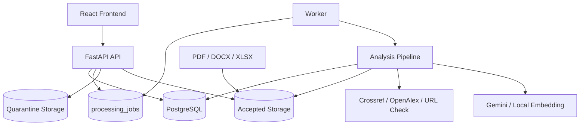

# System Architecture

**Status:** source-aligned v1.2 baseline
**Application version:** `1.2.0`
**API version:** `v1`

TrustLens v1.2 is a modular monolith: React frontend, FastAPI backend, PostgreSQL,
local file storage for the current baseline, a database-backed worker queue, and
provider adapters for metadata and relevance. It is not a microservices system.

## 1. Current Architecture



## 2. Frontend

| Area | Source |
|---|---|
| Route composition | `apps/frontend/src/App.tsx` |
| Screens | `apps/frontend/src/features/` |
| Shared UI | `apps/frontend/src/components/` |
| API clients | `apps/frontend/src/services/` |
| Client permission helpers | `apps/frontend/src/auth/permissions.ts` |
| Trust Score presentation | `apps/frontend/src/config/trustScoreConfig.ts` |

Client-side guards are UX helpers only. Backend authentication, permissions, and
ownership checks are authoritative.

## 3. Backend

| Layer | Responsibility |
|---|---|
| API layer | FastAPI routers under `/api/v1`. |
| Service layer | Auth, access control, file storage, job queue, pipeline, metadata, scoring, report/export, audit, dashboard, admin. |
| Data layer | SQLAlchemy models, Alembic migrations, PostgreSQL. |
| Worker | Claims queued `processing_jobs` and runs the canonical analysis pipeline. |

## 4. Queue and Worker

Current as-is behavior:

```text
As-is: database-backed queue using processing_jobs
Worker command: python -m app.workers.tasks
JOB_QUEUE_MODE=database
JOB_QUEUE_MODE=inline only for local debugging
```

Queue state is persisted in the `processing_jobs` table. The worker claims queued
jobs and invokes `run_analysis_pipeline`. The API enqueues jobs and returns quickly
with `202 Accepted`.

Key queue fields:

- `attempt_count`;
- `claimed_by`;
- `heartbeat_at`;
- `next_run_at`;
- `status`;
- `progress`;
- `step` / `current_step`;
- `retry_of_job_id`;
- `report_id`.

Full production-grade queue acceptance still requires crash, stale recovery,
concurrency, and restore evidence.

## 5. Canonical Pipeline

```text
QUEUED
-> VALIDATING
-> EXTRACTING
-> DETECTING_REFERENCES
-> PARSING_CITATIONS
-> NORMALIZING
-> VERIFYING_METADATA
-> SCORING
-> BUILDING_REPORT
-> COMPLETED
```

Failure states:

```text
FAILED_VALIDATION
FAILED_EXTRACTION
FAILED_METADATA
FAILED_SCORING
FAILED_INTERNAL
CANCELLED
```

Entrypoints using the canonical pipeline:

1. `POST /api/v1/submissions/{submission_id}/analyze`.
2. `POST /api/v1/jobs/submissions/{submission_id}/process` as a backward-compatible alias.
3. `POST /api/v1/jobs/{job_id}/retry` after creating a lineage-linked terminal retry job.

Rules:

- one active job per submission;
- retry creates a new job;
- retry keeps lineage;
- completed analysis jobs must have `report_id`;
- file must be in accepted storage and have clean scan status;
- PDF scan/image-only files fail clearly because OCR is not implemented.

## 6. Metadata and Relevance

Implemented metadata evidence sources:

- Crossref;
- OpenAlex;
- URL checker;
- publication-status evaluator.

Semantic Scholar is not part of the canonical metadata verification path in this
baseline. Provider failures must not be converted into academic conclusions.

Relevance uses configured embedding providers and fallback behavior. Evidence should
record provider/model/prompt/threshold profile and confidence.

## 7. File and Export Storage

Current baseline uses local filesystem paths with quarantine and accepted storage.
Accepted analysis requires:

- allowed extension;
- size and empty-file checks;
- signature/magic-byte validation;
- local scan policy result `clean`;
- `storage_state=accepted`.

Production-scale deployments still require an approved storage design, private object
storage or equivalent, backup/restore evidence, encryption decisions, and an approved
malware scanner.

## 8. Observability

Implemented baseline:

- `x-correlation-id` middleware;
- structured request completion log fields;
- `/health`;
- `/health/ready`;
- `/health/metrics`.

Still needed for full sign-off:

- alert rules;
- queue stuck dashboards;
- provider latency/error metrics;
- restore drill evidence;
- performance benchmark.

## 9. Architecture Constraints

- API prefix remains `/api/v1`.
- Application version remains `1.2.0`.
- Trust Score remains `trust-score-v1.2`.
- TrustLens v1.2 remains a modular monolith unless a later release provides evidence
  for splitting workloads.
- Roadmap items do not change implemented architecture until code and tests exist.
