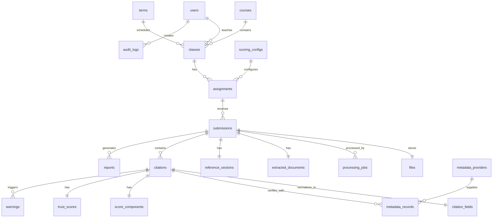
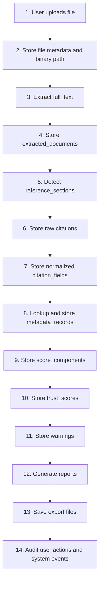

# Logical Data Model

| **Bảng/Entity**     | **Mục đích**                            | **Trường chính**                                                                              |
|---------------------|-----------------------------------------|-----------------------------------------------------------------------------------------------|
| users               | Người dùng hệ thống                     | id, email, full_name, role, password_hash, is_active, created_at                              |
| roles_permissions   | Định nghĩa quyền theo vai trò           | role, permission_code, description                                                            |
| terms               | Học kỳ/năm học                          | id, name, start_date, end_date                                                                |
| courses             | Học phần/môn học                        | id, code, name, description                                                                   |
| classes             | Lớp học phần                            | id, course_id, term_id, lecturer_id, class_code, name                                         |
| students            | Sinh viên hoặc nhóm sinh viên tối thiểu | id, student_code, full_name, email, group_name                                                |
| assignments         | Bài nộp cần thẩm định                   | id, class_id, title, due_date, required_style, scoring_config_id                              |
| submissions         | Một bài báo cáo được upload             | id, assignment_id, owner_label, file_id, status, overall_score                                |
| files               | Metadata file upload                    | id, original_name, stored_path, mime_type, size_bytes, checksum, uploaded_by                  |
| processing_jobs     | Job phân tích bất đồng bộ               | id, submission_id, status, progress, error_code, started_at, finished_at                      |
| extracted_documents | Text và layout đã trích xuất            | id, submission_id, full_text, page_count, extraction_method                                   |
| reference_sections  | Vùng tài liệu tham khảo                 | id, submission_id, start_offset, end_offset, heading, confidence                              |
| citations           | Từng citation được tách                 | id, submission_id, raw_text, order_index, confidence, duplicate_of                            |
| citation_fields     | Trường citation chuẩn hóa               | citation_id, title, authors, year, doi, url, venue, publisher, style_detected                 |
| metadata_records    | Kết quả metadata lookup                 | id, citation_id, provider, match_status, confidence, raw_json, normalized_json                |
| score_components    | Điểm thành phần                         | citation_id, format_score, existence_score, credibility_score, recency_score, relevance_score |
| trust_scores        | Điểm tổng hợp                           | id, citation_id/submission_id, score, label, config_version, explanation                      |
| warnings            | Cảnh báo và gợi ý                       | id, citation_id/submission_id, code, severity, message, suggested_action                      |
| reports             | Báo cáo kết quả                         | id, submission_id, generated_at, generated_by, summary_json, export_paths                     |
| scoring_configs     | Cấu hình trọng số                       | id, name, version, weights_json, thresholds_json, is_active                                   |
| metadata_providers  | Cấu hình provider                       | id, name, base_url, is_enabled, timeout_ms, priority                                          |
| audit_logs          | Lịch sử thao tác                        | id, actor_id, action, object_type, object_id, ip, created_at                                  |

# ERD

users 1-n classes  
courses 1-n classes  
classes 1-n assignments  
assignments 1-n submissions  
submissions 1-1 files  
submissions 1-n processing_jobs  
submissions 1-1 extracted_documents  
submissions 1-1 reference_sections  
submissions 1-n citations  
citations 1-1 citation_fields  
citations 1-n metadata_records  
citations 1-1 score_components  
citations 1-1 trust_scores  
citations 1-n warnings  
submissions 1-n reports  
scoring_configs 1-n assignments / reports  
users 1-n audit_logs

# D23. Entity Relationship Diagram

```mermaid
erDiagram 
	users {
        uuid id PK
        string email UK
        string full_name
        string role
        string password_hash
        boolean is_active
        datetime created_at
    }

    courses {
        uuid id PK
        string code
        string name
        text description
    }

    classes {
        uuid id PK
        uuid course_id FK
        uuid term_id FK
        uuid lecturer_id FK
        string class_code
        string name
    }

    assignments {
        uuid id PK
        uuid class_id FK
        string title
        datetime due_date
        string required_style
        uuid scoring_config_id FK
    }

    submissions {
        uuid id PK
        uuid assignment_id FK
        string owner_label
        uuid file_id FK
        string status
        float overall_score
    }

    files {
        uuid id PK
        string original_name
        string stored_path
        string mime_type
        integer size_bytes
        string checksum
        uuid uploaded_by FK
    }

    processing_jobs {
        uuid id PK
        uuid submission_id FK
        string status
        integer progress
        string error_code
        datetime started_at
        datetime finished_at
    }

    citations {
        uuid id PK
        uuid submission_id FK
        text raw_text
        integer order_index
        float confidence
        uuid duplicate_of
    }

    citation_fields {
        uuid citation_id PK
        string title
        string authors
        integer year
        string doi
        string url
        string venue
        string publisher
        string style_detected
    }

    metadata_records {
        uuid id PK
        uuid citation_id FK
        uuid metadata_provider_id FK
        string provider
        string match_status
        float confidence
        json raw_json
        json normalized_json
    }

    score_components {
        uuid citation_id PK
        float format_score
        float existence_score
        float credibility_score
        float recency_score
        float relevance_score
    }

    trust_scores {
        uuid id PK
        uuid citation_id FK
        uuid submission_id FK
        float score
        string label
        string config_version
        text explanation
    }

    warnings {
        uuid id PK
        uuid citation_id FK
        uuid submission_id FK
        string code
        string severity
        text message
        text suggested_action
    }

    reports {
        uuid id PK
        uuid submission_id FK
        datetime generated_at
        uuid generated_by FK
        json summary_json
        json export_paths
    }
```

# D24. Data Lifecycle

