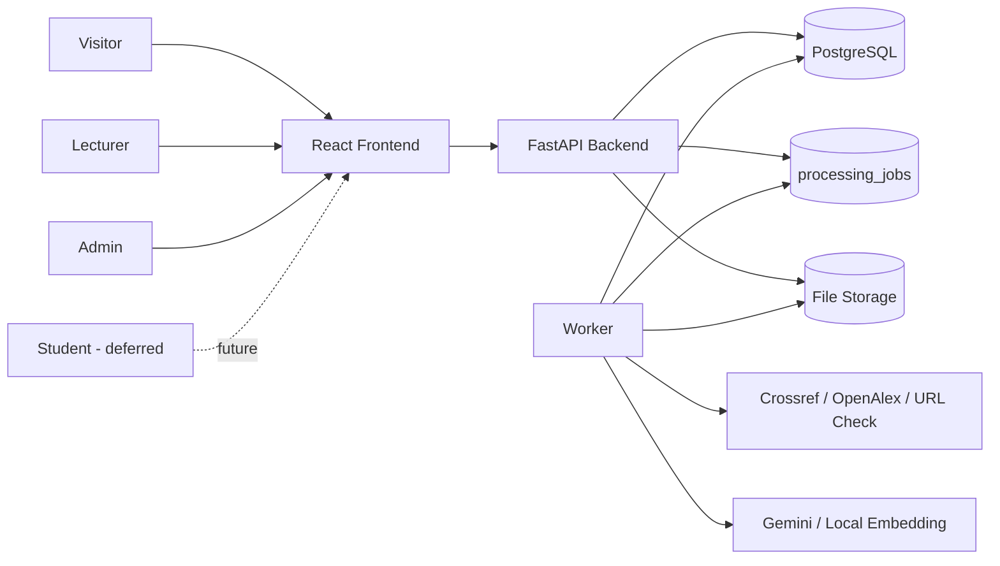

# System Context and Scope

**Status:** source-aligned v1.2 baseline

## 1. Boundary

TrustLens includes:

1. React frontend in the browser.
2. FastAPI backend for auth, business workflows, pipeline orchestration, and reports.
3. PostgreSQL and file storage.
4. Database-backed worker queue using `processing_jobs`.
5. External providers for metadata and relevance evidence.

External providers are evidence sources, not absolute truth sources.

## 2. Actors

| Code | Actor | Responsibility |
|---|---|---|
| ACT-01 | Visitor | Landing, register, login. |
| ACT-02 | Lecturer | Manage classes/assignments, upload, analyze, review reports. |
| ACT-03 | Admin | Lecturer capabilities plus users/providers/audit/admin tools. |
| ACT-04 | Student | Role exists; full student portal is deferred. |
| ACT-05 | Metadata provider | Crossref/OpenAlex/URL evidence. |
| ACT-06 | Embedding provider | Gemini/local relevance evidence. |
| ACT-07 | Operator | Configuration, migration, storage, backup, worker, monitoring. |

## 3. Context Diagram



## 4. Data Scope

### Account Data

Email, full name, role, permissions, active state, profile details, login timestamps,
refresh token records, and audit events.

### Academic Data

Course, class, assignment, submission, file, extracted text, reference section,
citation, metadata, Trust Score, warning, report, and export records.

### AI and Provider Data

Default AI configuration avoids raw input persistence/logging:

- `AI_DATA_MODE=sanitized_text_only`;
- `AI_PERSIST_RAW_INPUT=false`;
- `AI_LOG_INPUT_TEXT=false`.

Production deployments must approve provider data handling, retention, and legal
basis separately.

## 5. Ownership Scope

```text
User (Lecturer)
  -> Class
      -> Assignment
          -> Submission
              -> File
              -> ProcessingJob
              -> ExtractedDocument
              -> Citation / MetadataRecord
              -> Report / ReportExport
```

Admin has broader system scope. Tenant isolation is not implemented in v1.2.

## 6. Main Flow

### Login

1. Client sends email/password.
2. Backend authenticates active user.
3. Backend returns access and refresh tokens.
4. Frontend stores tokens and attaches bearer token.
5. Refresh rotates the server-side refresh token.
6. Logout revokes refresh token.

### Analyze

1. Lecturer selects assignment.
2. Frontend uploads PDF/DOCX.
3. Backend checks ownership and upload constraints.
4. Backend stores file in quarantine and promotes only clean accepted files.
5. Frontend calls `POST /api/v1/submissions/{submission_id}/analyze`.
6. Backend creates/enqueues a `processing_jobs` record.
7. Worker runs the canonical analysis pipeline.
8. Frontend polls job status.
9. Completed job links to a report.
10. Frontend opens report/export views.

### Metadata

1. Parse citation.
2. Query by DOI/title/author/year when available.
3. Match provider candidates.
4. Store status, confidence, and evidence.
5. `NOT_FOUND` is not interpreted as fake.

## 7. In-Scope Baseline

- Lecturer/admin web app.
- Text-layer PDF and DOCX.
- Course/class/assignment/submission.
- Metadata verification with Crossref/OpenAlex/URL evidence.
- Seven-component Trust Score v1.2.
- Database-backed job polling.
- Report/export.
- Audit and basic provider/admin tooling.

## 8. Out-of-Scope Baseline

- Native mobile app.
- OCR.
- Plagiarism verdicts.
- Paywalled full-text validation.
- Citation-in-context verification.
- Automatic grading.
- Enterprise multi-tenancy.
- Billing.
- Production SSO.
- Realtime socket/SSE progress.
- Production SLA claims.

## 9. Assumptions

| ID | Assumption | Risk if false |
|---|---|---|
| ASM-01 | Reference section can be detected. | `NO_REFERENCE_SECTION`. |
| ASM-02 | PDF has text layer or DOCX can be read. | OCR-not-supported failure. |
| ASM-03 | Providers respond within configured limits. | Lower confidence or unavailable status. |
| ASM-04 | Class/assignment ownership is accurate. | False denial or data leakage. |
| ASM-05 | Scoring version is stored. | Old reports become hard to explain. |
| ASM-06 | File storage is protected and restorable. | File loss or disclosure. |
