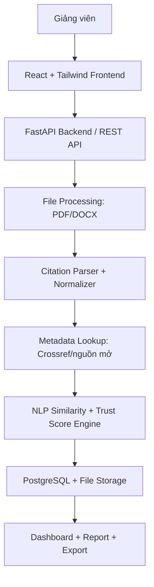

# Front matter
## FM-01. Document Control

| **Trường**            | **Giá trị**                                                            |
| --------------------- | ---------------------------------------------------------------------- |
| Phạm vi               | MVP dự thi IT Solution Challenge 2026 và nền tảng mở rộng sau cuộc thi |
| Đội dự án             | TrustLens Team                                                         |
| Vai trò sử dụng chính | Giảng viên / Người chấm báo cáo / Quản trị hệ thống                    |


### 0. Kiểm soát tài liệu

| **Thông tin**         | **Nội dung**                                                                                                       |
|-----------------------|--------------------------------------------------------------------------------------------------------------------|
| Tên tài liệu          | Software Requirements Specification - TrustLens                                                                    |
| Mục đích              | Chuẩn hóa yêu cầu nghiệp vụ, yêu cầu chức năng, yêu cầu phi chức năng và tiêu chí nghiệm thu cho toàn bộ hệ thống. |
| Người biên soạn chính | Nguyễn Minh Trúc - DS, BA, Academic Evaluation                                                                     |
| Đối tượng đọc         | Thành viên FE, BE, DS/BA; giảng viên cố vấn; ban giám khảo; người kiểm thử.                                        |
| Tình trạng            | Dự thảo chi tiết, dùng làm baseline cho thiết kế và triển khai MVP.                                                |
| Ngôn ngữ              | Tiếng Việt. Một số thuật ngữ kỹ thuật giữ nguyên tiếng Anh để tránh sai lệch nghĩa.                                |
## FM-02. Revision History

| **Phiên bản** | **Ngày**   | **Người thực hiện** | **Mô tả thay đổi**                                                                                                                 |
|---------------|------------|---------------------|------------------------------------------------------------------------------------------------------------------------------------|
| 0.1           | 05/06/2026 | TrustLens Team      | Khởi tạo project overview, nhóm chức năng và kiến trúc đề xuất.                                                                    |
| 1.0           | 07/06/2026 | Nguyễn Minh Trúc    | Biên soạn SRS chi tiết: phạm vi, use case, yêu cầu chức năng, phi chức năng, dữ liệu, API, scoring, test case và truy vết yêu cầu. |


```table-of-contents
```
# 1. Introduction
## 1.1. Purpose
Tài liệu này mô tả yêu cầu phần mềm chi tiết cho hệ thống TrustLens. Các yêu cầu được viết theo hướng có thể kiểm thử, có thể phân công triển khai và có thể dùng làm cơ sở cho thiết kế API, cơ sở dữ liệu, test case, demo sản phẩm và báo cáo kỹ thuật.

Tài liệu SRS này xác định đầy đủ những gì hệ thống TrustLens cần thực hiện, các ràng buộc khi triển khai, tiêu chí đo lường chất lượng và điều kiện nghiệm thu. Tài liệu đóng vai trò là hợp đồng kỹ thuật nội bộ giữa nhóm Product/BA, AI/NLP, Frontend, Backend và kiểm thử.

- Làm rõ bài toán: kiểm tra độ tin cậy, độ phù hợp, độ cập nhật và chuẩn trích dẫn của danh mục tài liệu tham khảo trong báo cáo CNTT.
- Chuẩn hóa phạm vi MVP để sản phẩm có thể chạy được trong thời gian ngắn, đồng thời vẫn có định hướng mở rộng sau cuộc thi.
- Xác định yêu cầu theo dạng có thể kiểm thử: mỗi yêu cầu có đầu vào, xử lý, đầu ra và tiêu chí nghiệm thu.
- Làm cơ sở cho thiết kế CSDL, API, pipeline xử lý file, mô hình điểm Trust Score, UI dashboard và test case.

## 1.2. Scope

TrustLens là hệ thống web hỗ trợ giảng viên thẩm định danh mục tài liệu tham khảo trong báo cáo Công nghệ Thông tin. Người dùng tải lên file báo cáo của sinh viên, hệ thống trích xuất danh mục tài liệu tham khảo, chuẩn hóa citation, xác minh metadata học thuật, đánh giá độ tin cậy, độ cập nhật, độ phù hợp với chủ đề báo cáo và sinh báo cáo kết quả.

| **Phân vùng phạm vi** | **Bao gồm trong MVP**                                                                                                | **Không bao gồm trong MVP**                                             |
|-----------------------|----------------------------------------------------------------------------------------------------------------------|-------------------------------------------------------------------------|
| Đối tượng file        | PDF và DOCX của báo cáo sinh viên; ưu tiên báo cáo có danh mục tài liệu tham khảo rõ ràng.                           | File scan ảnh cần OCR đầy đủ; file có mã hóa hoặc hỏng cấu trúc.        |
| Trích xuất citation   | Nhận diện khu vực References/Tài liệu tham khảo; tách từng mục tham khảo; nhận diện DOI, URL, tiêu đề, tác giả, năm. | Tái tạo citation hoàn chỉnh như công cụ quản lý tài liệu chuyên nghiệp. |
| Chuẩn trích dẫn       | Kiểm tra các lỗi cơ bản theo APA 7th, IEEE, ACM, MLA ở mức heuristic.                                                | Đảm bảo 100% mọi biến thể citation trong thực tế.                       |
| Xác minh học thuật    | Tra cứu DOI/tiêu đề/tác giả/năm qua metadata API; phân loại verified/partial/not found.                              | Truy cập cơ sở dữ liệu trả phí hoặc nội dung toàn văn của mọi bài báo.  |
| Độ phù hợp            | So sánh chủ đề báo cáo với tiêu đề/abstract/keyword của tài liệu bằng embedding và quy tắc ngữ nghĩa.                | Đánh giá chất lượng phương pháp nghiên cứu của từng tài liệu.           |
| Đầu ra                | Dashboard, bảng điểm, cảnh báo, gợi ý sửa, xuất PDF/DOCX/XLSX.                                                       | Tích hợp trực tiếp vào LMS ở giai đoạn MVP.                             |

## 1.3. Definitions, Acronyms, Abbreviations

| **Thuật ngữ**         | **Định nghĩa vận hành trong TrustLens**                                                                                              |
|-----------------------|--------------------------------------------------------------------------------------------------------------------------------------|
| Citation              | Một mục tài liệu tham khảo được trích trong danh mục tài liệu tham khảo của báo cáo.                                                 |
| Reference section     | Phần danh mục tài liệu tham khảo cuối báo cáo, có thể có tiêu đề References, Bibliography, Tài liệu tham khảo hoặc tên tương đương.  |
| Metadata              | Tập thông tin mô tả tài liệu: DOI, tiêu đề, tác giả, năm xuất bản, nguồn công bố, nhà xuất bản, abstract, URL.                       |
| Academic existence    | Trạng thái xác minh việc tài liệu có tồn tại trong nguồn metadata học thuật hay không.                                               |
| Credibility score     | Điểm đánh giá độ tin cậy của nguồn dựa trên khả năng xác minh, loại nguồn, uy tín nguồn công bố, nhà xuất bản và tín hiệu học thuật. |
| Recency score         | Điểm đánh giá độ cập nhật theo năm xuất bản và độ nhạy thời gian của lĩnh vực.                                                       |
| Relevance score       | Điểm đánh giá mức độ liên quan giữa tài liệu tham khảo và chủ đề/nội dung báo cáo.                                                   |
| Citation format score | Điểm đánh giá mức độ đúng/đủ của cấu trúc trích dẫn theo phong cách được nhận diện hoặc phong cách do giảng viên chọn.               |
| Trust Score           | Điểm tổng hợp 0-100 cho từng citation hoặc toàn bộ bài nộp, tính từ các điểm thành phần có trọng số.                                 |
| Confidence            | Mức tự tin của hệ thống đối với kết quả trích xuất, matching metadata hoặc phân loại cảnh báo.                                       |
## 1.4. Conventions

| **Mức** | **Ý nghĩa**                                                                       | **Áp dụng**                                                                          |
|---------|-----------------------------------------------------------------------------------|--------------------------------------------------------------------------------------|
| MUST    | Bắt buộc có trong MVP để demo và chứng minh giá trị cốt lõi.                      | Upload, trích xuất citation, metadata lookup, scoring cơ bản, dashboard, export.     |
| SHOULD  | Nên có để tăng chất lượng sản phẩm nhưng có thể giảm phạm vi nếu thiếu thời gian. | Batch processing, cấu hình trọng số, dashboard so sánh lớp.                          |
| COULD   | Có thể bổ sung sau MVP nếu còn nguồn lực.                                         | LMS integration, OCR nâng cao, citation recommendation tự động.                      |
| WON’T   | Chưa triển khai trong phạm vi tài liệu này.                                       | Phát hiện đạo văn toàn văn, quản lý tài liệu như Zotero, chấm điểm nội dung báo cáo. |

## 1.5. Requirement Conventions
  
Mỗi yêu cầu chức năng trong SRS phải có mã yêu cầu, mức ưu tiên, mô tả xử lý, đầu vào, đầu ra và tiêu chí nghiệm thu.  
  
Quy ước mã yêu cầu:  
  
| Loại yêu cầu               | Tiền tố | Ví dụ   |
| -------------------------- | ------- | ------- |
| Functional Requirement     | FR      | FR-01   |
| Non-functional Requirement | NFR     | NFR-01  |
| Data Requirement           | DR      | DR-01   |
| AI/NLP Requirement         | AIR     | AIR-01  |
| API Requirement            | API     | API-01  |
| UI Requirement             | UI      | UI-01   |
| Security Requirement       | SEC     | SEC-01  |
| Test Requirement           | TEST    | TEST-01 |
  
Các yêu cầu mức `MUST` cần được triển khai trong MVP hoặc có mock hoạt động được khi demo.
## 1.6. References
Tài liệu tham khảo nội bộ

| Mã | Tài liệu | Nội dung liên quan |  
|---|---|---|  
| REF-01 | Project Overview - TrustLens | Mô tả đề tài, thành viên, nhóm chức năng và kiến trúc đề xuất. |  
| REF-02 | Thể lệ IT Solution Challenge 2026 | Mục tiêu, sản phẩm dự thi, tiêu chí đánh giá, điều kiện bắt buộc và mốc thời gian. |  
| REF-03 | TrustLens Evaluation Criteria v1.0 | Bộ tiêu chí đánh giá tài liệu tham khảo. |  
| REF-04 | TrustLens Trust Score Specification v1.0 | Công thức điểm, trọng số, ngưỡng cảnh báo và cách tổng hợp điểm. |

```table-of-contents
```

# 2. Overall Description
## 2.1. Product Perspective

Trong báo cáo CNTT, danh mục tài liệu tham khảo ảnh hưởng trực tiếp đến chất lượng học thuật của bài viết. Một báo cáo có thể dùng nguồn không tồn tại, nguồn khó xác minh, nguồn không liên quan, nguồn quá cũ hoặc citation sai định dạng. Việc kiểm tra thủ công từng tài liệu gây tốn thời gian, khó chuẩn hóa và phụ thuộc nhiều vào kinh nghiệm người chấm. TrustLens xử lý vấn đề này bằng cách tự động hóa quy trình thẩm định tài liệu tham khảo và trình bày kết quả theo tiêu chí định lượng.

TrustLens là một ứng dụng web độc lập. Frontend gửi file và yêu cầu phân tích qua RESTful API. Backend điều phối xử lý file, queue job, metadata lookup, NLP scoring, lưu dữ liệu PostgreSQL và trả kết quả cho dashboard. Hệ thống có thể triển khai trên Supabase/Render cho MVP, sau đó mở rộng thành service có khả năng tích hợp LMS hoặc hệ thống quản lý học phần.




## 2.2. Business Objectives 

| **Mã mục tiêu** | **Mục tiêu**                                                            | **Chỉ số kiểm chứng**                                                                    |
|-----------------|-------------------------------------------------------------------------|------------------------------------------------------------------------------------------|
| OBJ-01          | Rút ngắn thời gian kiểm tra danh mục tài liệu tham khảo của giảng viên. | Một file báo cáo 10-20 trang xử lý xong trong \<= 120 giây ở MVP với tối đa 40 citation. |
| OBJ-02          | Phát hiện nguồn không tồn tại hoặc khó xác minh.                        | Ít nhất 90% citation có DOI hợp lệ được xác minh đúng trong tập kiểm thử.                |
| OBJ-03          | Đánh giá độ phù hợp giữa tài liệu tham khảo và chủ đề báo cáo.          | Mỗi citation có relevance score và nhãn phù hợp/cần xem xét/không phù hợp.               |
| OBJ-04          | Chuẩn hóa kết quả chấm nguồn theo tiêu chí có trọng số.                 | Mỗi bài nộp có Trust Score tổng, điểm thành phần và giải thích.                          |
| OBJ-05          | Tạo báo cáo có thể dùng trong phản hồi học thuật.                       | Xuất được PDF/DOCX/XLSX gồm bảng citation, cảnh báo, lý do và gợi ý sửa.                 |

## 2.3. Project Functions

| **Nhóm**                             | **Mô tả**                                                                            | **Mức ưu tiên** |
|--------------------------------------|--------------------------------------------------------------------------------------|-----------------|
| Quản lý người dùng và phân quyền     | Đăng nhập, vai trò giảng viên/quản trị, quyền xem/sửa/xóa dữ liệu.                   | MUST            |
| Quản lý lớp học, học phần và bài nộp | Tạo lớp/học phần/bài tập, quản lý file nộp và trạng thái xử lý.                      | MUST            |
| Trích xuất tài liệu tham khảo        | Nhận file PDF/DOCX, trích văn bản, phát hiện reference section, tách citation.       | MUST            |
| Chuẩn hóa citation                   | Nhận diện APA/IEEE/ACM/MLA, tách trường metadata, phát hiện thiếu trường.            | MUST            |
| Kiểm tra tồn tại học thuật           | Tra DOI, tiêu đề, tác giả, năm xuất bản qua metadata API.                            | MUST            |
| Đánh giá độ tin cậy                  | Đánh giá loại nguồn, nhà xuất bản, nguồn công bố, xác minh và citation count nếu có. | MUST            |
| Đánh giá độ cập nhật                 | Kiểm tra năm xuất bản theo ngưỡng lĩnh vực.                                          | SHOULD          |
| Đánh giá độ phù hợp                  | So sánh title/abstract với chủ đề/nội dung báo cáo bằng embedding.                   | MUST            |
| Chấm điểm và cảnh báo                | Tạo Trust Score, nhãn rủi ro, cảnh báo và gợi ý chỉnh sửa.                           | MUST            |
| Xuất kết quả                         | Xuất báo cáo PDF/DOCX/XLSX và lưu lịch sử phân tích.                                 | MUST            |

## 2.4. User Classes and Characteristics

| Actor | Mục tiêu sử dụng | Quyền chính |
|---|---|---|
| Giảng viên | Tải bài nộp, chạy phân tích, xem điểm, xem cảnh báo, xuất báo cáo phản hồi. | Tạo lớp/học phần/bài nộp; upload file; phân tích; xem/export kết quả của lớp mình. |
| Quản trị hệ thống | Quản lý tài khoản, cấu hình tiêu chí, theo dõi lỗi và vận hành hệ thống. | Quản lý user, role, scoring config, metadata source, system log. |
| Sinh viên | Không bắt buộc trong MVP; có thể là chủ thể của bài nộp. | Có thể được bổ sung quyền upload/xem phản hồi ở phiên bản mở rộng. |

## 2.5. External Systems and Internal Components

| Thành phần   | Vai trò                                                                | Ghi chú                                                                    |
| ------------ | ---------------------------------------------------------------------- | -------------------------------------------------------------------------- |
| Metadata API | Cung cấp thông tin học thuật để xác minh citation.                     | Có thể gồm Crossref, Semantic Scholar, OpenAlex hoặc nguồn mở tương đương. |
| Queue Worker | Xử lý file, metadata lookup và scoring bất đồng bộ.                    | Truy cập job queue, file storage, database và metadata API.                |
| File Storage | Lưu file báo cáo đầu vào và file export đầu ra.                        | MVP có thể dùng local storage; bản mở rộng có thể dùng object storage.     |
| Database     | Lưu user, submission, reference, metadata, score, report và audit log. | Baseline: PostgreSQL.                                                      |
## 2.6. Operating Environment

| **Môi trường**     | **Mục đích**                           | **Yêu cầu tối thiểu**                                                  |
|--------------------|----------------------------------------|------------------------------------------------------------------------|
| Local development  | Lập trình và test nhanh.               | Python 3.11+, Node.js LTS, PostgreSQL, Redis optional, .env local.     |
| Demo/Staging       | Trình diễn sản phẩm và test trước nộp. | Frontend deployed, backend deployed, DB cloud/local ổn định, file mẫu. |
| Production mở rộng | Triển khai thật cho khoa/bộ môn.       | HTTPS, backup, monitoring, worker scale, access policy, log retention. |

## 2.7. Design and Implementation Constraints

| **Layer**       | **Công nghệ baseline**                      | **Ghi chú yêu cầu**                                                         |
|-----------------|---------------------------------------------|-----------------------------------------------------------------------------|
| Frontend        | React + Tailwind CSS                        | Giao diện upload, trạng thái xử lý, dashboard, bảng kết quả, export.        |
| Backend         | FastAPI + SQLAlchemy + Alembic + JWT Auth   | REST API, xác thực, quản lý job, scoring, business rules.                   |
| Database        | PostgreSQL                                  | Lưu người dùng, lớp, bài nộp, citation, metadata, score, report, audit log. |
| File Processing | PyMuPDF, pdfplumber, python-docx            | Trích văn bản PDF/DOCX, giữ thông tin page/line nếu có thể.                 |
| NLP/AI          | Sentence Transformers / Embedding model     | So sánh ngữ nghĩa chủ đề báo cáo - tài liệu tham khảo.                      |
| Queue           | Redis + Celery                              | Xử lý bất đồng bộ để tránh timeout khi upload nhiều file.                   |
| Export          | WeasyPrint/ReportLab, python-docx, openpyxl | Xuất báo cáo theo định dạng PDF, DOCX, XLSX.                                |

## 2.8. Standards, Business Rules

Do TrustLens hướng đến sản phẩm dự thi, MVP cần ưu tiên tính ứng dụng thực tế, sản phẩm chạy được hoặc có mô hình thực nghiệm, mã nguồn đầy đủ, tài liệu cài đặt/sử dụng và khả năng demo ổn định. Các ràng buộc này ảnh hưởng trực tiếp đến phạm vi triển khai, test case và kế hoạch nghiệm thu.

| **Ràng buộc**                                       | **Ảnh hưởng lên SRS**                                                                                                                       |
|-----------------------------------------------------|---------------------------------------------------------------------------------------------------------------------------------------------|
| Sản phẩm phải có tính ứng dụng thực tiễn            | Yêu cầu phải bám sát workflow giảng viên kiểm tra báo cáo, không chỉ là mô hình AI rời rạc.                                                 |
| Sản phẩm phải chạy được hoặc có mô hình thực nghiệm | MVP phải có pipeline end-to-end: upload -\> phân tích -\> dashboard -\> export.                                                             |
| Không vi phạm bản quyền dữ liệu, mã nguồn, hình ảnh | Cần dùng dữ liệu hợp pháp, nguồn mở, tự tạo hoặc dữ liệu được phép công bố.                                                                 |
| Báo cáo kỹ thuật tối đa 20 trang                    | SRS có thể dài hơn, nhưng báo cáo dự thi phải chọn lọc lại phần mô tả bài toán, dữ liệu, phương pháp, kiến trúc, kết quả, hướng phát triển. |
| Video demo 3-5 phút                                 | Use case demo cần ngắn, có file mẫu, có dashboard kết quả rõ ràng, có export.                                                               |

## 2.9. Assumptions and Dependencies

- Giảng viên là người dùng chính trong MVP; sinh viên có thể không đăng nhập trực tiếp ở phiên bản đầu.
- Báo cáo đầu vào chứa văn bản có thể trích xuất bằng PyMuPDF, pdfplumber hoặc python-docx; nếu file là ảnh scan, hệ thống trả trạng thái cần OCR hoặc không hỗ trợ ở MVP.
- Metadata API có thể bị giới hạn tốc độ, lỗi mạng hoặc không tìm thấy tài liệu; hệ thống phải có trạng thái unknown thay vì kết luận sai.
- Điểm Trust Score là công cụ hỗ trợ đánh giá, không thay thế hoàn toàn nhận định học thuật của giảng viên.
- Các trọng số scoring ban đầu là đề xuất kỹ thuật; cần hiệu chỉnh bằng dữ liệu kiểm thử và phản hồi của giảng viên.

## 3.1. External Interface Requirements
### 3.1.1. User Interface Requirements

Navigation map được trình bày tại diagram: [[d10-navigation-map.png]] (Xem thêm: [[D10. UI Navigation Map]])

![[d10-navigation-map.png]]

| **ID** | **Màn hình**                 | **Nội dung chính**                                                       | **Tiêu chí nghiệm thu**                            |
|--------|------------------------------|--------------------------------------------------------------------------|----------------------------------------------------|
| UI-01  | Login                        | Form email/password, thông báo lỗi, chuyển dashboard.                    | Đăng nhập thành công và lỗi 401 hiển thị rõ.       |
| UI-02  | Dashboard tổng quan          | Tổng số lớp, assignment, file đã phân tích, file lỗi, điểm trung bình.   | Giảng viên nhìn được trạng thái toàn bộ công việc. |
| UI-03  | Danh sách lớp/học phần       | Bảng lớp, tìm kiếm, tạo lớp, mở chi tiết.                                | Tạo và chọn lớp để quản lý assignment.             |
| UI-04  | Assignment detail            | Thông tin assignment, style yêu cầu, upload zone, danh sách submissions. | Upload file và xem trạng thái job.                 |
| UI-05  | Job status panel             | Progress theo bước: validating, extracting, parsing, verifying, scoring. | Người dùng biết hệ thống đang xử lý đến đâu.       |
| UI-06  | Report overview              | Overall Trust Score, nhãn, biểu đồ điểm thành phần, số cảnh báo.         | Phân loại nhanh mức rủi ro bài nộp.                |
| UI-07  | Citation table               | Raw citation, source, status, scores, warning badges, filters.           | Xem chi tiết từng nguồn và lý do điểm.             |
| UI-08  | Citation detail drawer/modal | Metadata match, candidate, abstract nếu có, explanation, note.           | Giảng viên kiểm tra sâu từng citation.             |
| UI-09  | Export panel                 | Chọn PDF/DOCX/XLSX, phạm vi xuất, ghi chú.                               | Tải được report đúng định dạng.                    |
| UI-10  | Admin scoring config         | Chỉnh trọng số, thresholds, preset, version.                             | Admin cập nhật cấu hình an toàn.                   |

### 3.1.3. Software Interface Requirements
- RESTful API dùng JSON cho dữ liệu nghiệp vụ; multipart/form-data cho upload file.
- Mọi endpoint nghiệp vụ yêu cầu Authorization: Bearer \<JWT\>.
- Mã lỗi phải có dạng machine-readable: error_code, message, details.
- Endpoint xử lý file trả `job_id` để UI theo dõi tiến trình bất đồng bộ.
- API không trả `raw token`, `password hash` hoặc dữ liệu nhạy cảm trong response.

```json
{  
	"submission_id": "uuid",  
	"overall_score": 78.5,  
	"overall_label": "Needs Review",  
	"summary": {  
		"total_citations": 24,  
		"verified": 18,  
		"partial": 3,  
		"not_found": 2,  
		"unknown": 1,  
		"critical_warnings": 4  
	},  
	"citations": [  
		{  
		"citation_id": "uuid",  
		"raw_text": "...",  
		"fields": {
			"title": "...", 
			"year": 2022, 
			"doi": "10.xxxx/..."
		},  
		"metadata": {
			"provider": "Crossref", 
			"match_status": "verified", 
			"confidence": 0.94
		},  
		"scores": {  
			"format": 82,  
			"existence": 100,  
			"credibility": 85,  
			"recency": 90,  
			"relevance": 74,  
			"trust": 84.1  
		},  
		"warnings": [{
			"code": "STYLE_MINOR_ERROR", 
			"severity": "low", 
			"message": "Thiếu DOI ở cuối citation."
		}]  
		}  
	]  
}
```

## 3.2 Fucntional Requiremnets
### 3.2.1 Account, RBAC and Academic Structure Requirements

| **ID** | **Tên yêu cầu**            | **Mô tả chi tiết**                                                                                                                        | **Đầu vào / kích hoạt**                                       | **Đầu ra / tiêu chí nghiệm thu**                                                                    |
|--------|----------------------------|-------------------------------------------------------------------------------------------------------------------------------------------|---------------------------------------------------------------|-----------------------------------------------------------------------------------------------------|
| FR-01  | Đăng ký/khởi tạo tài khoản | Admin có thể tạo tài khoản giảng viên hoặc import danh sách tài khoản. Email phải duy nhất, role mặc định là lecturer nếu không chỉ định. | Email, họ tên, role, trạng thái active.                       | Tài khoản được lưu; email trùng bị từ chối; user inactive không đăng nhập được.                     |
| FR-02  | Đăng nhập và JWT session   | Người dùng đăng nhập bằng email/password. Backend phát access token và refresh token; token chứa user_id, role và thời hạn.               | Email, password.                                              | Thông tin đúng -\> vào dashboard; sai -\> lỗi 401; token hết hạn -\> yêu cầu đăng nhập lại/refresh. |
| FR-03  | Phân quyền theo vai trò    | Hệ thống kiểm tra quyền ở API và UI. Người dùng chỉ thấy lớp, assignment và report thuộc phạm vi được cấp.                                | JWT token, route/action.                                      | Role lecturer không truy cập được API admin; truy cập trái quyền trả 403 và ghi audit log.          |
| FR-04  | Quản lý học kỳ/học phần    | Giảng viên hoặc admin tạo học kỳ, môn học/học phần và mô tả ngắn để tổ chức bài nộp.                                                      | Mã học phần, tên học phần, học kỳ, mô tả.                     | Dữ liệu được tạo/sửa/xóa mềm; không cho xóa cứng nếu có assignment liên quan.                       |
| FR-05  | Quản lý lớp học            | Giảng viên tạo lớp, liên kết học phần, lưu danh sách sinh viên/nhóm ở mức tối thiểu.                                                      | Tên lớp, mã lớp, học phần, danh sách nhóm/sinh viên tùy chọn. | Lớp xuất hiện trong dashboard; lọc được assignment theo lớp.                                        |
| FR-06  | Quản lý assignment         | Giảng viên tạo bài nộp cần thẩm định, gắn citation style yêu cầu và preset scoring.                                                       | Tên assignment, lớp, deadline, style yêu cầu, preset score.   | Assignment lưu thành công; file upload được gắn đúng assignment.                                    |

### 3.2.2 Upload and Citation Extraction Requirements

Xem thêm tại [[D11. Upload-to-Report Activity Flow]]

| **ID** | **Tên yêu cầu**             | **Mô tả chi tiết**                                                                                                                                | **Đầu vào / kích hoạt**                   | **Đầu ra / tiêu chí nghiệm thu**                                                                |
|--------|-----------------------------|---------------------------------------------------------------------------------------------------------------------------------------------------|-------------------------------------------|-------------------------------------------------------------------------------------------------|
| FR-07  | Upload file báo cáo         | Cho phép upload PDF/DOCX một file hoặc nhiều file. Backend kiểm tra MIME type, extension, dung lượng và hash.                                     | File, assignment_id, student/group label. | File hợp lệ được lưu; file sai định dạng hoặc quá dung lượng bị từ chối với thông báo cụ thể.   |
| FR-08  | Lưu trữ file và metadata    | File được lưu trong storage; database lưu path, size, MIME type, checksum, uploader, thời gian upload.                                            | File binary và metadata upload.           | Có thể truy xuất thông tin file; checksum hỗ trợ phát hiện trùng file.                          |
| FR-09  | Validate file có thể xử lý  | Hệ thống kiểm tra file có thể mở, không hỏng, không mã hóa và có text layer đối với PDF.                                                          | File đã upload.                           | File valid chuyển QUEUED; file lỗi chuyển FAILED_VALIDATION với mã lỗi.                         |
| FR-10  | Trích xuất văn bản PDF/DOCX | Module file processing trích text từ PDF/DOCX, ưu tiên giữ page number và đoạn văn để phục vụ truy vết.                                           | File PDF/DOCX.                            | Text được lưu; có số trang/độ dài; lỗi extraction được ghi log.                                 |
| FR-11  | Phát hiện reference section | Hệ thống phát hiện phần tài liệu tham khảo bằng tiêu đề như References, Bibliography, Tài liệu tham khảo, Nguồn tham khảo và vị trí cuối văn bản. | Text toàn văn.                            | Trả vị trí bắt đầu/kết thúc reference section; nếu không có, cảnh báo NO_REFERENCE_SECTION.     |
| FR-12  | Tách từng citation          | Hệ thống phân đoạn reference section thành từng citation raw text bằng quy tắc numbering, bullet, DOI/URL pattern và line-break heuristic.        | Reference section text.                   | Mỗi citation có raw_text riêng; citation rỗng hoặc dòng nhiễu bị loại hoặc gắn confidence thấp. |
| FR-13  | Nhận diện citation style    | Hệ thống nhận diện style chủ đạo của danh mục: APA 7th, IEEE, ACM, MLA hoặc Unknown dựa trên mẫu ký hiệu.                                         | Danh sách citation raw text.              | Trả style_detected và confidence; nếu khác style yêu cầu, tạo cảnh báo STYLE_MISMATCH.          |
| FR-14  | Phân rã trường citation     | Trích DOI, URL, năm, tác giả, tiêu đề, venue/source, publisher nếu có. Trường không chắc chắn được đánh dấu confidence.                           | Citation raw text.                        | Tạo bản ghi citation_fields; thiếu trường bắt buộc tạo cảnh báo MISSING_FIELD.                  |
| FR-15  | Chuẩn hóa dữ liệu citation  | Chuẩn hóa khoảng trắng, chữ hoa/thường, DOI prefix, URL, năm, tên tác giả và loại bỏ ký tự thừa.                                                  | Citation fields thô.                      | Metadata chuẩn hóa dùng được cho matching; raw_text vẫn được giữ nguyên để kiểm tra lại.        |
| FR-16  | Phát hiện trùng citation    | So sánh DOI, normalized title và URL để phát hiện citation trùng trong cùng bài nộp.                                                              | Danh sách citation normalized.            | Citation trùng được gắn duplicate_of; dashboard hiển thị cảnh báo.                              |

### 3.2.3 Metadata Verification Requirements

| **ID** | **Tên yêu cầu**                            | **Mô tả chi tiết**                                                                                                             | **Đầu vào / kích hoạt**                      | **Đầu ra / tiêu chí nghiệm thu**                                                        |
|--------|--------------------------------------------|--------------------------------------------------------------------------------------------------------------------------------|----------------------------------------------|-----------------------------------------------------------------------------------------|
| FR-17  | Tra cứu DOI                                | Nếu citation có DOI, hệ thống gọi metadata API để xác minh tiêu đề, tác giả, năm, nguồn công bố.                               | DOI normalized.                              | DOI hợp lệ trả metadata; DOI không tồn tại hoặc lỗi trả status phù hợp.                 |
| FR-18  | Tra cứu bằng tiêu đề                       | Nếu không có DOI, hệ thống tìm kiếm theo normalized title, tác giả và năm, xếp hạng candidate theo similarity.                 | Title, author, year.                         | Nếu match confidence \>= ngưỡng thì verified/partial; nếu thấp thì ambiguous/not found. |
| FR-19  | Xác minh nguồn công bố                     | Hệ thống phân loại nguồn: journal, conference, book, thesis, preprint, website/blog, unknown và đánh giá độ tin cậy tương ứng. | Venue, publisher, URL domain, metadata type. | Mỗi citation có source_type và credibility explanation.                                 |
| FR-20  | Đánh giá citation count/tín hiệu học thuật | Nếu nguồn metadata cung cấp citation count hoặc is-referenced-by count, hệ thống dùng làm tín hiệu phụ, không bắt buộc.        | Metadata API response.                       | Có trường citation_signal; thiếu dữ liệu không làm thất bại job.                        |
### 3.2.4. Authorization Requirements

| **Chức năng**                 | **Giảng viên**                | **Quản trị**      | **Sinh viên mở rộng**             |
| ----------------------------- | ----------------------------- | ----------------- | --------------------------------- |
| Đăng nhập / đăng xuất         | Có                            | Có                | Có                                |
| Tạo lớp/học phần              | Có                            | Có                | Không                             |
| Tạo bài nộp/assignment        | Có                            | Có                | Không                             |
| Upload file báo cáo           | Có                            | Có                | Có, nếu mở quyền                  |
| Xem kết quả phân tích         | Có, trong phạm vi lớp mình    | Có, toàn hệ thống | Có, chỉ bài của mình nếu mở quyền |
| Cấu hình trọng số Trust Score | Không hoặc chỉ preset cá nhân | Có                | Không                             |
| Quản lý tài khoản             | Không                         | Có                | Không                             |
| Xem audit log                 | Không                         | Có                | Không                             |
| Xuất báo cáo                  | Có                            | Có                | Có, nếu được cấp quyền            |
|                               |                               |                   |                                   |
### 3.2.5. Reporting, Dashboard and Export Requirements

| **ID** | **Tên yêu cầu**                 | **Mô tả chi tiết**                                                                                                   | **Đầu vào / kích hoạt**           | **Đầu ra / tiêu chí nghiệm thu**                                              |
|--------|---------------------------------|----------------------------------------------------------------------------------------------------------------------|-----------------------------------|-------------------------------------------------------------------------------|
| FR-29  | Dashboard assignment            | Hiển thị danh sách file, trạng thái job, điểm tổng, số citation, số lỗi nghiêm trọng, bộ lọc.                        | assignment_id.                    | Giảng viên xem nhanh mức độ rủi ro của từng bài nộp.                          |
| FR-30  | Bảng chi tiết citation          | Hiển thị citation raw, metadata match, điểm thành phần, Trust Score, cảnh báo và gợi ý.                              | submission_id/report_id.          | Có thể sort/filter theo score, severity, status, source_type.                 |
| FR-31  | Gợi ý chỉnh sửa                 | Với từng lỗi, hệ thống đưa gợi ý ngắn: bổ sung DOI, thay nguồn, cập nhật nguồn mới, sửa style, kiểm tra lại tiêu đề. | Warning code và context.          | Gợi ý hiển thị cụ thể, không khẳng định quá mức khi confidence thấp.          |
| FR-32  | Export PDF                      | Xuất báo cáo thẩm định dạng PDF gồm thông tin bài nộp, tổng quan điểm, bảng citation, cảnh báo, ghi chú.             | report_id, export options.        | File PDF tải được; không thiếu bảng chính; có thời gian tạo.                  |
| FR-33  | Export DOCX/XLSX                | DOCX dùng cho phản hồi học thuật; XLSX dùng cho phân tích bảng điểm và thống kê.                                     | report_id, format.                | Tải được file đúng định dạng; dữ liệu nhất quán với dashboard.                |
| FR-34  | Batch processing                | Cho phép chạy phân tích nhiều file trong assignment và theo dõi trạng thái từng file.                                | Danh sách file/submission_id.     | Mỗi file có job riêng; lỗi một file không làm dừng toàn bộ batch.             |
| FR-35  | Quản lý job queue               | Backend tạo job phân tích, worker cập nhật progress và trạng thái theo từng bước pipeline.                           | submission_id.                    | UI polling hoặc realtime đọc được progress; job lỗi có error_code.            |
| FR-36  | Retry job                       | Người dùng có thể retry job khi lỗi mạng/API hoặc partial metadata. Retry không tạo bản ghi rác nếu chưa cần.        | job_id.                           | Job mới liên kết với submission cũ; lịch sử retry được lưu.                   |
| FR-37  | Cấu hình scoring preset         | Admin cấu hình trọng số, ngưỡng cảnh báo, kiểu môn học và style citation mặc định.                                   | Weights, thresholds, preset name. | Tổng trọng số hợp lệ = 100%; cấu hình có version và không phá report cũ.      |
| FR-38  | Audit log                       | Ghi nhận đăng nhập, upload, phân tích, export, thay đổi cấu hình, lỗi quyền truy cập.                                | System events.                    | Admin xem được log theo thời gian/user/action; log không chứa password/token. |
| FR-39  | Quản lý nguồn metadata          | Admin bật/tắt metadata providers, cấu hình endpoint/key nếu có, thứ tự ưu tiên và timeout.                           | Provider config.                  | Provider lỗi được ghi nhận; hệ thống tự fallback nếu có provider khác.        |
| FR-40  | Ghi chú thủ công của giảng viên | Giảng viên có thể thêm ghi chú vào report hoặc từng citation để bổ sung nhận định học thuật.                         | Text note, citation_id/report_id. | Ghi chú xuất hiện trong report export nếu tùy chọn được bật.                  |

1. Trang bìa ngắn: tên hệ thống, assignment, lớp, tên file, ngày phân tích.
2. Tóm tắt kết quả: overall Trust Score, nhãn kết luận, số citation, số cảnh báo theo severity.
3. Bảng điểm thành phần: format, existence, credibility, recency, relevance.
4. Bảng citation chi tiết: raw citation, metadata status, source type, điểm, cảnh báo, gợi ý.
5. Danh sách cảnh báo nghiêm trọng cần xử lý trước.
6. Ghi chú giảng viên nếu có.
7. Phụ lục: cấu hình trọng số dùng để tính điểm, thời gian sinh report, disclaimer.

## 3.3 Data Requirements
### 3.3.1 Data Principles and Retention Requirements
- Lưu `raw_text` để có thể kiểm chứng lại kết quả trích xuất.
- Lưu `normalized fields` để phục vụ `matching` và `scoring`.
- Lưu metadata response rút gọn và provider để audit nguồn xác minh.
- Lưu version scoring config để report cũ vẫn giải thích được dù cấu hình sau này thay đổi.
- Không lưu `password` dạng `plain text`; chỉ lưu `password_hash` nếu hệ thống tự quản lý tài khoản.
- Không gửi toàn bộ file cho metadata API; chỉ gửi `DOI`/`title`/`author`/`year` cần thiết.

## 3.4 Non-functional Requirements
### 3.4.1 Explainability / Ethical AI Requirements

- Không ghi “nguồn giả” nếu hệ thống chỉ không tìm thấy metadata; dùng “không xác minh được qua nguồn metadata hiện tại”.
- Mọi cảnh báo phải có lý do cụ thể và hành động đề xuất.
- Không dùng ngôn ngữ quy kết; kết quả chỉ hỗ trợ thẩm định học thuật.
- Phân biệt lỗi chắc chắn với lỗi confidence thấp.
- Hiển thị raw citation để giảng viên đối chiếu với file gốc.
### 3.4.2. Security Requirements

| **ID**   | **Yêu cầu**               | **Mô tả**                                                                                            |
| -------- | ------------------------- | ---------------------------------------------------------------------------------------------------- |
| `SEC-01` | Hash password             | Nếu hệ thống lưu tài khoản nội bộ, password phải hash bằng thuật toán phù hợp, không lưu plain text. |
| `SEC-02` | JWT expiration            | Access token có thời hạn ngắn; refresh token có cơ chế thu hồi khi logout nếu triển khai.            |
| `SEC-03` | Upload hardening          | Không thực thi file upload; kiểm tra MIME type, extension, size; lưu ngoài thư mục static public.    |
| `SEC-04` | Authorization server-side | Mọi thao tác xem/sửa/xóa phải kiểm tra role và ownership ở backend.                                  |
| `SEC-05` | Input validation          | Validate payload, tránh path traversal, SQL injection qua ORM, prompt injection vào phần gợi ý.      |
| `SEC-06` | Secrets management        | API key metadata provider không commit vào repository; dùng .env hoặc secret manager.                |
| `SEC-07` | Rate limiting             | Giới hạn login và upload để giảm brute force và lạm dụng tài nguyên.                                 |
| `SEC-08  | Audit log                 | Ghi log thao tác nhạy cảm nhưng không ghi token/password/file content không cần thiết.               |
### 3.4.3. Privacy Requirements

- Dữ liệu bài nộp chỉ phục vụ phân tích tài liệu tham khảo và demo sản phẩm.
- Không công bố file báo cáo sinh viên trong demo nếu chưa ẩn thông tin nhạy cảm hoặc dùng file mẫu tự tạo.
- Khi dùng dữ liệu thật, phải có quyền sử dụng hoặc chỉ dùng trong môi trường nội bộ có kiểm soát.
- Report export cần hạn chế thông tin cá nhân nếu dùng cho trình chiếu công khai.
- Có cơ chế xóa mềm submission và file khi giảng viên yêu cầu.
### 3.4.4. Tuân thủ bản quyền và dữ liệu hợp pháp

TrustLens không yêu cầu sao chép toàn văn tài liệu học thuật từ các nguồn bên ngoài. Hệ thống chỉ sử dụng metadata công khai hoặc hợp pháp như DOI, tiêu đề, tác giả, năm, nguồn công bố và abstract nếu provider cho phép. Dữ liệu mẫu dùng trong demo nên là báo cáo tự tạo hoặc đã được phép sử dụng.
### 6.1. Bảng yêu cầu phi chức năng

| **ID** | **Nhóm chất lượng**      | **Yêu cầu**                                                                                                              | **Cách kiểm chứng**                                       |
|--------|--------------------------|--------------------------------------------------------------------------------------------------------------------------|-----------------------------------------------------------|
| NFR-01 | Hiệu năng xử lý một file | Một file DOCX/PDF 10-20 trang, \<= 40 citation phải hoàn tất phân tích trong \<= 120 giây ở môi trường MVP.              | Kiểm thử với file mẫu chuẩn.                              |
| NFR-02 | Hiệu năng upload         | File \<= 20 MB phải upload ổn định trên kết nối phổ thông; progress hoặc trạng thái chờ phải rõ ràng.                    | Test upload với 5, 10, 20 MB.                             |
| NFR-03 | Bất đồng bộ              | Phân tích file phải chạy dưới dạng job queue, không block request HTTP quá lâu.                                          | API upload trả job_id trong \<= 5 giây.                   |
| NFR-04 | Độ sẵn sàng demo         | Trong phiên demo, các use case chính phải chạy liên tục không lỗi nghiêm trọng.                                          | Demo script chạy 3 lần liên tiếp với file mẫu.            |
| NFR-05 | Khả năng mở rộng         | Kiến trúc tách frontend, backend, worker, database để có thể tăng worker khi nhiều job.                                  | Tài liệu triển khai mô tả scale worker.                   |
| NFR-06 | Bảo mật xác thực         | Mọi API nghiệp vụ phải yêu cầu JWT hợp lệ, trừ login và health check.                                                    | Test truy cập không token trả 401.                        |
| NFR-07 | Bảo mật phân quyền       | Backend phải kiểm tra quyền theo role và ownership, không chỉ ẩn nút ở UI.                                               | Test lecturer A không xem được assignment của lecturer B. |
| NFR-08 | Bảo vệ file              | File upload phải được lưu theo path không đoán được, không cho thực thi file, không public trực tiếp nếu chưa cấp quyền. | Kiểm thử truy cập URL trái quyền.                         |
| NFR-09 | Quyền riêng tư           | File báo cáo và dữ liệu sinh viên/nhóm chỉ dùng cho phân tích trong phạm vi assignment.                                  | Có chính sách lưu trữ và xóa mềm.                         |
| NFR-10 | Auditability             | Các thao tác quan trọng phải có audit log: login, upload, analyze, export, config change.                                | Kiểm tra log sau từng thao tác.                           |
| NFR-11 | Tính giải thích được     | Mọi điểm thành phần phải có lý do; hệ thống không chỉ trả điểm số trần.                                                  | Report có explanation cho mỗi citation.                   |
| NFR-12 | Tính thận trọng          | Khi metadata không đủ hoặc confidence thấp, hệ thống dùng nhãn unknown/needs review thay vì kết luận chắc chắn.          | Case API lỗi không được gắn not found tuyệt đối.          |
| NFR-13 | Khả dụng giao diện       | Dashboard phải hiển thị được trạng thái job và lỗi bằng ngôn ngữ dễ hiểu cho giảng viên.                                 | Người dùng đọc được nguyên nhân và bước xử lý tiếp theo.  |
| NFR-14 | Responsive               | Giao diện sử dụng tốt trên laptop và tablet; màn hình điện thoại chỉ cần xem cơ bản ở MVP.                               | Test viewport 1366x768, 1024x768, 390x844.                |
| NFR-15 | Tính nhất quán dữ liệu   | Report export phải khớp với dữ liệu trên dashboard tại thời điểm export.                                                 | So sánh report_id và generated_at.                        |
| NFR-16 | Khôi phục lỗi            | Job lỗi do metadata API phải có retry; lỗi file không hỗ trợ phải kết thúc an toàn.                                      | Test retry từ FAILED_API.                                 |
| NFR-17 | Quan sát vận hành        | Backend cần log error_code, latency, provider status, job duration.                                                      | Admin xem log hoặc terminal log khi demo.                 |
| NFR-18 | Khả năng bảo trì         | Code tách module: auth, courses, submissions, extraction, metadata, scoring, reports.                                    | Repo có cấu trúc module rõ ràng.                          |
| NFR-19 | Khả năng kiểm thử        | Business rules scoring phải có unit test; API chính có integration test.                                                 | Có test case cho Trust Score và upload flow.              |
| NFR-20 | Tính di động triển khai  | MVP triển khai được local bằng Docker Compose hoặc hướng dẫn rõ ràng.                                                    | Người khác chạy theo README thành công.                   |
| NFR-21 | Giới hạn tài nguyên      | Mỗi job phải có timeout để tránh treo worker.                                                                            | Job vượt timeout chuyển FAILED_TIMEOUT.                   |
| NFR-22 | Sao lưu dữ liệu          | Database cần backup thủ công hoặc tự động trước demo/chung kết.                                                          | Có hướng dẫn backup/restore.                              |
| NFR-23 | Accessibility cơ bản     | UI dùng contrast đủ, label rõ, thao tác chính dùng được bằng bàn phím ở mức cơ bản.                                      | Kiểm tra form upload và dashboard.                        |
| NFR-24 | Ngôn ngữ                 | UI và report MVP dùng tiếng Việt, có thể giữ thuật ngữ tiếng Anh phổ biến.                                               | Không lẫn ngôn ngữ gây hiểu sai.                          |
| NFR-25 | Đạo đức AI               | Kết quả AI/NLP phải được mô tả là hỗ trợ thẩm định, không thay thế quyết định cuối cùng của giảng viên.                  | Report có disclaimer ngắn.                                |

### 6.2. Tiêu chí chất lượng thuật toán

| **Chỉ số**                   | **Mục tiêu MVP**                                                                              | **Cách đo**                            |
|------------------------------|-----------------------------------------------------------------------------------------------|----------------------------------------|
| Citation extraction coverage | \>= 85% citation trong file mẫu được tách thành mục riêng.                                    | So sánh với tập nhãn thủ công.         |
| DOI verification precision   | \>= 90% DOI hợp lệ được xác minh đúng.                                                        | Kiểm thử trên citation có DOI rõ ràng. |
| Title matching precision     | \>= 75% với citation không DOI nhưng có tiêu đề đầy đủ.                                       | So sánh top match với nhãn thủ công.   |
| Warning explainability       | 100% cảnh báo nghiêm trọng có reason_code và mô tả.                                           | Kiểm tra report JSON.                  |
| Relevance ranking sanity     | Citation rõ ràng liên quan phải có điểm cao hơn citation không liên quan trong cùng file mẫu. | Test cặp citation đối chứng.           |

## 3.5 Domain-specific Requirements
### 3.5.1. Trust Score Requirements
Trust Score được tính ở mức citation và mức submission. Trọng số ban đầu ưu tiên độ phù hợp, độ tin cậy và khả năng xác minh học thuật. Các trọng số có thể hiệu chỉnh qua scoring_configs nhưng tổng phải bằng 100%.

$$
Citation Trust Score =  
0.20 * Citation Format Score  
+ 0.25 * Academic Existence Score  
+ 0.25 * Source Credibility Score  
+ 0.10 * Recency Score  
+ 0.20 * Relevance Score
$$

| **Điểm thành phần**      | **Trọng số đề xuất** | **Lý do**                                                                                |
|--------------------------|----------------------|------------------------------------------------------------------------------------------|
| Citation Format Score    | 20%                  | Citation sai/thiếu trường làm giảm khả năng kiểm chứng nhưng không phải yếu tố duy nhất. |
| Academic Existence Score | 25%                  | Nguồn không tồn tại hoặc không xác minh được là rủi ro học thuật lớn.                    |
| Source Credibility Score | 25%                  | Nguồn công bố, loại nguồn và khả năng xác minh quyết định chất lượng tham khảo.          |
| Recency Score            | 10%                  | CNTT thay đổi nhanh, nhưng tài liệu nền tảng cũ vẫn có thể hợp lệ.                       |
| Relevance Score          | 20%                  | Nguồn có thật nhưng không liên quan vẫn không phục vụ báo cáo.                           |
### 3.5.2. Score Label requirements

| **Khoảng điểm** | **Nhãn**                     | **Ý nghĩa vận hành**                                                                      | **Hành động gợi ý**                              |
|-----------------|------------------------------|-------------------------------------------------------------------------------------------|--------------------------------------------------|
| 85-100          | Reliable                     | Danh mục tham khảo nhìn chung đáng tin cậy, phù hợp và ít lỗi nghiêm trọng.               | Có thể chấp nhận, chỉ sửa lỗi nhỏ nếu có.        |
| 70-84           | Acceptable with Minor Issues | Có một số lỗi định dạng, nguồn cần kiểm tra hoặc mức phù hợp chưa tối ưu.                 | Giảng viên xem các cảnh báo medium/low.          |
| 50-69           | Needs Review                 | Có rủi ro rõ ràng: nguồn chưa xác minh, nguồn yếu, lỗi style hoặc liên quan thấp.         | Yêu cầu sinh viên chỉnh sửa/bổ sung nguồn.       |
| 0-49            | High Risk                    | Danh mục tham khảo có nhiều nguồn không tồn tại, không liên quan hoặc không đáng tin cậy. | Cần kiểm tra thủ công và có thể yêu cầu nộp lại. |

### 3.5.3. Scoring Rules

| **Thành phần** | **Điểm cao**                                                   | **Điểm trung bình**                                                    | **Điểm thấp**                                                  |
|----------------|----------------------------------------------------------------|------------------------------------------------------------------------|----------------------------------------------------------------|
| Format         | Đủ tác giả, năm, tiêu đề, nguồn, DOI/URL; đúng style yêu cầu.  | Thiếu một số dấu câu/trường phụ; style chưa nhất quán.                 | Thiếu tiêu đề/năm/tác giả; không nhận diện được style.         |
| Existence      | DOI hoặc title match chính xác với metadata học thuật.         | Match theo title nhưng confidence vừa hoặc thiếu một trường.           | Không tìm thấy, DOI sai hoặc match mơ hồ.                      |
| Credibility    | Journal/conference/book uy tín, có publisher/venue rõ, có DOI. | Preprint, thesis, technical report hoặc website tổ chức có thẩm quyền. | Blog cá nhân, website không rõ tác giả, nội dung khó xác minh. |
| Recency        | Trong 5 năm gần nhất đối với chủ đề công nghệ nhanh.           | 6-10 năm hoặc tài liệu nền tảng có lý do hợp lệ.                       | \>10 năm không có vai trò nền tảng hoặc chủ đề đã lỗi thời.    |
| Relevance      | Tiêu đề/abstract bám sát chủ đề và nội dung báo cáo.           | Có liên quan gián tiếp hoặc chỉ hỗ trợ một phần.                       | Không liên quan đến chủ đề chính.                              |

### 3.5.4. Warming and Explanation Requirements
