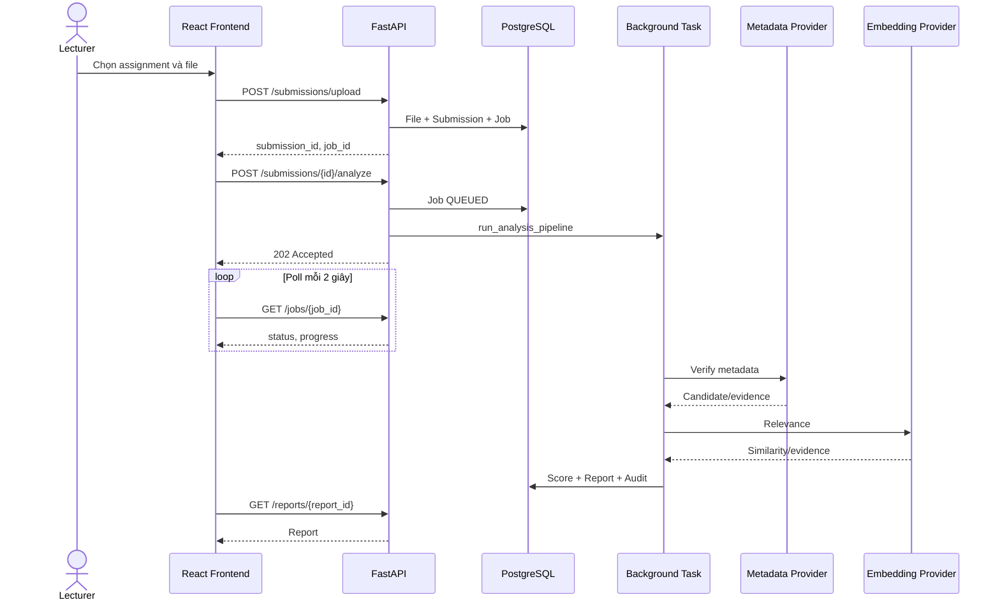

# 04. Use Case và Workflow

## 1. Danh sách

| ID | Use case | Actor | Trạng thái |
|---|---|---|---|
| UC-01 | Đăng ký | Guest | Implemented |
| UC-02 | Login/refresh | User | Implemented |
| UC-03 | Hồ sơ cá nhân | User | Implemented |
| UC-04 | Quản lý course | Lecturer/Admin | Implemented |
| UC-05 | Quản lý class | Lecturer/Admin | Implemented |
| UC-06 | Quản lý assignment | Lecturer/Admin | Implemented |
| UC-07 | Upload report | Lecturer/Admin | Implemented |
| UC-08 | Analyze report | Lecturer/Admin | Implemented |
| UC-09 | Theo dõi/retry job | Lecturer/Admin | Implemented |
| UC-10 | Xem report | Lecturer/Admin | Implemented |
| UC-11 | Export report | Lecturer/Admin | Implemented |
| UC-12 | Dashboard | Lecturer/Admin | Implemented |
| UC-13 | Quản lý user | Admin | Implemented |
| UC-14 | Provider/audit | Admin | Implemented/Partial |
| UC-15 | Student self-service | Student | Deferred |
| UC-16 | Batch | Lecturer/Admin | Planned |

## 2. UC-01 — Đăng ký

**Tiền điều kiện:** email chưa tồn tại.

**Luồng:** nhập dữ liệu → `POST /auth/register` → validate → tạo user → audit → trả user.

**Ngoại lệ:** họ tên trống, mật khẩu yếu, email trùng, database lỗi/rollback.

**Gap:** policy hiện chỉ yêu cầu tối thiểu 6 ký tự.

## 3. UC-02 — Login và refresh

1. Gửi email/mật khẩu.
2. Backend xác thực.
3. Trả access/refresh token và user.
4. Frontend lưu token.
5. Axios gắn bearer.
6. Khi 401, gọi refresh một lần.
7. Nếu refresh thất bại, xóa session và về login.

**Rủi ro:** token trong `localStorage` làm tăng tác động XSS.

## 4. UC-05 — Quản lý class

1. Chọn course, nhập mã/tên/kỳ.
2. Backend xác nhận course tồn tại.
3. Từ chối mã lớp trùng.
4. Gán `lecturer_id` là user hiện tại.
5. Admin xem toàn bộ; lecturer chỉ xem lớp sở hữu.
6. Update/delete phải kiểm tra owner/admin; delete ghi audit.

## 5. UC-06 — Quản lý assignment

1. Chọn class thuộc quyền.
2. Tạo assignment.
3. Backend kiểm tra class/ownership.
4. Từ chối title trùng trong class.
5. Lưu required style và status.

## 6. UC-07 — Upload report

**Tiền điều kiện:** có `submission.upload`, assignment thuộc quyền và `OPEN`.

1. Chọn PDF/DOCX.
2. Gửi multipart gồm `assignment_id`, `owner_label`, `file`.
3. Backend kiểm tra quyền và file.
4. Lưu file bằng tên an toàn.
5. Tạo File, Submission, Job.
6. Ghi audit.
7. Trả `submission_id`, `file_id`, `job_id`.

**Ngoại lệ:** assignment đóng, MIME/type sai, file rỗng/quá lớn, không có quyền, lỗi transaction.

## 7. UC-08 — Analyze report

**Endpoint chuẩn:** `POST /api/v1/submissions/{submission_id}/analyze`.

1. Kiểm tra ownership.
2. Tạo job `QUEUED`.
3. Trả `202`.
4. Chạy pipeline: validate → extract → detect → parse → normalize → verify → score → report.
5. Lưu report và audit completion.

**Ngoại lệ:** file mất/sai loại, PDF không text layer, không có reference section, không parse được citation, provider/scoring/report lỗi.

## 8. UC-09 — Theo dõi và retry

Frontend poll `GET /jobs/{job_id}` mỗi 2 giây, dừng khi completed/failed/cancelled và chuyển report khi hoàn tất.

**P0 remediation:** retry is valid only for terminal jobs, creates a new job with `retry_of_job_id`, preserves lineage, and runs `run_analysis_pipeline`. `/jobs/submissions/{submission_id}/process` is a backward-compatible alias of the canonical pipeline. Completed jobs must include `report_id` so the frontend navigates to the real report.

## 9. UC-10 — Xem report

Backend trả submission/file, extraction summary, reference section, verification summary, score/label/confidence, citation detail và warning/evidence; chỉ user đúng scope được xem.

## 10. UC-11 — Export

- PDF, DOCX, XLSX.
- Backend kiểm tra report scope.
- Tạo export record/file.
- Có thể tải lại qua `/report-exports/{export_id}/download`.
- Nếu record còn nhưng file vật lý mất, trả 404 rõ ràng.

## 11. UC-13 — Admin user management

Admin xem, tạo, cập nhật và vô hiệu hóa user. Frontend không được fallback mock ngoài explicit mock mode.

## 12. Sequence tổng thể

