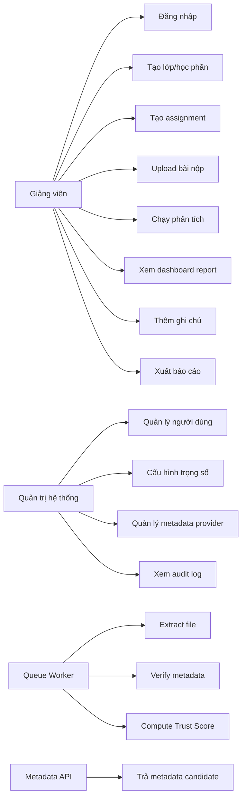
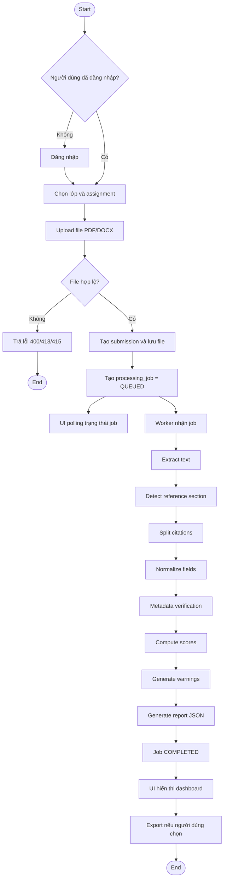

# D08. Actor & Use Case Overview

# D11. Upload-to-Report Activity Flow

# APP-B.1 Use Case Exceptions

| **Mã** | **Tình huống**                                     | **Xử lý bắt buộc**                                                                                      |
|--------|----------------------------------------------------|---------------------------------------------------------------------------------------------------------|
| EX-01  | File PDF chỉ chứa ảnh scan, không trích được text. | Trả trạng thái NEED_OCR hoặc UNSUPPORTED_SCAN; không tính điểm sai; gợi ý dùng file text-based.         |
| EX-02  | Không phát hiện phần tài liệu tham khảo.           | Tạo cảnh báo NO_REFERENCE_SECTION; cho phép người dùng chọn vùng/nhập thủ công trong phiên bản mở rộng. |
| EX-03  | Metadata API timeout hoặc rate limit.              | Retry theo exponential backoff; nếu vẫn lỗi, gắn trạng thái UNKNOWN_METADATA và cho phép retry sau.     |
| EX-04  | Citation thiếu tiêu đề hoặc năm.                   | Vẫn lưu citation raw_text; gắn lỗi MISSING_REQUIRED_FIELD; giảm citation format score.                  |
| EX-05  | Trùng citation trong cùng bài.                     | Gắn cảnh báo DUPLICATE_REFERENCE; không tính trùng vào điểm toàn bài nếu cấu hình yêu cầu.              |
| EX-06  | File quá lớn hoặc định dạng không đúng.            | Từ chối upload, trả lỗi rõ ràng về giới hạn dung lượng/định dạng.                                       |
| EX-07  | Người dùng không có quyền xem assignment.          | Trả HTTP 403, ghi audit log.                                                                            |
| EX-08  | Một citation có metadata match mơ hồ.              | Gắn trạng thái AMBIGUOUS_MATCH, hiển thị top candidates và confidence.                                  |
